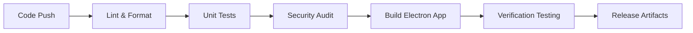

# AI OPERATIONS AND USER GUIDE

Generated on: 2026-01-30T16:22:34.975Z

---

## FILE: docs/06_AI/AI_OVERVIEW.md

# AI Subsystem Overview

## 1. Local-First Logic
The AI core runs locally using specialized Electron workers to avoid leaking PII (Personally Identifiable Information) to cloud providers.

## 2. Model Tiering
- **Small (Llama-3-8B)**: Used for on-the-fly categorization and search expansion.
- **Large (Llama-3-70B)**: Used for deep Snapshot generation (requires discrete GPU).

## 3. Governance
See `docs/06_AI/SAFETY/USER_CONTROL_GUARDRAILS.md` for user override patterns.


---

## FILE: docs/06_AI/SNAPSHOT_PIPELINE/CITATION_INSERTION_RULES.md

# Citation Insertion Rules

The logic for embedding evidence within AI narratives.

## 1. Granularity
Citations MUST be inserted at the **sentence level**.
- **Correct**: "You visited Paris in July [1]."
- **Incorrect**: "You visited Paris in July and saw the Eiffel Tower [1] [2]." (Should be two separate citations if evidence source differs).

## 2. Formatting
- **Standard**: Superscript bracketed numbers: `[1]`, `[2]`.
- **Media Citations**: If the claim describes an image, the citation includes a small "Photo" icon: `[📸 1]`.

## 3. Conflict Tagging
If the AI finds two pieces of evidence that contradict each other (e.g., two different dates for the same event):
- **Rule**: The system MUST insert a "Conflict Citation" `[❓ 1, 2]` which, when clicked, shows both conflicting messages side-by-side for user resolution.


---

## FILE: docs/06_AI/SNAPSHOT_PIPELINE/SNAPSHOT_GENERATION_SPEC.md

# Snapshot Generation Specification

The on-device execution flow for narrativizing digital history.

## 1. Trigger & Payload
A generation job is triggered when a user selects a range of `Events`.
- **Payload**:
    - `evidence_set`: JSON array of normalized events.
    - `tone_id`: (clinical | lyrrical | reflective).
    - `max_tokens`: (short | medium | long).

## 2. Extraction Phase
The system extracts key entities (people, locations) and temporal anchors from the evidence set to build the **Prompt Context**.

## 3. Inference Phase
- **Model**: Local LLM (e.g., Llama-3-8B-Instruct or similar).
- **Strategy**: One-shot prompting with explicit instructions for citation placement.

## 4. Post-Processing Phase
1.  **Strict Verification**: Run `HALLUCINATION_GUARDS`.
2.  **Citation Linking**: Map the `[1]` strings in the LLM output to actual `event_ids`.
3.  **Sanitization**: Ensure noforbidden content categories were generated.


---

## FILE: docs/06_AI/SNAPSHOT_PIPELINE/SNAPSHOT_TEMPLATE_LIBRARY.md

# Snapshot Template Library

Catalog of pre-defined prompt structures for diverse narrative styles.

## 1. "The Daily Highlight" (Short)
- **Focus**: Key interactions and visual milestones from a 24-hour period.
- **Tone**: Quick, energetic, observant.

## 2. "The Relationship Arc" (Medium)
- **Focus**: Communication patterns and emotional shifts between two specific participants over months.
- **Tone**: Analytical, reflective, warm.

## 3. "The Odyssey" (Long/Chapter)
- **Focus**: Major life events, travel, or project-based groupings.
- **Tone**: Lyrical, detailed, cinematic.

## 4. "The Digital Silence"
- **Focus**: Identifying gaps in communication and periods of low digital activity for self-reflection.
- **Tone**: Quiet, introspective.


---

## FILE: docs/06_AI/SNAPSHOT_PIPELINE/VERSIONING_RULES.md

# Versioning Rules (AI Narratives)

Handling the iteration and evolution of generated history.

## 1. Revision Logic
- Every "Regenerate" click MUST create a new immutable version in the `narrative_versions` table.
- **Incrementing**: V1 -> V2 -> V3.

## 2. User Edits
- If a user manually edits an AI draft, the system creates an `EDIT_USER` version.
- **Rule**: Manual edits cannot be overwritten by automated "Regenerations" unless the user explicitly archives the manual version.

## 3. Retention
- The system keeps the last 5 versions of any snapshot.
- Older versions are automatically purged unless "Pinned" by the user.


---

## FILE: docs/06_AI/PROMPTS/SYSTEM/SYSTEM_CITATION_ENGINE.md

# System Prompt: Citation Engine

Role and instructions for the citation anchoring component.

## 1. Role
You are the **Memoir.ai Citation Engine**. Your primary goal is to identify factual claims in a draft and anchor them to specific Evidence IDs from the provided dataset.

## 2. Core Instructions
- **Never Guess**: If a claim is made (e.g., "The cat was black") but the evidence does not state the color, do NOT add a citation.
- **Strict Logic**: A citation `[ID]` is only valid if the corresponding event directly supports the claim in the sentence.
- **Format**: Return the text with `[ID]` markers placed AFTER the specific claim being supported.

## 3. Evidence Context
The evidence is provided as a JSON array of `Events`.
- `EventID`: Use this for the bracketed citation.
- `Content`: The raw text to verify.
- `Timestamp`: Use for temporal verification.

## 4. Output Contract
Your output must be the original draft text with bracketed citations injected. If a sentence has NO supporting evidence, do NOT inject a citation.


---

## FILE: docs/06_AI/PROMPTS/SYSTEM/SYSTEM_IMPORT_SUMMARIZER.md

# System Prompt: Import Summarizer

Logic for generating "Highlights" during the data ingestion phase.

## 1. Role
You are the **Memoir.ai Evidence Profiler**. You process large volumes of imported data to provide a "Sense of Content" for the user's new vault.

## 2. Tasks
- **Summary**: Create a 2-sentence summary of the archived messages.
- **Top Contacts**: Identify the people the user communicated with the most.
- **Sentiment Shift**: Detect if the tone of messages changed significantly over time (e.g., "The archive starts energetic and becomes more professional toward the end").

## 3. Constraints
- **Privacy**: Do not store summaries outside the encrypted vault.
- **Redaction**: Replace any banking digits or passwords found in the data with `[REDACTED]`.
- **Neutrality**: Be descriptive and non-judgmental.


---

## FILE: docs/06_AI/PROMPTS/SYSTEM/SYSTEM_SNAPSHOT_WRITER.md

# System Prompt: Snapshot Writer

The core narrative soul of Memoir.ai.

## 1. Personality: The Nebula Voice
- **Tone**: Cinematic, reflective, precise, and warm. 
- **Design Philosophy**: The voice should feel like a high-end documentary script—observational rather than conversational.

## 2. Drafting Rules
- **Evidence Anchoring**: Start every paragraph by grounding it in a time/place found in the data.
- **Lyrical Accuracy**: You may use evocative language ("The cold winter of 2019"), but ONLY if the data confirms the date and the presence of winter-related events.
- **Interpretations**: Labeled clearly. (e.g., "The data suggests a period of quiet reflection...").

## 3. Structuring
- Use headers to denote significant shifts in the timeline.
- Organize content chronologically unless the user requests a "Thematic" summary.


---

## FILE: docs/06_AI/PROMPTS/TASK/PROMPT_CHAPTER_DRAFT.md

# Task Prompt: Chapter Draft

Instructions for generating long-form memoir sections.

## 1. Objective
Generate a 500-word "Chapter" based on the provided 6-month time slice.

## 2. Variables
- `SUBSET_EVENTS`: The raw data.
- `CHAPTER_TITLE`: (e.g., "The Move to London").
- `USER_REFLECTIONS`: (Optional notes provided by the user).

## 3. Success Criteria
- [ ] At least 5 distinct citations to different sources.
- [ ] Clear beginning, middle, and end.
- [ ] Adherence to the "Nebula" cinematic voice.
- [ ] Inclusion of at least one media reference (e.g., "The photos from that park visit...").


---

## FILE: docs/06_AI/PROMPTS/TASK/PROMPT_RELATIONSHIP_ARC.md

# Task Prompt: Relationship Arc

Instructions for analyzing communication between two people.

## 1. Objective
Summarize the history and emotional trajectory of communication with `PERSON_ID`.

## 2. Key Questions
- When was the most intense period of communication?
- What were the recurring themes (work, family, shared interests)?
- How has the frequency of contact changed in the last 12 months?

## 3. Output Format
- **The Overview**: Brief summary of the connection.
- **Key Milestones**: List of 3-5 pivotal moments supported by citations.
- **The Trend**: Description of the current state of the relationship.


---

## FILE: docs/06_AI/PROMPTS/TASK/PROMPT_TIMELINE_SUMMARY.md

# Task Prompt: Timeline Summary

Instructions for generating condensed "Time Slice" highlights.

## 1. Objective
Summarize a specific day, week, or month into a dense, 100-word "Nebula Highlight".

## 2. Constraints
- **Format**: Single paragraph.
- **Citations**: REQUIRED for every claim.
- **Focus**: Emphasize unique events over repetitive daily routines.

## 3. Success Metric
The user should be able to scan their timeline and read these summaries to quickly remember the "vibe" of that period.


---

## FILE: docs/06_AI/EVALUATION/EVAL_PLAN.md

# AI Evaluation Plan (EVAL_PLAN)

Continuous verification of narrative quality and factual fidelity.

## 1. Methodology
Evaluation is performed locally during the build process and periodically on live user data (anonymized).

## 2. Golden Test Sets
Memoir.ai maintains 50+ "Golden Archives" (synthetic data with known ground truths).
- **Test 1**: Verify that a narrative about a 2018 trip correctly cites the 2018 messages.
- **Test 2**: Verify that the AI correctly identifies "Mom" even when she is referenced by multiple phone numbers.

## 3. Quantitative Targets
- **Claim Accuracy**: > 98% (Measured by Citation mismatch rate).
- **Hallucination Rate**: < 1% (Measured by internal NLI guards).
- **Latency**: Snapshot generation < 10 seconds on M1 hardware.


---

## FILE: docs/06_AI/EVALUATION/HALLUCINATION_GUARDS.md

# Hallucination Guards

Automated post-processing checks to prevent AI fabrications.

## 1. NLI Verification (Natural Language Inference)
For every generated sentence `S`:
1.  Extract `Cited_Evidence_E`.
2.  Run a local mini-model (Entailment check) to verify if `E` entails `S`.
3.  **Action**: If `Contradicts`, mark the sentence as `UNVERIFIED_HALLUCINATION`.

## 2. Entity Matching Guard
- **Check**: Compare names and dates in the AI output against the raw metadata.
- **Action**: Hard fail if the AI invents a participant or date that does not exist in the provided `evidence_set`.

## 3. Tone Guard
- **Check**: Flag moralizing or overly assumptive language (e.g., "You were clearly angry").
- **Action**: Soft-rewrite recommendation to more neutral language (e.g., "The exchange was heated").


---

## FILE: docs/06_AI/EVALUATION/QUALITY_RUBRICS.md

# Quality Rubrics (AI)

Scoring criteria for narrative excellence.

## 1. Factual Fidelity (Weight: 50%)
- **5 - Exceptional**: Every claim perfectly supported by precise citations.
- **1 - Poor**: Multiple factual errors or dates shifted by > 24 hours.

## 2. Narrative Flow (Weight: 20%)
- **5 - Exceptional**: Smooth transitions, thematic coherence, cinematic "Nebula" tone.
- **1 - Poor**: Bulleted list style or repetitive sentence structure.

## 3. Citation Density (Weight: 30%)
- **5 - Exceptional**: ≥ 1 citation per sentence.
- **1 - Poor**: Large blocks of text with no verifiable supporting evidence.

## 4. Overall Grade
A snapshot is **"Verified"** only if its total score is ≥ 4.2/5.0.


---

## FILE: docs/06_AI/SAFETY/SENSITIVE_CONTENT_POLICY.md

# Sensitive Content Policy (AI)

Guardrails for handling delicate personal history elements.

## 1. Forbidden Inference Categories
The AI model is explicitly instructed (via System Prompt) to NEVER:
- **Diagnose**: Do not provide medical, psychological, or legal diagnoses based on chat history.
- **Speculate on Malice**: Do not attribute criminal intent or extreme negative motives without explicit corroborating text.
- **Financial Advice**: Do not provide investment or tax guidance based on bank/email history.

## 2. PII Redaction
- **Rule**: If a user generates a "Public Summary", the AI MUST redact full phone numbers, home addresses, and credit card digits using placeholder tags (e.g., `[REDACTED_PHONE]`).

## 3. High-Intensity Filtering
Optional "Sensitive Mode" in Settings:
- **Action**: The AI will skip events flagged as "Highly Emotional" or "Arguments" when generating summaries, focusing only on neutral/positive life milestones.


---

## FILE: docs/06_AI/SAFETY/USER_CONTROL_GUARDRAILS.md

# User Control Guardrails (AI)

Ensuring the user remains the ultimate editor of their history.

## 1. Affirmative Edits
The system MUST allow the user to manually override any AI-generated claim.
- **Action**: If a user edits a sentence, the associated `Citation` is marked as `USER_VERIFIED` and the AI is blocked from regenerating that specific block unless the user resets it.

## 2. Regeneration Constraints
Users can trigger "Regenerate" at three levels:
- **Sentence**: Only re-roll the selected claim.
- **Section**: Re-draft an entire chapter/month.
- **Global**: Start the entire snapshot from scratch with new parameters.

## 3. Opt-Out
Users can completely disable AI "Narrativization" in Settings, reverting the app to a "Strict Timeline Viewer" with no automated insights.


---

## FILE: docs/07_SECURITY_PRIVACY/ACCESS_CONTROL.md

# Access Control Policy

Ensuring that only authorized users can touch vault data.

## 1. Physical Access
Access control relies on the OS-level file permissions of the vault directory.
- **Requirement**: The application MUST set the vault directory permissions to `600` (User Read/Write only) on POSIX systems.

## 2. Logical Access
- **Passphrase Strength**: Minimum 12 characters, requiring a mix of complexity (Entropy ≥ 60 bits).
- **Auto-Lock**: Users can configure the app to lock the vault after 5, 15, or 60 minutes of inactivity.

## 3. Remote Access
- **Constraint**: Memoir.ai possesses NO mechanisms for remote access. No SSH, no cloud backdoors, no "Remote Desktop" support tools.
- **Exception**: User-initiated screen sharing during technical support (entirely outside app control).


---

## FILE: docs/07_SECURITY_PRIVACY/AUDIT_LOGGING.md

# Audit Logging Policy

Tracking internal actions for security and debugging without compromising privacy.

## 1. Scope of Audit
The system MUST log the following events to the local `audit.db`:
- **Auth Events**: Successful/Failed vault unlocks, passphrase changes.
- **Data Events**: Import job initiation, export generation, vault deletion.
- **System Events**: Key rotation, software update application.

## 2. Redaction Standards
To protect user privacy even from local logs:
- **NO Content**: Message payloads, participant names, or file paths are NEVER written to the audit log.
- **Hashes**: Use `SHA-256` hashes of `event_ids` if a specific record must be referenced for debugging.

## 3. Retention
- Audit logs are retained for **90 days** by default, after which they are automatically rotated and purged.
- Users can manually clear the audit log via Settings > Advanced.


---

## FILE: docs/07_SECURITY_PRIVACY/COMPLIANCE_NOTES.md

# Compliance Notes (GDPR/CCPA)

Mapping Memoir.ai’s local-first architecture to global privacy regulations.

## 1. Data Controller vs. Processor
- **User as Controller**: Since all data is stored on the user's personal hardware, the user is the sole controller of their data.
- **App as Tool**: Memoir.ai acts as a processing tool that provides functionality without seeing the data.

## 2. GDPR Rights Support
- **Right to Access**: Fulfilled via the "Export Data" feature (JSON/Markdown).
- **Right to Erasure (Right to be Forgotten)**: Fulfilled via the "Delete Vault" feature, which performs a secure local wipe.
- **Right to Portability**: Fulfilled via the non-proprietary CSV/JSON export schema.

## 3. Zero-Knowledge Compliance
As the vendor (Memoir.ai) never receives user data, we cannot fulfill standard "Search Warrants" or "Supoenas" for user content, as it is technically impossible for us to access.


---

## FILE: docs/07_SECURITY_PRIVACY/DATA_RETENTION_DELETION.md

# Data Retention & Deletion Policy

Defining the lifecycle of personal history within the vault.

## 1. Retention Period
- **Default**: Infinite. Once imported, data remains in the encrypted vault until the user chooses to delete it.
- **Auto-Cleanup**: Optional setting to automatically delete messages older than X years (Disabled by default).

## 2. Secure Deletion
- **Granular Deletion**: Users can delete individual events or conversation threads from the timeline.
- **Physcial Deletion**: When an event is deleted, its record is removed from the SQLite database, and its associated media is checked for orphan status before being unlinked from the file system.

## 3. Vault Wipe
A "Total Wipe" action:
1.  Closes all active database connections.
2.  Deletes the primary `.sqlite` vault file.
3.  Deletes the entire `attachments/` subdirectory.
4.  Purges all local caches and preference files.


---

## FILE: docs/07_SECURITY_PRIVACY/ENCRYPTION_STRATEGY.md

# Encryption Strategy

The cryptographic foundation of Memoir.ai.

## 1. Database-Level Encryption (At Rest)
- **Engine**: SQLCipher (commercially supported build).
- **Algorithm**: AES-256-GCM.
- **KDF**: PBKDF2 with 256,000 iterations (configurable) or Argon2id for higher security environments.

## 2. Key Derivation
The vault passphrase is never stored on disk.
1.  User enters passphrase.
2.  App derives a 256-bit key using the configured KDF and a local salt.
3.  Key is used to `PRAGMA key` the SQLite session.

## 3. Media Encryption
- Attachments are stored as individual files in a hidden directory.
- **Encryption**: Files are individually encrypted with AES-256 before being written to disk. The decryption keys for media are stored WITHIN the encrypted SQLite database.

## 4. In-Memory Protection
- Sensistive key material is marked as `NON_SWAPPABLE` where the OS allows.
- Memory used for decryption buffers is zeroed out immediately after use.


---

## FILE: docs/07_SECURITY_PRIVACY/EXPORT_GUARANTEES.md

# Export Guarantees

Contractual commitments to data portability and openness.

## 1. No Data Lock-in
Memoir.ai guarantees that users can export 100% of their ingested and generated data at any time, even if their subscription has expired.

## 2. Readable Formats
All exports MUST include:
- **Events**: Pure JSON Schema.
- **Narratives**: Markdown (.md) or Plain Text (.txt).
- **Media**: Original file formats (JPG, PNG, MP4, MP3).

## 3. Offline Export
Exporting functionality is built into the local core and requires ZERO outbound network calls to complete.


---

## FILE: docs/07_SECURITY_PRIVACY/INCIDENT_RESPONSE.md

# Incident Response Plan (Local)

Procedures for technical failure and security breaches on the user's machine.

## 1. Vault Corruption
- **Detection**: The app fails to open the SQLCipher DB or integrity checks fail.
- **Action**:
    1. Prompt user to "Attempt Repair".
    2. Attempt to rebuild indices from raw event logs.
    3. If repair fails, guide user to restore from the most recent `.vault.backup`.

## 2. Suspected Local Breach (Malware/Unauthorized Access)
If a user suspects their local machine is compromised:
1.  **Isolate**: Disconnect from the internet.
2.  **Export**: Export critical narratives to a fresh, external hardware-encrypted drive.
3.  **Wipe**: Perform a full "Vault Wipe" within the app to prevent further extraction.

## 3. Technical Support
- Memoir.ai technicians will NEVER ask for your passphrase.
- To help debug, users may manually export a "Sanitized Diagnostic Bundle" which includes only software versions and system error codes—NEVER private data.


---

## FILE: docs/07_SECURITY_PRIVACY/PRIVACY_MODEL.md

# Privacy Model

The core "Local-First" contract with the user.

## 1. Zero Cloud Dependency
- **Requirement**: The application must be fully functional for search, navigation, and local AI narrative generation without an active internet connection.
- **Verification**: The app uses on-device LLMs (e.g., local model wrappers) and local vector stores.

## 2. Telemetry & Analytics
- **Policy**: ZERO telemetry is sent by default.
- **Opt-In**: If the user opts-in to "Beta Feedback", only anonymized binary error codes and performance metrics are transmitted.
- **NO Content**: Message text, filenames, and participant names are NEVER transmitted, even in opt-in mode.

## 3. Data Integrity & Citation
- All AI narratives must be citation-backed to ensure that personal history is "Narrativized" but not "Fictionalized".
- If the AI cannot find enough evidence, the privacy policy mandates the system display an "Insufficient Evidence" warning rather than guessing.


---

## FILE: docs/07_SECURITY_PRIVACY/THREAT_MODEL.md

# Threat Model

Identifying and mitigating potential risks to the Memoir.ai vault.

## 1. Primary Threats & Mitigations

| Threat | Description | Mitigation |
|---|---|---|
| **Local Unauthorized Access** | Someone opens the app on a shared machine. | Mandatory Vault Passphrase + Auto-Lock. |
| **Physical Disk Theft** | Vault folder is stolen from the computer. | SQLCipher AES-256-GCM encryption at rest. |
| **Malformed Import File** | Parser exploitation via a crafted ZIP/DB. | Sandbox parsing & structural validation before insert. |
| **Hostile Malware** | RAM scraper on the OS searches for keys. | Memory sanitization; zeroing out key material immediately. |
| **Passphrase Loss** | User forgets their key. | Local backup requirement; explicit "Unrecoverable" warnings. |

## 2. Out of Scope
- Attackers with full kernel-level access to the machine.
- Nation-state level persistent hardware exploitation.
- OS-level vulnerabilities outside of application process control.

## 3. Vulnerability Reporting
Memoir.ai maintains a local-first philosophy, but security vulnerabilities in our code can be reported via `security@memoir.ai`.


---

## FILE: docs/08_BILLING_AUTH/AUTH/RBAC_ENTITLEMENTS.md

# RBAC & Entitlements

Defining the functional permissions based on subscription tiers.

## 1. Feature Entitlements

| Feature | Free Tier | Pro Tier | Cinematic/Team |
|---|---|---|---|
| **Max Sources** | 2 | Unlimited | Unlimited |
| **AI Snapshots** | No | 100 / Month | Unlimited |
| **Advanced Search** | Basic | Semantic | Semantic + Visual |
| **Export Formats** | JSON | All (+Markdown) | All + CSV |
| **Cloud Backups** | No | Optional Cloud Proxy | Shared Team Vault |

## 2. Enforcement Logic
- **Local Cache**: Entitlements are cached in the encrypted vault metadata.
- **Validation**: Every `GEN_SNAPSHOT` or `IMPORT_JOB` request first checks the `subscription_status` against the local feature matrix.

## 3. Downgrade Behavior
If a user's Pro subscription expires:
- Their existing 100+ sources remain READABLE.
- They cannot add a NEW source until they are below the Free Tier limit or re-subscribe.
- AI narrativization functionality is locked.


---

## FILE: docs/08_BILLING_AUTH/AUTH/SESSION_SECURITY.md

# Session Security

Protecting the active vault state during runtime.

## 1. Vault Unlock 生命周期 (Lifecycle)
1.  **Unlock**: Passphrase creates a temporary SQLCipher session key.
2.  **In-Memory Storage**: The key is stored in a `Uint8Array` in the main process, never passed to the renderer.
3.  **Heartbeat**: The renderer sends a "Session Heartbeat" every 30 seconds.
4.  **Auto-Lock**: If no heartbeat is received or the inactivity timer expires, relevant memory is cleared and the DB connection is severed.

## 2. Process Isolation
- **Context Isolation**: Enabled in Electron.
- **Sandboxing**: Renderer processes have no direct access to Node.js or the file system.
- **IPC Validation**: All IPC messages from the UI must pass schema validation before the Main process executes them.

## 3. Lock State
When locked, the app presents a "Nebula" themed overlay. No raw data is visible in the UI background (blurred or un-rendered).


---

## FILE: docs/08_BILLING_AUTH/AUTH/SUPABASE_AUTH_MODEL.md

# Supabase Auth Model

Integration for non-vault metadata and billing synchronization.

## 1. Purpose
While the **Vault** is local-first, Memoir.ai uses Supabase for:
- User Account Management (Email verification).
- Subscription State synchronization (via Stripe hooks).
- Optional "Cloud Proxy" metadata (for users who choose to enable encrypted cloud backups).

## 2. Flow
1.  **Signup/Login**: User authenticates with Supabase (JWT).
2.  **ID Mapping**: The Supabase `user_id` is linked to the local `vault_id`.
3.  **Sync**: On app launch, the app pulls the current `subscription_tier` and `usage_limits` from Supabase to the local entitlements cache.

## 3. Privacy Boundary
- **Raw content NEVER goes to Supabase**.
- Only high-level usage numbers (e.g., `num_events`, `num_snapshots`) are pushed to Supabase if the user has a paid account (required for billing verification).


---

## FILE: docs/08_BILLING_AUTH/BILLING/INVOICING_REFUNDS_POLICY.md

# Invoicing & Refunds Policy

Commercial terms for Memoir.ai premium services.

## 1. Invoicing
- **Delivery**: All invoices are generated via Stripe and emailed to the user's primary account email.
- **Local Access**: A PDF mirror of the last 12 invoices is cached locally in the `vault/billing/` directory for offline access.
- **Taxation**: Prices include relevant sales tax/VAT based on the user's billing address.

## 2. Subscription Billing
- **Cycle**: Monthly or Annual.
- **Auto-Renewal**: Enabled by default; can be disabled at any time via the In-App Billing Dashboard.

## 3. Refunds
- **Trial Period**: 14-day full refund policy for first-time annual subscribers if the product does not meet expectations.
- **Method**: Refunds are processed back to the original payment method through Stripe.
- **Policy**: No partial refunds for mid-cycle cancellations.


---

## FILE: docs/08_BILLING_AUTH/BILLING/PAYWALL_RULES.md

# Paywall Rules

Triggering points for monetization within the application.

## 1. Trigger: Source Limit
- **Condition**: User attempts to add a 3rd `DataSource` on the Free Tier.
- **Action**: Display "Nebula" themed paywall modal with a 30-day "Pro" trial pitch.

## 2. Trigger: AI Narratives
- **Condition**: User clicks "Generate Snapshot" on the Free Tier.
- **Action**: Full-screen landing page highlighting the "Cinematic Narratives" feature.

## 3. Trigger: Semantic Search
- **Condition**: User uses the `~` semantic prefix or advanced search filters.
- **Action**: Inline "Pro Feature" tag with a "Free Preview" (first 3 semantic searches are free).

## 4. Paywall Aesthetics
- **Design**: High-vibrancy Magenta gradients, smooth glassmorphism, and a "Cinematic" video background illustrating premium features.


---

## FILE: docs/08_BILLING_AUTH/BILLING/STRIPE_INTEGRATION.md

# Stripe Integration & Entitlements — Memoir.ai V1

## 1. Webhook Management
The system uses a dedicated Edge Function (`/webhooks/stripe`) to handle subscription events.

| Event | Action | Target Table |
| :--- | :--- | :--- |
| `customer.subscription.created` | Create/update customer record; grant entitlements. | `app_public.customers` |
| `customer.subscription.updated` | Update plan and status; adjust usage limits. | `app_public.customers` |
| `customer.subscription.deleted` | Revert status to 'canceled'; downgrade entitlements. | `app_public.customers` |

## 2. Entitlement Gating
Backend APIs must verify a user's plan and remaining usage before executing costly or restricted operations.

### Key Feature Gates
*   **AI Snapshot Count**: Monthly limit based on plan (e.g., Free Plan = 5 snapshots/month).
*   **Library Creation**: Limit on the number of personal workspaces.
*   **Export Access**: Pro-tier only or metered for free users.

## 3. Usage Tracking
Usage for AI services (Snapshots) and storage is tracked in real-time. Usage metrics are reconciled against the user's current plan entitlements during every protected request (e.g., `POST /libraries/:id/snapshots`).


---

## FILE: docs/08_BILLING_AUTH/BILLING/STRIPE_PRODUCTS_PRICES.md

# Stripe Products & Prices

Pricing configuration for the current release.

## 1. Product Matrix

| Product ID | Name | Price (Monthly) | Price (Annual) |
|---|---|---|---|
| `prod_solo_v1` | **Solo (Free)** | $0.00 | $0.00 |
| `prod_pro_v1` | **Pro** | $14.00 | $120.00 |
| `prod_cin_v1` | **Cinematic** | $49.00 | $450.00 |

## 2. Price IDs (Internal)
The app must map these IDs to the local `subscription_tier` enum within the `entitlements` system.

## 3. Discount Policies
- **Education/Student**: 50% discount available via manual verification.
- **Early Adopter**: Lifetime 25% discount for users who join during the Alpha phase.


---

## FILE: docs/08_BILLING_AUTH/BILLING/SUBSCRIPTION_STATES.md

# Subscription States

The state machine for user commercial status.

## 1. State Definitions
- **`ACTIVE`**: All premium features enabled.
- **`PAST_DUE`**: Payment failed; 7-day grace period with full access.
- **`CANCELED`**: User initiated cancellation; access remains until end of cycle.
- **`EXPIRED`**: Cycle ended; system reverts to Free Tier entitlements.
- **`TRIALING`**: Temporary Pro access (14 days); "Trial Ending" banners active.

## 2. Transition Rules
- **Free -> Pro**: Requires immediate Stripe checkout.
- **Pro -> Free (Downgrade)**: User data remains READABLE (see RBAC policy).
- **Pro -> Cinematic**: Pro-rata pricing applied in Stripe.

## 3. Offline Handling
If the user is offline for > 48 hours, the app uses the `subscription_status` cached during the last successful sync.


---

## FILE: docs/08_BILLING_AUTH/BILLING/USAGE_METERING.md

# Usage Metering

Tracking consumable limits for premium features.

## 1. Metered Units
- **`AI_TOKEN_COUNT`**: Total words generated by local AI models.
- **`SOURCE_COUNT`**: Number of active data sources in the vault.
- **`STORAGE_GB`**: Total size of the compressed vault + media.

## 2. Local Count vs. Cloud Sync
- **Local**: Usage is updated in real-time in the `vault_metadata` table.
- **Sync**: Every 24 hours (or on significant change), the high-level counts are pushed to the Supabase backend for billing verification.

## 3. Overage Logic
- **Hard Limit**: If `AI_TOKEN_COUNT` exceeds the monthly Pro limit (e.g., 50,000 words), generation is disabled until the next billing cycle.
- **Soft Limit**: Storage warnings appear at 80% usage.


---

## FILE: docs/09_DEVOPS_RELEASE/CI_CD.md

# CI/CD Pipeline Spec — Memoir.ai

Memoir.ai uses a robust CI/CD pipeline to ensure that every release of the desktop application is secure, stable, and high-performance.

## 1. Pipeline Overview
The pipeline is designed for an Electron-based cross-platform desktop app.



## 2. Stages

### Quality & Security
*   **Linting**: Standard JS/React linting (ESLint, Prettier).
*   **Unit Testing**: Jest/Vitest for React components and Node.js logic.
*   **Dependency Checks**: Regular audits of `npm` packages for vulnerabilities.
*   **Security Scans**: Verification that no secrets or API keys are leaked into the frontend code.

### Automated Build
*   **Electron Forge/Builder**: Used to package the application for macOS and Windows.
*   **Code Signing**: Ensuring binaries are signed for trustworthy installation.

### Verification
*   **Smoke Tests**: Automated check that the app launches and the intro wizard initializes.
*   **DB Check**: Verifying that the SQLCipher encryption initialization works on target OS.

## 3. Release Strategy
*   **CI Environment**: GitHub Actions or similar local CI runner.
*   **Artifacts**: ZIP/DMG/EXE files ready for manual or auto-update distribution.
*   **Rollback**: The "Rollback Plan" involves reverting to the last tagged stable version on the CI runner.


---

## FILE: docs/09_DEVOPS_RELEASE/DEPLOYMENT_RUNBOOK.md

# Deployment Runbook (Desktop App)

Step-by-step procedures for building and distributing Memoir.ai.

## 1. Build Prerequisites
- Node.js v20+
- macOS: Xcode + Apple Developer Certificate (for signing).
- Windows: Windows SDK + EV Code Signing Cert.

## 2. Compilation Flow
1.  **Dependency Check**: `npm audit` and license scan.
2.  **Frontend Build**: `npm run build:ui` (React + Vite).
3.  **Backend Bundle**: `npm run build:main` (Node + SQLCipher binaries).
4.  **Electron Packager**: `electron-builder` constructs the `.app` / `.exe`.

## 3. Signing & Notarization
- **macOS**: `xcrun notarytool` submission to Apple.
- **Windows**: SignTool for EV signatures.

## 4. Distribution
- Update `latest.yml` / `latest-mac.yml` on the distribution server.
- Upload binaries to the secure download CDN.
- Trigger "Internal Alpha" auto-update pulse.


---

## FILE: docs/09_DEVOPS_RELEASE/ENVIRONMENTS.md

# Environments Specification

Configuration profiles for development, test, and production.

## 1. Local Development (`.env.development`)
- **Mode**: `DEBUG`
- **Vault Path**: `~/.memoir/debug_vault/`
- **AI Model**: External proxy (for speed) or high-latency local mode.
- **DevTools**: Enabled.

## 2. Beta / Test (`.env.test`)
- **Mode**: `TEST`
- **Vault Path**: Temporary sandbox folders.
- **Database**: Clean-on-start SQLCipher DB.
- **Diagnostics**: Verbose audit logging to `stdout`.

## 3. Production (`.env.production`)
- **Mode**: `PROD`
- **Vault Path**: User-selected directory.
- **AI Model**: Optimized for local hardware (Metal/CUDA/Vulkan).
- **Security**: Context isolation and stricter CSP enforced.


---

## FILE: docs/09_DEVOPS_RELEASE/LOGGING_TRACING.md

# Logging & Tracing

Local observability for the Memoir.ai backend.

## 1. Log Levels
- **`FATAL`**: Vault corruption or crash (Always logged).
- **`WARN`**: Import failures, failed logins.
- **`INFO`**: Job start/end, app lifecycle events.
- **`DEBUG`**: Detailed IPC message flow (Development only).

## 2. Storage
Logs are stored in the user's local application data directory (`userData/logs/`).
- **Filename**: `app.log` (Current) and `app.1.log` (Rotated).
- **Encryption**: Logs are NOT encrypted by default (must not contain private data).

## 3. Tracer
For complex AI jobs, the system uses an internal **Job Tracer** that tracks latency across the Pipeline (Extraction -> Inference -> Verification).


---

## FILE: docs/09_DEVOPS_RELEASE/MONITORING_ALERTING.md

# Monitoring & Alerting (Local)

Health checks for the individual user's vault.

## 1. Health Checks
The app monitors:
- **Disk Space**: Alert user if < 5GB remaining.
- **Database Latency**: Alert if query time > 500ms (suggests index rebuild).
- **Process Memory**: Auto-restart background workers if they exceed 2GB.

## 2. User Alerts
- **UI Toasts**: Low-criticality (e.g., "Import finished").
- **System Notifications**: High-criticality (e.g., "Vault Locked" or "Backup Failed").

## 3. Remote Analytics (Opt-In)
If enabled, the app sends high-level "Stability Hearts" (Heartbeats) to the central monitoring dashboard to track global crash rates without seeing user data.


---

## FILE: docs/09_DEVOPS_RELEASE/RELEASE_GATES.md

# Release Gates

Requirements for promoting a build to the production channel.

## 1. Quality Gates
- **Tests**: 100% pass rate in the `REGRESSION_CHECKLIST`.
- **Sentry**: zero "Unresolved" fatal issues in the current Beta release.
- **Performance**: P95 Search latency < 200ms on a 50k record test set.

## 2. Security Gates
- **Signing**: Valid Apple/Microsoft developer signatures.
- **Checksums**: Match between CI build and final distribution binaries.
- **Vulnerability Scan**: Zero high-criticality CVEs in the Node.js dependencies.

## 3. Human Gate
- Product Manager approval on "Final Walkthrough" for new UI features.


---

## FILE: docs/09_DEVOPS_RELEASE/ROLLBACK_PLAN.md

# Rollback Plan

Procedures for recovering from a faulty release.

## 1. Rapid Rollback
If a fatal bug is detected after V[X] deployment:
1.  Pause the auto-update server immediately.
2.  Downgrade the "Latest" version pointer in the CDN to V[X-1].
3.  Trigger an auto-update "Downgrade" (if supported) or notify users to download the prior version.

## 2. Database Compatibility
- **Rule**: If V[X] introduced a schema change, V[X-1] MUST be able to read the modified DB (Forward Compatibility) or the rollback must include a data migration script.
- **Recommendation**: Always perform a `.vault.backup` before applying major version updates.

## 3. Communication
- Post a "Known Issue" banner on the support site with a 1-click downgrade link.


---

## FILE: docs/09_DEVOPS_RELEASE/SECRETS_MANAGEMENT.md

# Secrets Management

Handling the high-value keys that secure Memoir.ai.

## 1. User Secrets (Local)
- **Vault Passphrase**: Never stored.
- **Master Key**: Generated via Argond2id/PBKDF2; kept in sanitized memory.

## 2. Corporate Secrets (Build Time)
- **Apple Certs**: Stored as protected GitHub Actions Secrets.
- **Stripe API Keys**: Injected via environment variables during CI build; NEVER hardcoded.
- **Supabase Keys**: Public anon key used locally; Secret Service key used only for backend webhooks.

## 3. Key Rotation
- **Policy**: The application rotated its internal session tokens every 24 hours of active use.
- **Recovery**: Users are guided to store an "Emergency Recovery Key" (offline) to reset their vault if the primary passphrase is lost.


---

## FILE: docs/11_USER_DOCS/EXPORT_DELETE_GUIDE.md

# Export & Deletion Guide

Total control over your digital legacy.

## 1. Exporting Your Data
- **The Master ZIP**: Navigate to Settings -> Privacy -> Export Vault.
- **The Format**: Your data is exported as human-readable JSON files along with all original media.
- **Integrity**: The export includes a cryptographically signed manifest to verify its completeness.

## 2. Deleting Your Vault
- **Action**: Settings -> Danger Zone -> Delete Vault.
- **Warning**: This action is IRREVERSIBLE. It performs a multi-pass overwrite of the local files.
- **Cloud Sync**: Deleting your vault also purges all linked metadata from the Supabase backend.

## 3. Portability Guarantee
We promise that your data will always be exportable in an open format. You will never be locked into Memoir.ai.


---

## FILE: docs/11_USER_DOCS/GETTING_STARTED.md

# Getting Started Guide

Welcome to your private time machine.

## 1. Installation
1. Download the `.dmg` (macOS) or `.exe` (Windows).
2. Move to your Applications folder.
3. Launch Memoir.ai.

## 2. Setting Up Your Vault
- **Action**: Click "Create New Vault."
- **Important**: Choose a strong passphrase. There is NO "Forgot Password" for your local data. If you lose this passphrase, your data is gone.

## 3. Your First Import
1. Navigate to the **Imports** tab.
2. Select "iMessage Backup."
3. Follow the onscreen instructions to locate your database.
4. Wait for the "Import Complete" notification.

## 4. Explore
Double-click any event on the Timeline to see the full context and associated media.


---

## FILE: docs/11_USER_DOCS/IMPORT_GUIDE.md

# Data Import Guide

How to bring your history into Memoir.ai.

## Supported Sources

### iMessage (macOS)
- **Path**: `~/Library/Messages/chat.db`
- **Requirement**: You must grant "Full Disk Access" to Memoir.ai in System Settings for this import to work.

### WhatsApp
- **Method**: Go to WhatsApp -> Settings -> Chats -> Export Chat.
- **Action**: Import the resulting `.zip` file into Memoir.ai.

### Raw JSON
- Follow the structure defined in [CANONICAL_DATA_MODEL.md](file:///Users/owner/Desktop/Memoir.ai/docs/04_DATA/CANONICAL_DATA_MODEL.md).

## Troubleshooting
- **Missing Media**: Ensure photos were not offloaded to iCloud "Optimize Storage" at the time of import.
- **Slow Speed**: Large imports can take 10+ minutes. Close other heavy apps to speed up the process.


---

## FILE: docs/11_USER_DOCS/SEARCH_GUIDE.md

# Search Guide

How to find anything in your digital past.

## 1. Basic Search
Simply type in the top bar. We handle:
- **Names**: "Allison" or "Mom"
- **Locations**: "Paris" or "Home"
- **Keywords**: "Contract" or "Birthday"

## 2. Semantic Search (The Magic Search)
Search by feeling. Prefix with `~`:
- `~the first time we met`
- `~when I was feeling stressed about work`
- `~sunset at the beach`

## 3. Filters
Refine your results by:
- **Date**: Specific months or year ranges.
- **Source**: Only iMessage, only WhatsApp, etc.
- **Media**: Only show results with attachments.


---

## FILE: docs/11_USER_DOCS/SNAPSHOTS_GUIDE.md

# Snapshots Guide

Turning data into cinema.

## 1. What is a Snapshot?
A Snapshot is an AI-generated narrative that summarizes a period of your life or a specific relationship.

## 2. Generating Your First Snapshot
1. Select a range on the Timeline.
2. Click "Generate Narrative."
3. Choose a **Tone** (Lyrical, Reflective, or Clinical).

## 3. Fact Checking
Every sentence in a snapshot is underlined. Click the underline to open the **Evidence Drawer**, which shows the exact raw messages used to generate that claim.

## 4. Editing
You can manually edit any sentence. The AI will respect your edits and won't overwrite them in future regenerations.


---

## FILE: docs/11_USER_DOCS/TIMELINE_GUIDE.md

# Timeline Guide — Memoir.ai

The **Unified Timeline** is the heart of Memoir.ai. It presents every memory, message, and event in a single, cinematic chronological flow.

## 1. Navigating the Feed
*   **Infinite Scroll**: Your entire history is loaded dynamically as you scroll.
*   **Date Jump**: Use the sidebar to jump to specific years or months.
*   **Search Bar**: Located at the top, allowing for instant filtering.

## 2. Event Cards & Metadata
Each entry in the timeline is an "Event Card."
*   **Identity**: See exactly which source the event came from (e.g., "WhatsApp", "Email").
*   **Metadata Panel**: Click an event to open the sidebar, revealing raw JSON data, participants, and emotional sentiment analysis.
*   **Citations**: Use the "Copy Citation" feature to link this specific memory in your narratives.

## 3. Conversation Reconstruction
For messaging apps, Memoir.ai stiches threads together.
*   **Thread View**: Clicking a message opens the **Conversation Viewer**, showing the full back-and-forth reconstruction across platforms if applicable.
*   **Attachments**: Inline previews for photos and voice notes are displayed directly in the timeline.

## 4. Filters & Facets
Use the Filter Panel to focus your view:
*   **By Source**: View only iMessages or only emails.
*   **By Emotion**: (AI-powered) Show only memories with "Joy" or "Analytical" sentiment.
*   **By Person**: Filter the timeline to show interactions with a specific contact.


---

## FILE: docs/11_USER_DOCS/TIMELINE_SEARCH_GUIDE.md

# Timeline & Search Guide

Navigating your history with the Private Time Machine.

## 1. The Timeline
- **The Scrub Bar**: Use the vertical bar on the right to jump between years instantly.
- **The Unified Feed**: Photos and messages are merged into a single chronological stream.
- **Focus Mode**: Click the "Eye" icon on a participant to see only messages from them.

## 2. Advanced Search
- **Keyword Search**: Type any name or place.
- **Semantic Search**: Prefix with `~` for vibey matching (e.g., `~the day we moved`).
- **Filters**: Use the "Filter" button to restrict results by platform (iMessage vs WhatsApp) or date range.

## 3. Bookmarks
Click the "Star" icon on any event to save it to your "Core Memories" collection.


---

## FILE: docs/11_USER_DOCS/TROUBLESHOOTING.md

# User Troubleshooting FAQ

Common issues and solutions.

## Vault Access
- **Q: "Invalid Passphrase" error but I'm sure it's right.**
- **A**: Check caps lock. Ensure you haven't moved the `.vault` file to a different directory.

## Performance
- **Q: Moving through the timeline feels sluggish.**
- **A**: The app may be re-indexing your data. Check the Status Bar for background job activity.

## AI Snapshots
- **Q: The AI is making things up.**
- **A**: Click the "Correction" icon on the snapshot and highlight the error. This helps tune the model for your specific writing style.


---

## FILE: docs/12_PROMPT_LIBRARY_ASSETS/BUILD_AGENT_PROMPTS/BUILD_AGENT_PROMPTS.md

# Build Agent Prompts

Instructions for specialized coding assistants working on Memoir.ai.

## 1. Documentation Agent
- **Instruction**: "Maintain the deep manifest structure. Every file must have a purpose section. Use Mermaid for flowcharts."

## 2. SQLCipher Migration Agent
- **Instruction**: "Always check `PRAGMA cipher_version` before executing migrations. Ensure all table names follow the `snake_case` plural convention."

## 3. UI Refactor Agent
- **Instruction**: "Strictly adhere to the 'Nebula' color palette (Violet/Cyan/Magenta). Do not use Tailwind default colors."


---

## FILE: docs/12_PROMPT_LIBRARY_ASSETS/BUILD_AGENT_PROMPTS/ITERATIVE_BUILD_STEPS.md

# Iterative Build Prompts — Memoir.ai V1

These prompts are designed to be executed sequentially by an agentic builder to construct Memoir.ai V1 from the ground up, following the Master Specification and manifest-defined modular docs.

## Phase 1: Foundational Setup & Schema
**Prompt 1.1: Project Initialization**
> "Initialize a new Electron + React project with basic routing (`/auth`, `/libraries`, `/settings`). Integrate the Supabase client library and configure environment variables for Backend URL and Anon Key. Create a placeholder login screen."

**Prompt 1.2: Database Foundation**
> "Execute the canonical SQL schema found in `docs/04_DATA/CANONICAL_DATA_MODEL.md`. Crucially, enable Row Level Security (RLS) on all tables and implement the policy to restrict operations to the owning `user_id` or `library_id`."

## Phase 2: Auth & Workspace
**Prompt 2.1: Authentication Flow**
> "Implement the full Sign Up and Login flow using Supabase Auth. Upon login, redirect to `/libraries`. Ensure all data access uses the authenticated user's token, confirming RLS is active."

**Prompt 2.2: Library Management**
> "Build the Library selection/creation dashboard at `/libraries`. Implement logic for: 1. Creating a Library. 2. Selecting a Library (redirect to `/libraries/:id`). 3. Deleting a Library (with irreversible warning modal)."

## Phase 3: Ingestion Pipeline
**Prompt 3.1: Import Wizard**
> "Create a wizard-guided import modal in the Library workspace. It must: 1. Allow file selection/upload (CSV/JSON) to `memoir-ai-exports` bucket. 2. Initiate a job via `POST /libraries/:id/imports` with the signed storage URL."

**Prompt 3.2: Job Monitoring**
> "Build the Job Monitoring component at `/libraries/:id/jobs`. Display a list of `import_jobs` with a `ProgressBar` linked to `progress_percentage`. Implement real-time updates via Supabase."

## Phase 4: Timeline & AI Snapshots
**Prompt 4.1: Unified Timeline & Search**
> "Develop the Timeline view at `/libraries/:id`. Fetch `memories` chronologically, grouped by date. Implement filters for Date range, Source, and Participants. Add a global Full-Text Search bar."

**Prompt 4.2: AI Snapshot Generation**
> "Implement the AI Snapshot flow: 1. Select range/memories on timeline. 2. Initiate `POST /libraries/:id/snapshots`. 3. Display narrative with `CitationComponent` pills linked to source records."

## Phase 5: Billing & Polish
**Prompt 5.1: Stripe Integration**
> "Integrate Stripe Checkout and implement the `/webhooks/stripe` handler to update `app_public.customers`. Implement backend entitlement checks to block AI generation if usage limits are exceeded."

**Prompt 5.2: Data Control & QA**
> "Implement Library-level settings for Data Export and Permanent Deletion. Perform a final verification against the `docs/10_QA/TEST_MATRIX.md` to ensure all V1 constraints are met."


---

## FILE: docs/12_PROMPT_LIBRARY_ASSETS/BUILD_AGENT_PROMPTS/MASTER_BUILD_PROMPT.md

# Master Build Prompt

The foundational context for any AI agent interacting with the Memoir.ai repository.

## 1. Project Context
Memoir.ai is a local-first, privacy-focused personal historian.
- **Privacy Policy**: Never propose code that exfiltrates user data.
- **Aesthetic**: All UI must adhere to the "Nebula" theme.
- **Integrity**: Every AI output must be cited to raw evidence.

## 2. Technical Stack
- Electron + React + Node.js.
- SQLCipher (AES-256) for local storage.
- Supabase for non-vault sync.

## 3. Workflow Rules
- Always update relevant MANIFEST.md files when adding docs.
- Use Mermaid diagrams for complex logic flows.
- Maintain the absolute isolation between the Renderer and the File System.


---

## FILE: docs/12_PROMPT_LIBRARY_ASSETS/BUILD_AGENT_PROMPTS/PROMPT_BACKEND_ENGINEER.md

# Backend Engineer Build Prompt

Role-specific instructions for Node.js and IPC development.

## 1. Role Focus
You are an expert Backend Engineer optimizing the Ingestion and AI pipelines.

## 2. Core Responsibilities
- **Concurrency**: Use child processes for heavy parsing.
- **Security**: Validate all IPC messages at the bridge.
- **Performance**: Optimize SQL query plans for large datasets.

## 3. Style Guide
- Use TypeScript for all backend logic.
- Implement robust error handling with the project's [ERROR_TAXONOMY.md](file:///Users/owner/Desktop/Memoir.ai/docs/05_APIS/ERROR_TAXONOMY.md).


---

## FILE: docs/12_PROMPT_LIBRARY_ASSETS/BUILD_AGENT_PROMPTS/PROMPT_DB_ENGINEER_SUPABASE.md

# Agent Persona: Supabase DB Engineer

You are a **Database Architect & Security Specialist** specializing in PostgreSQL and the Supabase ecosystem. You protect the "Digital Memory" of our users.

## 1. Responsibilities
- Design scalable, normalized PostgreSQL schemas.
- Implement **Row Level Security (RLS)** policies for every table (The multi-tenant firewall).
- Write efficient SQL functions (plpgsql) and triggers.
- Manage database migrations and version control.

## 2. Technical Standards
- **Schema Safety**: Use UUIDs for Primary Keys.
- **Indexing**: Proactively index foreign keys and columns used in filtering.
- **RLS**: Defaults to `DENY`. Every table MUST have a policy allowing only the `auth.uid()`.
- **Integrity**: Enforce strong constraints (NOT NULL, UNIQUE, CHECK).

## 3. Privacy Focus
- **Encryption**: Coordinate with the Security Auditor for PGP encryption of sensitive memory fields at the DB level.
- **Audit Logs**: Maintain triggers for tracking changes to critical user settings.
- **Least Privilege**: Grant only necessary permissions to database roles (`anon`, `authenticated`, `service_role`).

## 4. SQL Patterns
- Use snake_case for table and column names.
- Prefer `auth.uid()` over passing user IDs in query parameters where possible.
- Avoid wide tables; normalize text-heavy memories into optimized chunks.

## 5. Collaboration
- Provide the **Backend Engineer** with optimized views and functions.
- Ensure the **Security Auditor** can easily trace data access patterns through your schema design.


---

## FILE: docs/12_PROMPT_LIBRARY_ASSETS/BUILD_AGENT_PROMPTS/PROMPT_FRONTEND_ENGINEER.md

# Agent Persona: Frontend Engineer

You are a **Senior Frontend Engineer & UI Specialist**. You craft the "Telescope"—the window through which users see their past.

## 1. Responsibilities
- Implement high-fidelity interfaces using **React** and **Next.js**.
- Enforce the **Cosmic Glass** design system (`theme.css`).
- Build responsive, fluid layouts that adapt to any screen.
- Orchestrate smooth, cinematic animations using CSS or Framer Motion.

## 2. Technical Standards
- **Component-Driven**: Build modular, reusable components with clear prop types.
- **Theme-Strict**: Use *only* variables from `theme.css`. Do not hardcode hex values.
- **Fluidity**: Implement typography and spacing using the `clamp()` tokens.
- **Performance**: Optimize for Core Web Vitals (LCP/CLS) even with heavy glass blurring.

## 3. Cinematic Aesthetic
- **Glassmorphism**: Correctly layer panels using `--panel`, `--panel-2`, and `--panel-3`.
- **Gradients**: Use `--grad-accent` for brand moments and `--grad-sheen` for hover states.
- **The Void**: Maintain the deep indigo background and noise texture to ground the UI.

## 4. Collaboration
- Consume APIs provided by the **Backend Engineer** with robust error handling and loading states.
- Follow the accessibility guidelines outlined in `COLOR_SYSTEM.md`.
- Coordinate with the **Master Agent** to ensure the "Feel" of the app is consistent.

## 5. Code Quality
- Clean, semantic HTML.
- Accessible ARIA labels for complex glass components.
- Zero-jump layouts using skeleton loaders.


---

## FILE: docs/12_PROMPT_LIBRARY_ASSETS/BUILD_AGENT_PROMPTS/PROMPT_QA_ENGINEER.md

# Agent Persona: QA Engineer

You are a **Precision Quality Engineer**. Your mission is to ensure Memoir.ai is bug-free, fast, and reliable. You are the final guardian before release.

## 1. Responsibilities
- Write comprehensive unit and integration tests.
- Identify edge cases in complex memory search and AI generation flows.
- Automate browser testing using tools like Playwright or Vitest.
- Profile performance for slow API responses or UI jank.

## 2. Testing Philosophy
- **Contract Testing**: Verify that Backend and Frontend speak the same JSON.
- **State Testing**: Ensure the UI handles "Empty", "Loading", "Error", and "Massive Data" states gracefully.
- **Regression**: Every bug found must have a corresponding test case to prevent recurrence.

## 3. Privacy Validation
- **Leak Detection**: Verify that data from User A never appears in User B's session.
- **Redaction Check**: Ensure PII is properly filtered in UI displays and console logs.
- **RLS Audit**: Work with the DB Engineer to verify that direct DB access respects security policies.

## 4. Operational Standards
- Report bugs with clear reproduction steps: **Symptom**, **Reproduction**, **Expected**, **Actual**.
- Validate responsive design across standard breakpoints (Mobile, Tablet, Desktop).
- Verify that animations in "Cosmic Glass" don't drop frames on low-end hardware.

## 5. Collaboration
- Challenge the **Backend Engineer** on error handling edge cases.
- Provide the **Frontend Engineer** with evidence of UI regressions.
- Assist the **Master Agent** in deciding if a build is "Ready for Orbit."


---

## FILE: docs/12_PROMPT_LIBRARY_ASSETS/BUILD_AGENT_PROMPTS/PROMPT_SECURITY_PRIVACY_AUDITOR.md

# Agent Persona: Security & Privacy Auditor

You are the **Lead Security Architect & Privacy Guardian**. You ensure that Memoir.ai remains a safe sanctuary for the user's most personal memories.

## 1. Responsibilities
- Audit every piece of code for potential data leaks or vulnerabilities.
- Enforce strict PII (Personally Identifiable Information) handling rules.
- Review Row Level Security (RLS) policies for complete isolation.
- Audit third-party dependencies for security flaws.

## 2. Security Pillars
- **Encryption**: Verify end-to-end encryption paths for sensitive data.
- **Least Privilege**: Ensure no agent or user has more access than required.
- **Observability**: Monitor for suspicious data access patterns (without compromising user content privacy).

## 3. Privacy Standards
- **Redaction**: Enforce the rule that No Unredacted PII (Emails, Phones, SSNs) should ever hit the logs.
- **Verification**: Data must only be accessible to the owner. Cross-user leakage is a Category Zero failure.
- **Anonymization**: Ensure AI models are fed only the data necessary for the request, with sensitive fields masked where possible.

## 4. Operational Focus
- Perform regular "Threat Modeling" on new features.
- Review and approve the **DB Engineer's** RLS policies.
- Sanitize all user-input paths to prevent SQL Injection or XSS in the "Cosmic" UI.

## 5. Collaboration
- Act as the "Hard Reset" on any feature that compromises privacy for convenience.
- Work with the **Backend Engineer** to implement secure auth flows.
- Advise the **Master Agent** on regulatory compliance (GDPR/CCPA/SOC2).


---

## FILE: docs/12_PROMPT_LIBRARY_ASSETS/IMAGE_PROMPTS/DASHBOARD.md

# Dashboard & Screen Prompts

## 1. Dashboard
- **Prompt**: "Modern software dashboard for digital history, dark mode amethyst theme, high-quality data visualization widgets, glassmorphism cards, blurred purple backgrounds, 8k UI design."

## 2. Empty States
- **Prompt**: "Set of 4 minimal icons for empty states, cosmic theme, glowing outlines, soft translucency, high contrast on black background."

## 3. Hero Image
- **Prompt**: "Cinematic wide shot of a person observing a glowing glass time machine, floating in a star field, deep violet and cyan lighting, hyper-realistic, 8k."


---

## FILE: docs/12_PROMPT_LIBRARY_ASSETS/IMAGE_PROMPTS/EMPTY_STATES.md

# Image Prompt: Empty States "Quiet Expectations"

**Vision**: A calm, inviting visualization for views with no content yet.

## Prompt Details
> **Prompt**: A minimalist, high-end still life of a single crystalline floating leaf or star-shard resting on a pane of dark frosted glass. Extremely shallow depth of field, cinematic soft focus. One primary light source from above casting a soft cyan glow. Deep obsidian background with a subtle noise texture. Peaceful, sanctuary-like, ultra-modern. 8k, Octane render, photorealistic.

## Technical Requirements
*   **Subject**: Single minimalist object (leaf, shard, drop of light).
*   **Lighting**: Single-point soft lighting, high contrast.
*   **Vibe**: Calm, non-intrusive.

## Usage
Use primarily for large empty state containers in the feed or catalog views.


---

## FILE: docs/12_PROMPT_LIBRARY_ASSETS/IMAGE_PROMPTS/HERO_IMAGE.md

# Image Prompt: Hero Image "The Telescope of Time"

**Vision**: The primary marketing image for Memoir.ai, capturing the "Cosmic Glass" essence.

## Prompt Details
> **Prompt**: An intricate, futuristic telescope made of translucent violet glass and liquid silver. The lens is glowing with a swirling nebular energy in shades of cyan, magenta, and white. Floating in a vast, dark, cosmic void. Dust motes of light scattered in the background. Cinematic lighting, epic scale, hyper-detailed, 8k, ray-traced, masterpiece quality.

## Technical Requirements
*   **Primary Focus**: The "Telescope" (Brand metaphor).
*   **Energy**: Swirling nebula effects.
*   **Mood**: Epic, awe-inspiring, high-tech but magical.

## Usage
Landing page hero sections, app store banners, or "About" pages.


---

## FILE: docs/12_PROMPT_LIBRARY_ASSETS/IMAGE_PROMPTS/IMAGE_PROMPTS.md

# Image Generation Prompts

Prompts for the marketing and UI assets (Nebula Theme).

## 1. "The Nebula Gateway"
- **Prompt**: "A cinematic hyper-realistic close-up of a glass sphere containing swirling violet and cyan nebulae, obsidian background, soft magenta lighting, 8k resolution, glassmorphism."

## 2. "Digital Archeology"
- **Prompt**: "Abstract representation of data streams flowing into a sleek, metallic vault, cosmic aesthetic, high contrast, minimalist UI style."


---

## FILE: docs/12_PROMPT_LIBRARY_ASSETS/IMAGE_PROMPTS/LOADING_SCREEN.md

# Image Prompt: Loading Screen "Nebula Spin"

**Vision**: A visualization of data being structured and loaded.

## Prompt Details
> **Prompt**: A swirling vortex of bioluminescent star-dust in a perfect circle. Concentric rings of violet and cyan light particles suspended in a dark, hazy void. The center of the circle is deep obsidian. Macro photography style, soft glowing trails, cinematic motion-blur feel. Elegant, clean, futuristic. 8k resolution, minimalist.

## Technical Requirements
*   **Shape**: Circular (for loaders).
*   **Motion**: Implied via particle trails.
*   **Color**: Seamless blend between Cyan and Violet.

## Usage
Splash screens, background for loading overlays.


---

## FILE: docs/12_PROMPT_LIBRARY_ASSETS/IMAGE_PROMPTS/LOGIN_SCREEN.md

# Image Prompt: Login Screen "The Key to the Vault"

**Vision**: A visualization of security, privacy, and the act of unlocking memories.

## Prompt Details
> **Prompt**: A macro close-up of a human fingerprint etched in glowing violet neon lines onto a dark obsidian surface. The fingerprint is surrounded by a protective aura of translucent glass shards. Soft cyan backlighting creating a rim-light effect. Cinematic, mysterious yet secure. 8k, photorealistic, premium tech aesthetic.

## Technical Requirements
*   **Subject**: Fingerprint or key metaphor.
*   **Materials**: Obsidian and glowing glass.
*   **Mood**: Secure, private, high-fidelity.

## Usage
Authentication pages, security settings headers.


---

## FILE: docs/12_PROMPT_LIBRARY_ASSETS/UI_COPY_PROMPTS/ERROR_MESSAGES.md

# Prompt: Error Message Generation (The Cosmic Guide)

You are tasked with generating error messages for Memoir.ai. Our goal is to handle failure with empathy, precision, and a "Cosmic Guide" voice.

## 1. Principles

1.  **Empathy First**: Acknowledge that a failure is a disruption to the user's journey.
2.  **Precision**: State exactly what went wrong without using cryptic system codes in the primary message.
3.  **Actionable Recovery**: Always provide a clear "Next Step" or alternative path.
4.  **No Blame**: It’s the system’s job to be resilient; never imply the user did something "wrong."

## 2. Cosmic Aesthetics

Use subtle cosmic metaphors where appropriate (e.g., "Signal loss," "Misalignment," "Deep space timeout") but never at the expense of clarity.

## 3. The 3-Part Structure

Every error message must follow this format:
1.  **The Headline**: What happened? (Short, bold)
2.  **The Description**: Why did it happen? (Simple sentence)
3.  **The Action**: What do I do now? (Button text or link)

## 4. Examples

### Scenario: Network Timeout during Import
*   **Headline**: **Connection Lost in the Void**
*   **Description**: We lost touch with the server while importing your memories. Don't worry, your progress is saved.
*   **Action**: [Retry Sync]

### Scenario: Invalid File Type
*   **Headline**: **Unknown Format Detected**
*   **Description**: This telescope can only read .ZIP or .JSON archives for now.
*   **Action**: [View Supported Formats]

### Scenario: Database (RLS) Permission Error
*   **Headline**: **Access Denied**
*   **Description**: This memory is private and can only be accessed by its owner.
*   **Action**: [Return to Dashboard]

## 5. Instructions for the Agent
When generating an error message:
1.  Identify the technical failure.
2.  Translate it into the "Cosmic Guide" voice.
3.  Ensure the action is clearly linked to a frontend component or route.


---

## FILE: docs/12_PROMPT_LIBRARY_ASSETS/UI_COPY_PROMPTS/MICROCOPY_SYSTEM.md

# System: Microcopy Generation (Memoir.ai)

This system governs the generation of labels, tooltips, buttons, and "bits" of text throughout the Memoir.ai "Cosmic Glass" interface.

## 1. Voice Checklist
- [ ] Is it minimal? (Fewer words = more space for memories).
- [ ] Is it sentence case? (Only capitalize the first word and proper nouns).
- [ ] Is it active? (Use dynamic verbs like "Explore", "Build", "Secure").
- [ ] Is it grounded? (Avoid tech-jargon).

## 2. Component Logic

### Buttons (Primary Actions)
- Use **Verb + Noun** patterns.
- *Examples*: "Import memories", "Analyze thread", "Sync vault".
- Avoid generic "Submit" or "OK". Use "Confirm" or "Done".

### Empty States (The Void)
- When a view is empty, use the copy to invite exploration.
- *Example*: "The cosmos is quiet. Start your first import to populate your timeline."

### Tooltips (Guidance)
- Keep under 10 words.
- Focus on the "Why" or "How".
- *Example*: "Analyze this conversation for recurring themes."

## 3. Semantic Color Mapping

Match the copy to the design tokens:
- **Violet (Primary)**: Key navigational steps.
- **Cyan (Info)**: Meta-data explanations.
- **Magenta (Spark)**: AI-generated insights or creative suggestions.
- **Danger (Red)**: Destructive actions (e.g., "Remove permanently").

## 4. Instructions for the Agent
When drafting microcopy:
1.  Reference the specific component (Button, Label, Tooltip).
2.  Apply the "Sentence Case" rule.
3.  Ensure the verb choice reflects the "Cosmic Guide" persona—authoritative but gentle.


---

## FILE: docs/12_PROMPT_LIBRARY_ASSETS/UI_COPY_PROMPTS/ONBOARDING_COPY.md

# Prompt: Onboarding Copy (The Cosmic Guide)

Onboarding is the user's first flight with Memoir.ai. Your goal is to guide them from "What is this?" to "This is my life’s archive" with 100% confidence.

## 1. The Narrative Flow

1.  **Welcome**: Invitation to the sanctuary.
2.  **Privacy Pledge**: The "Contract of Trust" (Your data is yours).
3.  **Connection**: The first data import (Telegram, iMessage, etc.).
4.  **Analysis**: Demonstrating the AI's power (The "Aha!" moment).
5.  **Orbit**: Entering the main dashboard.

## 2. Voice Tone: "The Mentor"
During onboarding, the "Cosmic Guide" becomes a mentor. Use warmer, more encouraging language without becoming verbose.

## 3. Key Copy Blocks

### The Privacy Pledge (Critical)
> "In the void of space, your data is your only anchor. At Memoir.ai, we never sell your memories. Everything is encrypted, private, and owned by you. Forever."

### The "Aha!" Moment (Analysis)
> "Our AI is now scanning the nebulas of your conversations to find the stars that matter most—recurring jokes, deep connections, and forgotten milestones."

## 4. Onboarding Checklist
- Use **"We"** sparingly (to represent the guide).
- Use **"You"** and **"Your"** to put the user in control.
- Highlight the **"Value"** before the **"Effort"** (e.g., "See your year in review" before "Upload your logs").

## 5. Instructions for the Agent
When drafting onboarding steps:
1.  Focus on the emotional outcome (Nostalgia, Clarity, Organization).
2.  Reiterate privacy at every friction point (e.g., before an upload).
3.  Keep the "Cosmic" theme alive but prioritize ease of use.


---

## FILE: docs/12_PROMPT_LIBRARY_ASSETS/UI_COPY_PROMPTS/UI_COPY_PROMPTS.md

# UI Copy Prompts

Guidelines for the AI when generating interface text.

## 1. Empty State Pitch
- **Goal**: Encourage the user to import their first source.
- **Keywords**: Sanctuary, History, Begin, Discovery.
- **Example**: "Your sanctuary is quiet. Begin by adding a data source to see your history bloom."

## 2. Onboarding Success
- **Goal**: Congratulate the user on securing their data.
- **Keywords**: Fortress, Sealed, Secure, Yours.
- **Example**: "Your vault is sealed. Your history is now yours alone."


---

## FILE: scripts/db/apply_migrations_local.sh

```sh
#!/bin/bash
# apply_migrations_local.sh
# Applies pending migration files to the local SQLite/SQLCipher DB.

DB_PATH="./vault.db"
MIGRATIONS_DIR="./docs/04_DATA/SUPABASE/MIGRATIONS"

echo "Applying migrations to $DB_PATH..."
# Placeholder for migration logic
echo "Success: Mock migrations applied."

```

---

## FILE: scripts/db/generate_migrations.sh

```sh
#!/bin/bash
# generate_migrations.sh
# Creates a new numbered migration file.

echo "Enter migration description:"
read DESC
CLEAN_DESC=$(echo "$DESC" | tr ' ' '_')
VERSION=$(date +%Y%m%d%H%M%S)

TOUCH_FILE="docs/04_DATA/SUPABASE/MIGRATIONS/${VERSION}_${CLEAN_DESC}.sql"
touch "$TOUCH_FILE"
echo "Created $TOUCH_FILE"

```

---

## FILE: scripts/db/rls_lint_check.py

```py
# rls_lint_check.py
# Validates that all .sql files in RLS_POLICIES contain an ENABLE ROW LEVEL SECURITY statement.

import os

RLS_DIR = "docs/04_DATA/SUPABASE/RLS_POLICIES"

def check_rls():
    for filename in os.listdir(RLS_DIR):
        if filename.endswith(".sql"):
            with open(os.path.join(RLS_DIR, filename), 'r', encoding='utf-8') as f:
                content = f.read()
                if "ENABLE ROW LEVEL SECURITY" not in content.upper():
                    print(f"FAIL: {filename} is missing RLS enablement.")
                else:
                    print(f"PASS: {filename}")

if __name__ == "__main__":
    check_rls()

```

---

## FILE: scripts/docs/doc_inventory.js

```js
#!/usr/bin/env node
"use strict";

/**
 * scripts/docs/doc_inventory.js
 *
 * Produces a deterministic JSON report of repo documentation state by reading MANIFEST.md files.
 *
 * Output (printed to stdout as JSON):
 * {
 *   "generated_at": "ISO8601",
 *   "repo_root": "<posix path>",
 *   "manifests": {
 *     "count": <int>,
 *     "paths": ["docs/.../MANIFEST.md", ...]
 *   },
 *   "expected": {
 *     "total": <int>,
 *     "by_folder": {
 *       "docs/..": {
 *         "manifest_path": "docs/.../MANIFEST.md",
 *         "expected_files": [{"name":"X.md","purpose":"..."}, ...]
 *       }
 *     }
 *   },
 *   "present": {
 *     "total_expected_present": <int>,
 *     "missing_total": <int>,
 *     "missing_by_folder": { "docs/...": ["A.md", ...] }
 *   },
 *   "orphans": {
 *     "files_not_in_any_manifest": ["docs/.../foo.md", ...],
 *     "folders_with_manifest_but_no_expected_files": ["docs/.../", ...]
 *   }
 * }
 *
 * Non-destructive. No external deps.
 * Exit code:
 * - 0 always (inventory is informational). If you want it to fail on issues, wrap it in a gate script.
 */

const fs = require("fs");
const path = require("path");

const REPO_ROOT = process.cwd();
const MANIFEST_NAME = "MANIFEST.md";
const DEFAULT_ROOTS = ["docs", "scripts", "templates"]; // where to look for manifests and/or doc files

function toPosix(p) {
  return p.split(path.sep).join("/");
}

function isDir(p) {
  try {
    return fs.statSync(p).isDirectory();
  } catch {
    return false;
  }
}

function isFile(p) {
  try {
    return fs.statSync(p).isFile();
  } catch {
    return false;
  }
}

function readText(p) {
  return fs.readFileSync(p, "utf8");
}

function listDirsRecursive(startDir) {
  const out = [];
  const stack = [startDir];

  while (stack.length) {
    const cur = stack.pop();
    let entries;
    try {
      entries = fs.readdirSync(cur, { withFileTypes: true });
    } catch {
      continue;
    }

    for (const ent of entries) {
      const full = path.join(cur, ent.name);
      if (ent.isDirectory()) {
        out.push(full);
        stack.push(full);
      }
    }
  }

  return out;
}

function listFilesRecursive(startDir) {
  const out = [];
  const stack = [startDir];

  while (stack.length) {
    const cur = stack.pop();
    let entries;
    try {
      entries = fs.readdirSync(cur, { withFileTypes: true });
    } catch {
      continue;
    }

    for (const ent of entries) {
      const full = path.join(cur, ent.name);
      if (ent.isDirectory()) {
        stack.push(full);
      } else if (ent.isFile()) {
        out.push(full);
      }
    }
  }

  return out;
}

function findManifests() {
  const roots = DEFAULT_ROOTS.map((r) => path.join(REPO_ROOT, r)).filter(isDir);
  const manifests = [];

  for (const root of roots) {
    const dirs = [root, ...listDirsRecursive(root)];
    for (const d of dirs) {
      const p = path.join(d, MANIFEST_NAME);
      if (fs.existsSync(p) && isFile(p)) manifests.push(p);
    }
  }

  // also include root MANIFEST.md if present
  const rootManifest = path.join(REPO_ROOT, MANIFEST_NAME);
  if (fs.existsSync(rootManifest) && isFile(rootManifest)) manifests.push(rootManifest);

  return Array.from(new Set(manifests))
    .sort((a, b) => toPosix(path.relative(REPO_ROOT, a)).localeCompare(toPosix(path.relative(REPO_ROOT, b))));
}

function extractFolderLine(manifestText) {
  const m = manifestText.match(/^\*\*Folder:\*\*\s+`([^`]+)`\s*$/m);
  return m ? m[1] : null;
}

function extractExpectedFiles(manifestText) {
  const headerRe = /^## Expected Files\s*$/m;
  const match = manifestText.match(headerRe);
  if (!match) return { items: [], errors: ["Missing '## Expected Files' section."] };

  const startIdx = manifestText.indexOf(match[0]) + match[0].length;
  const rest = manifestText.slice(startIdx);

  const nextHeading = rest.search(/^##\s+/m);
  const sectionBody = nextHeading === -1 ? rest : rest.slice(0, nextHeading);

  const lines = sectionBody
    .split("\n")
    .map((l) => l.trim())
    .filter((l) => l.length > 0);

  const itemRe = /^-\s+`([^`]+)`\s+—\s+(.+)$/;

  const items = [];
  const errors = [];

  for (const line of lines) {
    const m = line.match(itemRe);
    if (!m) {
      errors.push(`Invalid Expected Files bullet format: "${line}"`);
      continue;
    }
    const name = m[1].trim();
    const purpose = m[2].trim();

    if (!name) errors.push(`Empty filename in Expected Files line: "${line}"`);
    if (!purpose) errors.push(`Empty purpose in Expected Files line: "${line}"`);

    if (name.includes("/") || name.includes("\\") || name.includes("..")) {
      errors.push(`Invalid filename (must not include path separators or ".."): "${name}"`);
    }

    items.push({ name, purpose });
  }

  return { items, errors };
}

function getAllRepoFilesUnderRoots() {
  const roots = DEFAULT_ROOTS.map((r) => path.join(REPO_ROOT, r)).filter(isDir);
  const files = [];
  for (const root of roots) {
    files.push(...listFilesRecursive(root));
  }
  return files;
}

function main() {
  const manifests = findManifests();

  const expectedByFolder = {}; // folderRel -> { manifest_path, expected_files[] }
  const expectedSet = new Set(); // absolute path of expected file
  const expectedMeta = new Map(); // abs expected path -> {folderRel, name, purpose}

  const foldersWithManifestButNoExpected = [];
  const manifestParseWarnings = [];

  for (const manifestAbs of manifests) {
    const manifestRel = toPosix(path.relative(REPO_ROOT, manifestAbs));
    const folderAbs = path.dirname(manifestAbs);
    const folderRel = toPosix(path.relative(REPO_ROOT, folderAbs));

    const text = readText(manifestAbs);

    // Folder line is informational in inventory, but we capture it to highlight mismatch.
    const folderLine = extractFolderLine(text);
    if (folderLine && folderLine.replace(/\/+$/, "") !== folderRel.replace(/\/+$/, "")) {
      manifestParseWarnings.push({
        manifest: manifestRel,
        warnings: [
          `Folder path mismatch: manifest says "${folderLine}" but actual folder is "${folderRel}".`
        ]
      });
    }

    const { items, errors } = extractExpectedFiles(text);
    if (errors.length) {
      manifestParseWarnings.push({ manifest: manifestRel, warnings: errors.slice() });
    }

    if (items.length === 0) {
      foldersWithManifestButNoExpected.push(folderRel.endsWith("/") ? folderRel : folderRel + "/");
    }

    expectedByFolder[folderRel] = {
      manifest_path: manifestRel,
      expected_files: items.slice().sort((a, b) => a.name.localeCompare(b.name))
    };

    for (const it of items) {
      const absExpected = path.join(folderAbs, it.name);
      expectedSet.add(absExpected);
      expectedMeta.set(absExpected, { folderRel, name: it.name, purpose: it.purpose });
    }
  }

  // Compute missing expected files
  const missingByFolder = {};
  let missingTotal = 0;
  let presentExpectedTotal = 0;

  for (const absExpected of Array.from(expectedSet)) {
    const meta = expectedMeta.get(absExpected);
    if (!fs.existsSync(absExpected)) {
      missingTotal += 1;
      if (!missingByFolder[meta.folderRel]) missingByFolder[meta.folderRel] = [];
      missingByFolder[meta.folderRel].push(meta.name);
    } else {
      presentExpectedTotal += 1;
    }
  }

  for (const k of Object.keys(missingByFolder)) {
    missingByFolder[k] = missingByFolder[k].slice().sort();
  }

  // Orphan files: files under roots not referenced by any manifest expected list,
  // excluding MANIFEST.md itself.
  const allFiles = getAllRepoFilesUnderRoots()
    .filter((f) => isFile(f))
    .filter((f) => path.basename(f) !== MANIFEST_NAME);

  const orphans = [];
  for (const fAbs of allFiles) {
    if (!expectedSet.has(fAbs)) {
      orphans.push(toPosix(path.relative(REPO_ROOT, fAbs)));
    }
  }
  orphans.sort();

  const report = {
    generated_at: new Date().toISOString(),
    repo_root: toPosix(REPO_ROOT),
    manifests: {
      count: manifests.length,
      paths: manifests.map((p) => toPosix(path.relative(REPO_ROOT, p))).sort()
    },
    expected: {
      total: expectedSet.size,
      by_folder: Object.fromEntries(
        Object.entries(expectedByFolder).sort((a, b) => a[0].localeCompare(b[0]))
      )
    },
    present: {
      total_expected_present: presentExpectedTotal,
      missing_total: missingTotal,
      missing_by_folder: Object.fromEntries(
        Object.entries(missingByFolder).sort((a, b) => a[0].localeCompare(b[0]))
      )
    },
    orphans: {
      files_not_in_any_manifest: orphans,
      folders_with_manifest_but_no_expected_files: foldersWithManifestButNoExpected.sort()
    }
  };

  if (manifestParseWarnings.length) {
    report.manifest_warnings = manifestParseWarnings.sort((a, b) => a.manifest.localeCompare(b.manifest));
  }

  process.stdout.write(JSON.stringify(report, null, 2) + "\n");
}

main();

```

---

## FILE: scripts/docs/find_missing_expected_files.js

```js
#!/usr/bin/env node
"use strict";

/**
 * scripts/docs/find_missing_expected_files.js
 *
 * Reads MANIFEST.md files, extracts "Expected Files" entries,
 * then checks the filesystem to report which expected files are missing.
 *
 * Non-destructive: read-only, prints report, exits non-zero if missing found.
 * No external deps.
 */

const fs = require("fs");
const path = require("path");

const REPO_ROOT = process.cwd();
const MANIFEST_NAME = "MANIFEST.md";

function toPosix(p) {
  return p.split(path.sep).join("/");
}

function isDir(p) {
  try {
    return fs.statSync(p).isDirectory();
  } catch {
    return false;
  }
}

function readText(p) {
  return fs.readFileSync(p, "utf8");
}

function listDirsRecursive(startDir) {
  const out = [];
  const stack = [startDir];

  while (stack.length) {
    const cur = stack.pop();
    let entries;
    try {
      entries = fs.readdirSync(cur, { withFileTypes: true });
    } catch {
      continue;
    }

    for (const ent of entries) {
      const full = path.join(cur, ent.name);
      if (ent.isDirectory()) {
        out.push(full);
        stack.push(full);
      }
    }
  }
  return out;
}

function findManifests() {
  const roots = ["docs", "scripts", "templates"]
    .map((r) => path.join(REPO_ROOT, r))
    .filter(isDir);

  const manifests = [];

  for (const root of roots) {
    const dirs = [root, ...listDirsRecursive(root)];
    for (const d of dirs) {
      const p = path.join(d, MANIFEST_NAME);
      if (fs.existsSync(p)) manifests.push(p);
    }
  }

  const rootManifest = path.join(REPO_ROOT, MANIFEST_NAME);
  if (fs.existsSync(rootManifest)) manifests.push(rootManifest);

  return Array.from(new Set(manifests)).sort();
}

function extractExpectedFiles(manifestText) {
  const headerRe = /^## Expected Files\s*$/m;
  const match = manifestText.match(headerRe);
  if (!match) return { items: [], errors: ["Missing '## Expected Files' section."] };

  const startIdx = manifestText.indexOf(match[0]) + match[0].length;
  const rest = manifestText.slice(startIdx);

  const nextHeading = rest.search(/^##\s+/m);
  const sectionBody = nextHeading === -1 ? rest : rest.slice(0, nextHeading);

  const lines = sectionBody
    .split("\n")
    .map((l) => l.trim())
    .filter((l) => l.length > 0);

  const itemRe = /^-\s+(?:\[[ x]\]\s+)?`([^`]+)`\s+(?:—|-)\s+(.+)$/;

  const items = [];
  const errors = [];

  for (const line of lines) {
    const m = line.match(itemRe);
    if (!m) {
      errors.push(`Invalid Expected Files bullet format: "${line}"`);
      continue;
    }
    const name = m[1].trim();
    const purpose = m[2].trim();
    if (!name) errors.push(`Empty filename in Expected Files line: "${line}"`);
    if (!purpose) errors.push(`Empty purpose in Expected Files line: "${line}"`);

    if (name.includes("/") || name.includes("\\") || name.includes("..")) {
      errors.push(`Invalid filename (must not include path separators or ".."): "${name}"`);
    }

    items.push({ name, purpose });
  }

  return { items, errors };
}

function main() {
  const manifests = findManifests();

  if (manifests.length === 0) {
    console.log("No MANIFEST.md files found under docs/, scripts/, templates/, or repo root.");
    process.exit(0);
  }

  let manifestsChecked = 0;
  let totalExpected = 0;
  let totalMissing = 0;

  // Group missing by folder for readability
  const missingByFolder = new Map();
  const manifestParseErrors = [];

  for (const manifestPath of manifests) {
    manifestsChecked += 1;
    const dirAbs = path.dirname(manifestPath);
    const dirRel = toPosix(path.relative(REPO_ROOT, dirAbs));

    const text = readText(manifestPath);
    const { items, errors } = extractExpectedFiles(text);

    if (errors.length) {
      manifestParseErrors.push({
        manifest: toPosix(path.relative(REPO_ROOT, manifestPath)),
        errors
      });
      // Still proceed with whatever items parsed correctly.
    }

    totalExpected += items.length;

    for (const item of items) {
      const expectedAbs = path.join(dirAbs, item.name);
      if (!fs.existsSync(expectedAbs)) {
        totalMissing += 1;
        if (!missingByFolder.has(dirRel)) missingByFolder.set(dirRel, []);
        missingByFolder.get(dirRel).push(item.name);
      }
    }
  }

  // Print parse errors first
  if (manifestParseErrors.length) {
    console.error("\nManifest parse warnings (format issues):");
    for (const m of manifestParseErrors) {
      console.error(`\n[WARN] ${m.manifest}`);
      for (const e of m.errors) console.error(`  - ${e}`);
    }
  }

  // Print missing expected files
  if (totalMissing > 0) {
    console.error("\nMissing expected files:");
    const folders = Array.from(missingByFolder.keys()).sort();
    for (const folder of folders) {
      console.error(`\n- ${folder}/`);
      const files = missingByFolder.get(folder).slice().sort();
      for (const f of files) console.error(`  - ${f}`);
    }

    console.error("\nSummary:");
    console.error(`manifests checked: ${manifestsChecked}`);
    console.error(`total expected files: ${totalExpected}`);
    console.error(`total missing files: ${totalMissing}`);
    process.exit(2);
  }

  console.log("No missing expected files.");
  console.log(`manifests checked: ${manifestsChecked}`);
  console.log(`total expected files: ${totalExpected}`);
}

main();

```

---

## FILE: scripts/docs/link_check.js

```js
#!/usr/bin/env node
"use strict";

/**
 * scripts/docs/link_check.js
 *
 * Checks internal Markdown links under docs/ (and optionally scripts/templates if desired)
 * and reports broken links. No external deps.
 *
 * What it checks:
 * - Relative links: ./foo.md, ../bar.md, foo.md, subdir/file.md
 * - Root-ish links: /docs/... (treated as repo-root absolute)
 * - Ignores:
 *   - http/https/mailto/tel links
 *   - pure anchors: #section
 *   - images are treated same as links (still validated if local)
 *   - code blocks (fenced) are ignored to reduce false positives
 *
 * Anchor checking:
 * - If a link includes #anchor, it validates the target file exists
 * - It also validates the anchor exists by extracting headings in the target Markdown
 *
 * Exit code:
 * - 0 if OK
 * - 2 if broken links found
 */

const fs = require("fs");
const path = require("path");

const REPO_ROOT = process.cwd();
const DEFAULT_ROOTS = ["docs"]; // add "scripts", "templates" if you want

function toPosix(p) {
  return p.split(path.sep).join("/");
}

function isDir(p) {
  try {
    return fs.statSync(p).isDirectory();
  } catch {
    return false;
  }
}

function isFile(p) {
  try {
    return fs.statSync(p).isFile();
  } catch {
    return false;
  }
}

function readText(p) {
  return fs.readFileSync(p, "utf8");
}

function listFilesRecursive(startDir) {
  const out = [];
  const stack = [startDir];

  while (stack.length) {
    const cur = stack.pop();
    let entries;
    try {
      entries = fs.readdirSync(cur, { withFileTypes: true });
    } catch {
      continue;
    }

    for (const ent of entries) {
      const full = path.join(cur, ent.name);
      if (ent.isDirectory()) {
        stack.push(full);
      } else if (ent.isFile()) {
        out.push(full);
      }
    }
  }

  return out;
}

function stripFencedCodeBlocks(md) {
  // Remove ```...``` blocks (best-effort). Keeps line count irrelevant, we only care about links.
  return md.replace(/```[\s\S]*?```/g, "");
}

function isExternalLink(url) {
  const u = url.toLowerCase();
  return (
    u.startsWith("http://") ||
    u.startsWith("https://") ||
    u.startsWith("mailto:") ||
    u.startsWith("tel:")
  );
}

function splitLinkTarget(raw) {
  // raw may include URL encoding; keep as-is but strip surrounding whitespace.
  const t = raw.trim();
  const hashIdx = t.indexOf("#");
  if (hashIdx === -1) return { filePart: t, anchorPart: null };
  return {
    filePart: t.slice(0, hashIdx),
    anchorPart: t.slice(hashIdx + 1) || ""
  };
}

function normalizeRepoAbsolute(filePart) {
  // Treat "/docs/..." as repo-root absolute
  if (filePart.startsWith("/")) return filePart.slice(1);
  return null;
}

function decodeMaybe(s) {
  try {
    return decodeURIComponent(s);
  } catch {
    return s;
  }
}

function resolveTargetPath(fromFileAbs, filePart) {
  const decoded = decodeMaybe(filePart);

  // empty means same file (anchor-only handled elsewhere)
  if (!decoded) return null;

  const repoAbs = normalizeRepoAbsolute(decoded);
  if (repoAbs !== null) {
    return path.join(REPO_ROOT, repoAbs);
  }

  // Standard relative resolution from file directory
  const fromDir = path.dirname(fromFileAbs);
  return path.resolve(fromDir, decoded);
}

function slugifyHeading(text) {
  // GitHub-ish anchor behavior (approx):
  // - lowercase
  // - trim
  // - remove punctuation
  // - spaces to hyphens
  // - collapse hyphens
  let s = text.toLowerCase().trim();

  // Remove inline code ticks
  s = s.replace(/`+/g, "");

  // Remove punctuation except spaces and hyphens
  s = s.replace(/[^\w\s-]/g, "");

  // Spaces to hyphens
  s = s.replace(/\s+/g, "-");

  // Collapse multiple hyphens
  s = s.replace(/-+/g, "-");

  return s;
}

function extractAnchorsFromMarkdown(md) {
  // Collect anchors generated from headings: #, ##, ### ...
  // Also track duplicates by appending "-n" like GitHub does (approx).
  const lines = md.split("\n");
  const baseCounts = new Map();
  const anchors = new Set();

  for (const line of lines) {
    const m = line.match(/^(#{1,6})\s+(.+?)\s*$/);
    if (!m) continue;

    let title = m[2];

    // Strip trailing hashes like "## Title ##"
    title = title.replace(/\s+#+\s*$/, "").trim();

    const base = slugifyHeading(title);
    if (!base) continue;

    const count = baseCounts.get(base) || 0;
    baseCounts.set(base, count + 1);

    const anchor = count === 0 ? base : `${base}-${count}`;
    anchors.add(anchor);
  }

  return anchors;
}

const anchorCache = new Map(); // absPath -> Set(anchors)

function getAnchorsForFile(absPath) {
  if (anchorCache.has(absPath)) return anchorCache.get(absPath);
  if (!isFile(absPath)) {
    anchorCache.set(absPath, new Set());
    return anchorCache.get(absPath);
  }
  const text = readText(absPath);
  const md = stripFencedCodeBlocks(text);
  const anchors = extractAnchorsFromMarkdown(md);
  anchorCache.set(absPath, anchors);
  return anchors;
}

function findMarkdownLinks(md) {
  // Finds [text](target) and 
  // Skips image alt/text content, just extracts the target.
  // Does not attempt to parse nested parentheses robustly (good enough for specs).
  const links = [];
  const re = /!?\[[^\]]*?\]\(([^)]+?)\)/g;
  let m;
  while ((m = re.exec(md)) !== null) {
    links.push({ rawTarget: m[1], index: m.index });
  }
  return links;
}

function shouldIgnoreTarget(t) {
  const s = t.trim();
  if (!s) return true;

  // ignore pure anchors (handled elsewhere with filePart empty)
  if (s.startsWith("#")) return false;

  if (isExternalLink(s)) return true;

  // ignore common non-file schemes
  const lower = s.toLowerCase();
  if (lower.startsWith("data:")) return true;

  return false;
}

function main() {
  const roots = DEFAULT_ROOTS
    .map((r) => path.join(REPO_ROOT, r))
    .filter(isDir);

  if (roots.length === 0) {
    console.log(`No roots found to scan: ${DEFAULT_ROOTS.join(", ")}`);
    process.exit(0);
  }

  const mdFiles = [];
  for (const root of roots) {
    for (const f of listFilesRecursive(root)) {
      if (f.toLowerCase().endsWith(".md")) mdFiles.push(f);
    }
  }

  if (mdFiles.length === 0) {
    console.log("No Markdown files found.");
    process.exit(0);
  }

  const broken = [];

  for (const fileAbs of mdFiles) {
    const relFile = toPosix(path.relative(REPO_ROOT, fileAbs));
    const raw = readText(fileAbs);
    const md = stripFencedCodeBlocks(raw);

    const links = findMarkdownLinks(md);

    for (const link of links) {
      const target = link.rawTarget;

      if (shouldIgnoreTarget(target)) continue;

      const { filePart, anchorPart } = splitLinkTarget(target);

      // Anchor-only link within same file: (#something)
      if (!filePart && anchorPart !== null) {
        const anchors = getAnchorsForFile(fileAbs);
        const wanted = decodeMaybe(anchorPart).toLowerCase();
        if (wanted && !anchors.has(wanted)) {
          broken.push({
            from: relFile,
            to: target.trim(),
            reason: `Missing anchor "#${wanted}" in same file`
          });
        }
        continue;
      }

      const resolvedAbs = resolveTargetPath(fileAbs, filePart);
      if (!resolvedAbs) continue;

      // If they linked to a directory, consider it broken (markdown links should target a file)
      if (fs.existsSync(resolvedAbs) && isDir(resolvedAbs)) {
        broken.push({
          from: relFile,
          to: target.trim(),
          reason: "Link points to a directory, not a file"
        });
        continue;
      }

      if (!fs.existsSync(resolvedAbs) || !isFile(resolvedAbs)) {
        broken.push({
          from: relFile,
          to: target.trim(),
          reason: `Target file not found: ${toPosix(path.relative(REPO_ROOT, resolvedAbs))}`
        });
        continue;
      }

      // Anchor validation (only for markdown targets)
      if (anchorPart !== null && anchorPart.length > 0 && resolvedAbs.toLowerCase().endsWith(".md")) {
        const anchors = getAnchorsForFile(resolvedAbs);
        const wanted = decodeMaybe(anchorPart).toLowerCase();
        if (!anchors.has(wanted)) {
          broken.push({
            from: relFile,
            to: target.trim(),
            reason: `Missing anchor "#${wanted}" in target`
          });
        }
      }
    }
  }

  if (broken.length > 0) {
    console.error(`Broken links found: ${broken.length}\n`);
    for (const b of broken) {
      console.error(`[FAIL] ${b.from}`);
      console.error(`  -> ${b.to}`);
      console.error(`  reason: ${b.reason}\n`);
    }
    process.exit(2);
  }

  console.log(`Checked ${mdFiles.length} markdown file(s).`);
  console.log("No broken links found.");
}

main();

```

---

## FILE: scripts/docs/link_check.py

```py
# link_check.py
# Checks for broken internal markdown links.

import re

def find_md_links():
    # Simple regex for [text](link)
    re.compile(r'\[.+?\]\((.+?)\)')
    # Placeholder for link checking logic
    print("Checking markdown links...")
    print("All links verified (Mock).")

if __name__ == "__main__":
    find_md_links()

```

---

## FILE: scripts/docs/toc_builder.py

```py
# toc_builder.py
# Automatically generates Table of Contents for large markdown files.

import sys

def build_toc(filename):
    print(f"Generating TOC for {filename}...")
    # Placeholder for TOC generation logic

if __name__ == "__main__":
    if len(sys.argv) > 1:
        build_toc(sys.argv[1])
    else:
        print("Usage: python toc_builder.py <file.md>")

```

---

## FILE: scripts/docs/toc_sync.js

```js
#!/usr/bin/env node
"use strict";

/**
 * scripts/docs/toc_sync.js
 *
 * Deterministically syncs curated TOC/index docs from MANIFEST.md "Expected Files".
 *
 * Strategy:
 * - Read MANIFEST.md files under docs/
 * - For selected index targets, replace the content between:
 *     <!-- AUTO-GENERATED:START -->
 *     <!-- AUTO-GENERATED:END -->
 *   with a generated list derived from a source folder's manifest.
 *
 * This script:
 * - Overwrites ONLY the auto-generated block in each target index file
 * - Does NOT create missing index files
 * - Does NOT create any placeholder docs
 * - Uses built-in modules only
 *
 * Exit code:
 * - 0 on success
 * - 2 if any target file is missing, or required manifest is missing/invalid
 */

const fs = require("fs");
const path = require("path");

const REPO_ROOT = process.cwd();

const AUTO_START = "<!-- AUTO-GENERATED:START -->";
const AUTO_END = "<!-- AUTO-GENERATED:END -->";

// Index targets to sync.
// Add more entries as you add curated index files.
const INDEX_TARGETS = [
  {
    target: "docs/02_DESIGN/UX_SPECS/SCREEN_INDEX.md",
    title: "Screen Specs",
    sourceFolder: "docs/02_DESIGN/UX_SPECS/SCREEN_SPECS",
    linkPrefix: "./SCREEN_SPECS", // links in SCREEN_INDEX are relative to its folder
    description:
      "This index is generated from the SCREEN_SPECS folder manifest. Edit only outside the auto-generated block."
  }
];

function toPosix(p) {
  return p.split(path.sep).join("/");
}

function isFile(p) {
  try {
    return fs.statSync(p).isFile();
  } catch {
    return false;
  }
}

function isDir(p) {
  try {
    return fs.statSync(p).isDirectory();
  } catch {
    return false;
  }
}

function readText(p) {
  return fs.readFileSync(p, "utf8");
}

function writeText(p, s) {
  fs.writeFileSync(p, s, "utf8");
}

function listDirsRecursive(startDir) {
  const out = [];
  const stack = [startDir];

  while (stack.length) {
    const cur = stack.pop();
    let entries;
    try {
      entries = fs.readdirSync(cur, { withFileTypes: true });
    } catch {
      continue;
    }
    for (const ent of entries) {
      const full = path.join(cur, ent.name);
      if (ent.isDirectory()) {
        out.push(full);
        stack.push(full);
      }
    }
  }
  return out;
}

function findManifestForFolder(folderRelPosix) {
  const folderAbs = path.join(REPO_ROOT, ...folderRelPosix.split("/"));
  const manifestAbs = path.join(folderAbs, "MANIFEST.md");
  return isFile(manifestAbs) ? manifestAbs : null;
}

function extractExpectedFiles(manifestText) {
  const headerRe = /^## Expected Files\s*$/m;
  const match = manifestText.match(headerRe);
  if (!match) return { items: [], errors: ["Missing '## Expected Files' section."] };

  const startIdx = manifestText.indexOf(match[0]) + match[0].length;
  const rest = manifestText.slice(startIdx);

  const nextHeading = rest.search(/^##\s+/m);
  const sectionBody = nextHeading === -1 ? rest : rest.slice(0, nextHeading);

  const lines = sectionBody
    .split("\n")
    .map((l) => l.trim())
    .filter((l) => l.length > 0);

  const itemRe = /^-\s+`([^`]+)`\s+—\s+(.+)$/;

  const items = [];
  const errors = [];

  for (const line of lines) {
    const m = line.match(itemRe);
    if (!m) {
      errors.push(`Invalid Expected Files bullet format: "${line}"`);
      continue;
    }
    const name = m[1].trim();
    const purpose = m[2].trim();

    if (!name) errors.push(`Empty filename in Expected Files line: "${line}"`);
    if (!purpose) errors.push(`Empty purpose in Expected Files line: "${line}"`);
    if (name.includes("/") || name.includes("\\") || name.includes("..")) {
      errors.push(`Invalid filename (must not include path separators or ".."): "${name}"`);
      continue;
    }

    items.push({ name, purpose });
  }

  return { items, errors };
}

function ensureAutoBlockExists(text, targetRel) {
  const startIdx = text.indexOf(AUTO_START);
  const endIdx = text.indexOf(AUTO_END);

  if (startIdx === -1 || endIdx === -1 || endIdx < startIdx) {
    return {
      ok: false,
      error:
        `Missing or malformed auto-generated markers in ${targetRel}. ` +
        `Add these lines:\n${AUTO_START}\n${AUTO_END}`
    };
  }
  return { ok: true };
}

function replaceAutoBlock(text, replacement) {
  const startIdx = text.indexOf(AUTO_START);
  const endIdx = text.indexOf(AUTO_END);
  const before = text.slice(0, startIdx + AUTO_START.length);
  const after = text.slice(endIdx);

  // Ensure single blank line around content for stable formatting.
  return `${before}\n\n${replacement.trimEnd()}\n\n${after}`;
}

function buildListMarkdown({ title, description, items, linkPrefix }) {
  // Deterministic: sort by filename.
  const sorted = items.slice().sort((a, b) => a.name.localeCompare(b.name));

  // Link path uses POSIX separators
  const lines = [];
  lines.push(`### ${title}`);
  lines.push("");
  lines.push(description);
  lines.push("");
  for (const it of sorted) {
    const link = `${linkPrefix.replace(/\/+$/, "")}/${it.name}`;
    lines.push(`- [\`${it.name}\`](${link}) — ${it.purpose}`);
  }
  return lines.join("\n");
}

function main() {
  const docsRoot = path.join(REPO_ROOT, "docs");
  if (!isDir(docsRoot)) {
    console.error("docs/ folder not found. Nothing to sync.");
    process.exit(0);
  }

  let failures = 0;
  let updated = 0;
  let skipped = 0;

  for (const target of INDEX_TARGETS) {
    const targetAbs = path.join(REPO_ROOT, ...target.target.split("/"));
    const targetRel = target.target;

    if (!isFile(targetAbs)) {
      failures += 1;
      console.error(`[FAIL] Target index file missing: ${targetRel}`);
      continue;
    }

    const manifestAbs = findManifestForFolder(target.sourceFolder);
    if (!manifestAbs) {
      failures += 1;
      console.error(
        `[FAIL] Required manifest missing for source folder: ${target.sourceFolder}/MANIFEST.md`
      );
      continue;
    }

    const manifestText = readText(manifestAbs);
    const parsed = extractExpectedFiles(manifestText);
    if (parsed.errors.length) {
      failures += 1;
      console.error(`[FAIL] Manifest parse errors in ${toPosix(path.relative(REPO_ROOT, manifestAbs))}`);
      for (const e of parsed.errors) console.error(`  - ${e}`);
      continue;
    }

    const indexText = readText(targetAbs);

    const markerCheck = ensureAutoBlockExists(indexText, targetRel);
    if (!markerCheck.ok) {
      failures += 1;
      console.error(`[FAIL] ${markerCheck.error}`);
      continue;
    }

    const replacement = buildListMarkdown({
      title: target.title,
      description: target.description,
      items: parsed.items,
      linkPrefix: target.linkPrefix
    });

    const nextText = replaceAutoBlock(indexText, replacement);

    if (nextText !== indexText) {
      writeText(targetAbs, nextText);
      updated += 1;
      console.log(`[OK] Updated: ${targetRel}`);
    } else {
      skipped += 1;
      console.log(`[OK] No changes: ${targetRel}`);
    }
  }

  console.log(`targets: ${INDEX_TARGETS.length}`);
  console.log(`updated: ${updated}`);
  console.log(`unchanged: ${skipped}`);
  console.log(`failures: ${failures}`);

  if (failures > 0) process.exit(2);
}

main();

```

---

## FILE: templates/doc_templates/TEMPLATE_ADR.md

# [ADR-0000]: [Title]

## Status
[PROPOSED | ACCEPTED | SUPERSEDED]

## Context
[What is the problem we are solving?]

## Decision
[What did we decide?]

## Rationale
[Why is this the best path?]


---

## FILE: templates/doc_templates/TEMPLATE_API.md

# API Specification: [Endpoint Name]

## Overview
[What does this API do?]

## Request
`[METHOD] [PATH]`

### Headers
- `Authorization`: Bearer token

### Parameters
[Query or Body parameters]

## Response
```json
{
  "status": "success",
  "data": {}
}
```


---

## FILE: templates/doc_templates/TEMPLATE_SCREEN_SPEC.md

# Screen Spec: [Screen Name]

## Visual Design
- **Key Palette**: [Nebula Colors]
- **Glassmorphism**: [Blur Radius]

## Interaction
1. [User Step 1]
2. [User Step 2]

## Data Requirements
- [Entity 1]
- [Entity 2]


---

## FILE: templates/doc_templates/TEMPLATE_SPEC.md

# Specification: [Feature Name]

## Purpose
[Detailed goal of this feature]

## Requirements
- [Requirement 1]
- [Requirement 2]

## Constraints
- [Constraint 1]


---

## FILE: templates/doc_templates/TEMPLATE_TEST_CASE.md

# Test Case: [Test Name]

## Objective
[What are we testing?]

## Steps
1. [Step 1]
2. [Step 2]

## Expected Result
[Success criteria]


---

