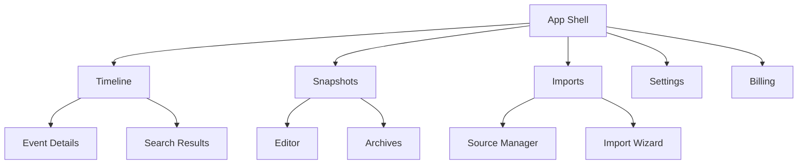

# DESIGN AND UX SPECIFICATION

Generated on: 2026-01-30T16:22:34.949Z

---

## FILE: docs/02_DESIGN/CONTENT_STYLE_GUIDE.md

# Content Style Guide

Voice, tone, and grammar rules for the Memoir.ai interface.

## 1. The Voice: "The Sage Observer"
The UI should sound empathetic but objective. Avoid overly "Chipper" or "Corporate" language.

- **DO**: "Your vault is ready for exploration."
- **DON'T**: "Yay! You're all set to go!"

## 2. Key Terminology
- **Vault**: The local, encrypted storage unit. (Capitalize as proper noun).
- **Snapshot**: A generated AI narrative.
- **Evidence**: Raw messages or photos used to support a claim.
- **Timeline**: The scrollable unified feed.

## 3. Error Message Guidelines
Errors should follow the **Nebula-Response** pattern:
1. State what happened (Neutral).
2. Explain the impact.
3. Provide a clear "Next Step".

## 4. Formatting
- Use **Title Case** for primary navigation items.
- Use **Sentence case** for descriptions and body text.


---

## FILE: docs/02_DESIGN/DESIGN_SYSTEM/COLOR_SYSTEM.md

# Color System

The "Nebula" palette. Emphasizing depth, luminosity, and high contrast.

## 1. Primary Palette
- **Obsidian (Base)**: `#050505` - Main background.
- **Star-Violet**: `#8B5CF6` - Primary action color.
- **Nebula-Cyan**: `#06B6D4` - Secondary/Teal accent.
- **Supernova-Magenta**: `#D946EF` - Highlights and alerts.

## 2. Dynamic States
- **Hover**: 20% increased luminosity of the base accent.
- **Active**: 10% decreased luminosity + subtle bloom effect.

## 3. UI Backgrounds
- **Glass-Base**: `rgba(255, 255, 255, 0.03)` with `backdrop-filter: blur(20px)`.
- **Frost-Edge**: `rgba(255, 255, 255, 0.1)` border.


---

## FILE: docs/02_DESIGN/DESIGN_SYSTEM/COMPONENT_INVENTORY.md

# Component Inventory — Memoir.ai V1

This document lists the core UI components required for Memoir.ai V1, as specified in the Product Requirements and Build Spec.

## 1. Foundation Components

### Button
*   **Variants**: Primary, Secondary, Ghost, Destructive.
*   **States**: Default, Hover, Active, Disabled, Loading.
*   **Usage**: Primary actions like "Generate Snapshot" or "Import Data".

### Modal
*   **Props**: `title`, `children`, `onClose`, `isOpen`.
*   **Usage**: Import wizards, confirmation dialogs (Library deletion), and settings.

### ProgressBar
*   **Props**: `percentage`, `status` (pending, running, complete, failed).
*   **Usage**: Visualizing the progress of background import/export jobs.

## 2. Business Components

### TimelineItem
*   **Props**: `timestamp`, `source_icon`, `content_snippet`.
*   **Aesthetic**: High information density, easy for scanning large datasets.

### TimelineGroup
*   **Props**: `date`, `children` (TimelineItems).
*   **Logic**: Groups memories by date (e.g., "Mondy, Jan 26").

### CitationComponent
*   **Props**: `citation_id`, `source_memory_id`, `text`.
*   **Aesthetic**: Non-intrusive "pill" or numbered marker within a Snapshot.
*   **Interaction**: Click to scroll/jump to the source memory in the timeline.

## 3. Navigation & Search

### Global Search Bar
*   **Features**: Real-time filtering, syntax support (source:messenger), and date range pickers.
*   **Placement**: Historically fixed at the top of the Library workspace.

### Sidebar
*   **Sections**: Library switcher, Timeline, Search, Snapshots, Settings.


---

## FILE: docs/02_DESIGN/DESIGN_SYSTEM/DESIGN_PRINCIPLES.md

# Design Principles

1. **Local-First, Zero-Exfiltration**: The UI must never leak data status to the cloud without intent.
2. **Cinematic Immersion**: Use motion and depth (z-layers) to make the archival process feel like discovery, not homework.
3. **Typography as Structure**: Minimize lines; use whitespace and weight hierarchy to define zones.
4. **The "Evidence First" Rule**: No AI generated content should be shown without its citation "Anchor" visible or reachable.


---

## FILE: docs/02_DESIGN/DESIGN_SYSTEM/ICONOGRAPHY.md

# Iconography

Icons in Memoir.ai serve as **navigational beacons** in the void. They must be precise, lightweight, and clear.

## 1. Style Guide

*   **Stroke-Based**: We use a clean stroke style (1.5px to 2px). No solid fills unless representing a toggled state or a specific brand asset.
*   **Geometry**: Icons should feel "engineered." Perfect circles, straight lines, distinct corners.
*   **Open Contours**: Avoid heavy, closed shapes. The icons should feel like they are made of light (neon tubes).

## 2. Recommended Set

We use **Lucide React** (or Heroicons Outline) as the standard library.

*   **Consistency**: Adhere to the standard SVG stroke width.
*   **Corners**: Rounded joins (`stroke-linejoin="round"`) match the UI's border radius.

## 3. Sizing

| Token | Size | Usage |
| :--- | :--- | :--- |
| **Small** | 16px | Inside dense buttons, meta-data rows, timestamps. |
| **Medium** | 20px | Navigation items, standard inputs, table actions. |
| **Large** | 24px | Section headers, empty states, major toggles. |

## 4. Color & State

*   **Neutral**: By default, icons inherit the text color (`currentColor` or `--ink-2`).
*   **Active/Glow**:
    *   Active navigation items often glow `--cyan`.
    *   Destructive actions glow `--danger`.
*   **Stroke**: Ensure `vector-effect: non-scaling-stroke` if resizing heavily (though we prefer swapping size variants).

## 5. Usage Examples

```jsx
/* DO */
<Icon name="search" size={20} color="var(--ink-2)" />

/* DON'T */
/* Filled icons for non-active states */
<Icon name="search-filled" /> 
```


---

## FILE: docs/02_DESIGN/DESIGN_SYSTEM/SPACING_ELEVATION.md

# Spacing & Elevation

Memoir.ai uses a fluid spacing system and a multi-layered glass elevation model to create depth in the void.

## 1. Spacing System

We do not use fixed pixels for structural padding. We use **Fluid Spacing Tokens** that adapt to the viewport width using `clamp()`. This ensures the interface never feels cramped on laptops or sparse on large monitors.

| Token | CSS Variable | Value Range (approx) | Usage |
| :--- | :--- | :--- | :--- |
| **Small** | `--pad-sm` | `10px` | Internal component padding (buttons, inputs). |
| **Medium** | `--pad-md` | `16px` | Standard gap between small elements. |
| **Large** | `--pad-lg` | `16px - 24px` | Card padding, section gaps. |
| **Extra Large** | `--pad-xl` | `20px - 32px` | Page margins, major section breaks. |

### The Grid
While fluid, we align to a **4px baseline grid** where possible.
*   Elements are spaced by `4px`, `8px`, `16px`, `24px`, `32px`, `48px`, `64px`.

## 2. Elevation & Depth

In the "Cosmic Glass" aesthetic, elevation is defined by **opacity** and **blur**, not just shadow.

### Layer 0: The Void
*   **Variable**: `--bg-0`
*   **Use**: The infinite background. Never place content directly here; use a panel.

### Layer 1: Base Panel
*   **Variable**: `--panel` (`rgba(27, 16, 61, 0.45)`)
*   **Use**: Sidebar, large background containers.
*   **Effect**: Low opacity, high blur. Recedes behind content.

### Layer 2: Standard Glass
*   **Variable**: `--panel-2` (`rgba(19, 12, 46, 0.55)`)
*   **Use**: Cards, feed items, tiles.
*   **Effect**: Medium opacity, medium blur. The distinct "objects" in the space.

### Layer 3: Floating / Hard Glass
*   **Variable**: `--panel-3` (`rgba(12, 8, 32, 0.75)`)
*   **Use**: Modals, dropdowns, sticky headers.
*   **Effect**: High opacity, crisp border, bright specular highlight.

## 3. Shadows

Shadows represent the light cast by the UI elements.

*   **`--shadow-lg`**: Deep, ambient shadow for floating elements.
    *   `0 24px 60px rgba(0,0,0,0.55)`
*   **`--shadow-glow`**: Neon diffusion for active states.
    *   `0 0 40px rgba(123, 97, 255, 0.15)`


---

## FILE: docs/02_DESIGN/DESIGN_SYSTEM/THEME.css

```css
/* theme.css — Memoir.ai “cosmic glass” design system
   One CSS file to rule many HTMLs (tragically useful).

   Goals:
   - Deep indigo/near-black base
   - Purple/violet glass panels with soft neon edges
   - Cyan → violet → magenta accent gradients
   - Consistent typography + spacing
   - Document-friendly + UI-friendly components
*/

/* ========== 0) Design Tokens ========== */
:root {
    /* Typography */
    --font-sans: ui-sans-serif, system-ui, -apple-system, "Segoe UI", Roboto, Helvetica, Arial;
    --font-mono: ui-monospace, SFMono-Regular, Menlo, Monaco, Consolas, "Liberation Mono", "Courier New";

    /* Core palette (pulled from your screenshots/icon palette) */
    --bg-0: #040313;
    /* near-black indigo */
    --bg-1: #070521;
    /* deep night */
    --bg-2: #0B0830;
    /* deep purple */
    --ink-0: #F5F3FF;
    /* near-white */
    --ink-1: rgba(245, 243, 255, .88);
    --ink-2: rgba(245, 243, 255, .68);
    --ink-3: rgba(245, 243, 255, .48);

    /* Surfaces (glass) */
    --panel: rgba(27, 16, 61, .45);
    --panel-2: rgba(19, 12, 46, .55);
    --panel-3: rgba(12, 8, 32, .70);

    /* Borders / separators */
    --stroke: rgba(210, 185, 255, .20);
    --stroke-2: rgba(210, 185, 255, .12);
    --hairline: rgba(255, 255, 255, .08);

    /* Neon accents */
    --violet: #7B61FF;
    --indigo: #4C3397;
    --blue: #6CB7FF;
    --cyan: #7FE7FF;
    --magenta: #FF4FD8;
    --pink: #F08BFF;

    /* Status */
    --ok: #3BE8C3;
    --warn: #FFB547;
    --danger: #FF5A6A;

    /* Effects */
    --shadow-lg: 0 24px 60px rgba(0, 0, 0, .55);
    --shadow-md: 0 14px 34px rgba(0, 0, 0, .45);
    --shadow-sm: 0 8px 18px rgba(0, 0, 0, .35);

    --blur: 18px;
    --radius-lg: 18px;
    --radius-md: 14px;
    --radius-sm: 12px;

    --pad-xl: 28px;
    --pad-lg: 22px;
    --pad-md: 16px;
    --pad-sm: 12px;

    --page-max: 980px;

    /* Gradients */
    --grad-accent: linear-gradient(90deg, rgba(127, 231, 255, .85), rgba(123, 97, 255, .85), rgba(255, 79, 216, .85));
    --grad-accent-soft: linear-gradient(90deg, rgba(127, 231, 255, .22), rgba(123, 97, 255, .22), rgba(255, 79, 216, .22));
    --grad-surface: linear-gradient(180deg, rgba(255, 255, 255, .08), rgba(255, 255, 255, .02));
    --grad-edge: linear-gradient(180deg, rgba(255, 255, 255, .18), rgba(255, 255, 255, .02));

    color-scheme: dark;
}

/* ========== 1) Base Reset ========== */
* {
    box-sizing: border-box;
}

html,
body {
    height: 100%;
}

body {
    margin: 0;
    font-family: var(--font-sans);
    line-height: 1.55;
    color: var(--ink-1);
    background:
        radial-gradient(1200px 700px at 75% 25%, rgba(255, 79, 216, .14), transparent 60%),
        radial-gradient(900px 600px at 15% 70%, rgba(127, 231, 255, .10), transparent 55%),
        radial-gradient(1100px 800px at 50% 50%, rgba(123, 97, 255, .14), transparent 60%),
        linear-gradient(180deg, var(--bg-0), var(--bg-1) 50%, var(--bg-2));
    -webkit-font-smoothing: antialiased;
    -moz-osx-font-smoothing: grayscale;
}

img {
    max-width: 100%;
    height: auto;
}

a {
    color: inherit;
    text-decoration: none;
}

a:hover {
    text-decoration: underline;
    text-decoration-color: rgba(255, 255, 255, .25);
}

code,
pre {
    font-family: var(--font-mono);
}

::selection {
    background: rgba(123, 97, 255, .35);
    color: var(--ink-0);
}

hr {
    border: 0;
    height: 1px;
    background: linear-gradient(90deg, transparent, rgba(210, 185, 255, .25), transparent);
    margin: 18px 0;
}

/* ========== 2) Layout Helpers ========== */
.container {
    width: min(var(--page-max), calc(100% - 2*var(--pad-xl)));
    margin: 0 auto;
}

.stack {
    display: flex;
    flex-direction: column;
    gap: var(--pad-md);
}

.row {
    display: flex;
    gap: var(--pad-md);
    flex-wrap: wrap;
}

.center {
    display: grid;
    place-items: center;
}

.muted {
    color: var(--ink-2);
}

.small {
    font-size: 12px;
    color: var(--ink-2);
}

.kbd {
    font-family: var(--font-mono);
    font-size: 12px;
    padding: 2px 8px;
    border-radius: 10px;
    background: rgba(255, 255, 255, .06);
    border: 1px solid rgba(255, 255, 255, .10);
    color: var(--ink-1);
}

/* ========== 3) Glass Surfaces ========== */
.glass {
    background: var(--panel);
    border: 1px solid var(--stroke-2);
    border-radius: var(--radius-lg);
    box-shadow: var(--shadow-md);
    backdrop-filter: blur(var(--blur));
    -webkit-backdrop-filter: blur(var(--blur));
}

.glass.soft {
    background: var(--panel-2);
    border-color: rgba(210, 185, 255, .14);
    box-shadow: var(--shadow-sm);
}

.glass.hard {
    background: var(--panel-3);
    border-color: rgba(255, 255, 255, .10);
}

.glass.edge-glow {
    position: relative;
    overflow: hidden;
}

.glass.edge-glow::before {
    content: "";
    position: absolute;
    inset: 0;
    border-radius: inherit;
    padding: 1px;
    background: var(--grad-accent-soft);
    -webkit-mask:
        linear-gradient(#000 0 0) content-box,
        linear-gradient(#000 0 0);
    -webkit-mask-composite: xor;
    mask-composite: exclude;
    opacity: .85;
    pointer-events: none;
}

.glass.edge-glow::after {
    content: "";
    position: absolute;
    inset: -40px -60px auto auto;
    width: 220px;
    height: 140px;
    background: radial-gradient(circle at 30% 30%, rgba(255, 79, 216, .22), transparent 70%);
    filter: blur(10px);
    opacity: .8;
    pointer-events: none;
}

/* ========== 4) App Shell (matches your UI screenshots) ========== */
.app {
    min-height: 100vh;
    display: grid;
    grid-template-columns: 260px 1fr;
    gap: var(--pad-lg);
    padding: var(--pad-xl);
}

.sidebar {
    padding: var(--pad-lg);
    border-radius: var(--radius-lg);
}

.sidebar.glass {
    background: rgba(16, 10, 40, .55);
}

.brand {
    display: flex;
    align-items: center;
    gap: 12px;
    padding: 8px 6px 18px;
}

.brand .logo {
    width: 34px;
    height: 34px;
    border-radius: 12px;
    background: var(--grad-accent);
    box-shadow: 0 10px 26px rgba(123, 97, 255, .28);
}

.brand .name {
    font-weight: 650;
    letter-spacing: .2px;
    color: var(--ink-0);
}

.nav {
    display: flex;
    flex-direction: column;
    gap: 6px;
    padding-top: 8px;
}

.nav a {
    display: flex;
    align-items: center;
    gap: 10px;
    padding: 10px 12px;
    border-radius: 12px;
    color: var(--ink-2);
    border: 1px solid transparent;
    background: transparent;
}

.nav a:hover {
    color: var(--ink-0);
    background: rgba(255, 255, 255, .04);
    border-color: rgba(255, 255, 255, .08);
}

.nav a.active {
    color: var(--ink-0);
    background: rgba(123, 97, 255, .14);
    border-color: rgba(123, 97, 255, .25);
    box-shadow: 0 10px 26px rgba(123, 97, 255, .12);
}

.nav .icon {
    width: 18px;
    height: 18px;
    opacity: .9;
}

.main {
    display: flex;
    flex-direction: column;
    gap: var(--pad-lg);
    min-width: 0;
}

.topbar {
    padding: 14px 16px;
    border-radius: var(--radius-lg);
    display: flex;
    align-items: center;
    gap: 12px;
    justify-content: space-between;
}

.search {
    flex: 1;
    max-width: 520px;
}

/* ========== 5) Typography ========== */
h1,
h2,
h3 {
    margin: 0;
    color: var(--ink-0);
    letter-spacing: .2px;
}

h1 {
    font-size: 30px;
    font-weight: 720;
}

h2 {
    font-size: 18px;
    font-weight: 680;
}

h3 {
    font-size: 15px;
    font-weight: 650;
}

p {
    margin: 0;
    color: var(--ink-1);
}

.lede {
    color: var(--ink-2);
    max-width: 72ch;
}

/* ========== 6) Buttons ========== */
.btn {
    appearance: none;
    border: 1px solid rgba(255, 255, 255, .12);
    background: rgba(255, 255, 255, .06);
    color: var(--ink-0);
    padding: 10px 14px;
    border-radius: 12px;
    font-weight: 600;
    letter-spacing: .2px;
    cursor: pointer;
    box-shadow: 0 10px 22px rgba(0, 0, 0, .22);
    backdrop-filter: blur(10px);
    -webkit-backdrop-filter: blur(10px);
    transition: transform .12s ease, border-color .12s ease, background .12s ease, box-shadow .12s ease;
}

.btn:hover {
    background: rgba(255, 255, 255, .08);
    border-color: rgba(210, 185, 255, .22);
    box-shadow: 0 14px 30px rgba(0, 0, 0, .30);
}

.btn:active {
    transform: translateY(1px);
}

.btn.primary {
    border-color: rgba(123, 97, 255, .35);
    background: linear-gradient(90deg, rgba(123, 97, 255, .38), rgba(255, 79, 216, .28));
}

.btn.primary:hover {
    border-color: rgba(255, 255, 255, .18);
    background: linear-gradient(90deg, rgba(127, 231, 255, .22), rgba(123, 97, 255, .45), rgba(255, 79, 216, .34));
}

.btn.ghost {
    background: transparent;
    border-color: rgba(255, 255, 255, .10);
    box-shadow: none;
}

.btn.ghost:hover {
    background: rgba(255, 255, 255, .05);
    box-shadow: 0 10px 22px rgba(0, 0, 0, .18);
}

.btn.sm {
    padding: 8px 12px;
    border-radius: 11px;
    font-size: 13px;
}

.btn.lg {
    padding: 12px 16px;
    border-radius: 14px;
}

/* ========== 7) Inputs ========== */
.input,
input[type="text"],
input[type="search"],
input[type="email"],
input[type="password"],
textarea,
select {
    width: 100%;
    padding: 10px 12px;
    border-radius: 12px;
    border: 1px solid rgba(255, 255, 255, .12);
    background: rgba(255, 255, 255, .05);
    color: var(--ink-0);
    outline: none;
    box-shadow: inset 0 1px 0 rgba(255, 255, 255, .06);
}

input::placeholder,
textarea::placeholder {
    color: rgba(245, 243, 255, .45);
}

.input:focus,
input:focus,
textarea:focus,
select:focus {
    border-color: rgba(127, 231, 255, .30);
    box-shadow:
        0 0 0 3px rgba(123, 97, 255, .18),
        inset 0 1px 0 rgba(255, 255, 255, .06);
}

/* ========== 8) Cards / Tiles (Import grid look) ========== */
.grid {
    display: grid;
    gap: var(--pad-md);
}

.grid.cols-3 {
    grid-template-columns: repeat(3, minmax(0, 1fr));
}

.grid.cols-2 {
    grid-template-columns: repeat(2, minmax(0, 1fr));
}

.tile {
    border-radius: var(--radius-lg);
    padding: 18px;
    border: 1px solid rgba(255, 255, 255, .10);
    background: rgba(255, 255, 255, .04);
    box-shadow: var(--shadow-sm);
    backdrop-filter: blur(var(--blur));
    -webkit-backdrop-filter: blur(var(--blur));
    min-height: 110px;
    display: flex;
    align-items: center;
    justify-content: center;
    text-align: center;
    position: relative;
    overflow: hidden;
    transition: border-color .12s ease, background .12s ease, transform .12s ease, box-shadow .12s ease;
}

.tile:hover {
    border-color: rgba(255, 79, 216, .22);
    background: rgba(255, 255, 255, .05);
    box-shadow: 0 18px 44px rgba(0, 0, 0, .38);
    transform: translateY(-1px);
}

.tile.selected {
    border-color: rgba(255, 79, 216, .32);
    box-shadow: 0 0 0 3px rgba(255, 79, 216, .14), 0 18px 44px rgba(0, 0, 0, .42);
}

.tile::after {
    content: "";
    position: absolute;
    inset: auto -80px -90px auto;
    width: 260px;
    height: 200px;
    background: radial-gradient(circle at 30% 30%, rgba(127, 231, 255, .16), transparent 70%);
    filter: blur(10px);
    opacity: .8;
    pointer-events: none;
}

.tile .tile-title {
    font-weight: 650;
    color: var(--ink-0);
}

.tile .tile-sub {
    font-size: 12px;
    color: var(--ink-2);
}

/* ========== 9) Tables (Import mapping look) ========== */
.table-wrap {
    border-radius: var(--radius-lg);
    overflow: hidden;
    border: 1px solid rgba(255, 255, 255, .10);
    background: rgba(255, 255, 255, .03);
    backdrop-filter: blur(var(--blur));
    -webkit-backdrop-filter: blur(var(--blur));
}

table {
    width: 100%;
    border-collapse: collapse;
}

th,
td {
    text-align: left;
    padding: 12px 14px;
    border-bottom: 1px solid rgba(255, 255, 255, .08);
    color: var(--ink-1);
    vertical-align: top;
}

th {
    font-size: 12px;
    letter-spacing: .24px;
    text-transform: uppercase;
    color: rgba(245, 243, 255, .72);
    background: rgba(123, 97, 255, .10);
}

tr:nth-child(even) td {
    background: rgba(255, 255, 255, .02);
}

tr:hover td {
    background: rgba(255, 255, 255, .04);
}

/* ========== 10) Callouts ========== */
.callout {
    border-radius: var(--radius-md);
    padding: 12px 14px;
    border: 1px solid rgba(255, 255, 255, .12);
    background: rgba(255, 255, 255, .04);
}

.callout strong {
    color: var(--ink-0);
}

.callout.info {
    border-color: rgba(123, 97, 255, .24);
    background: rgba(123, 97, 255, .10);
}

.callout.ok {
    border-color: rgba(59, 232, 195, .26);
    background: rgba(59, 232, 195, .10);
}

.callout.warn {
    border-color: rgba(255, 181, 71, .28);
    background: rgba(255, 181, 71, .10);
}

.callout.danger {
    border-color: rgba(255, 90, 106, .28);
    background: rgba(255, 90, 106, .10);
}

/* ========== 11) Document Layout (formal docs) ========== */
.page {
    width: min(var(--page-max), calc(100% - 2*var(--pad-xl)));
    margin: 0 auto;
    padding: var(--pad-xl) 0;
}

.doc {
    padding: var(--pad-xl);
    border-radius: var(--radius-lg);
}

.doc.glass {
    background: rgba(16, 10, 40, .52);
}

.doc-header {
    padding-bottom: 16px;
    margin-bottom: 18px;
    border-bottom: 1px solid rgba(255, 255, 255, .10);
    position: relative;
}

.doc-header::after {
    content: "";
    position: absolute;
    left: 0;
    right: 0;
    bottom: -1px;
    height: 1px;
    background: var(--grad-accent-soft);
    opacity: .9;
}

.doc-title {
    font-size: 30px;
    font-weight: 760;
    margin: 0 0 6px 0;
    color: var(--ink-0);
}

.doc-subtitle {
    margin: 0;
    color: var(--ink-2);
    max-width: 80ch;
}

.doc-meta {
    display: flex;
    flex-wrap: wrap;
    gap: 10px 14px;
    margin-top: 14px;
    color: var(--ink-2);
    font-size: 13px;
}

.doc-meta .field {
    display: flex;
    gap: 8px;
    align-items: baseline;
    padding: 6px 10px;
    border-radius: 12px;
    border: 1px solid rgba(255, 255, 255, .10);
    background: rgba(255, 255, 255, .03);
}

.doc-meta .label {
    text-transform: uppercase;
    letter-spacing: .22px;
    font-size: 11px;
    color: rgba(245, 243, 255, .60);
}

.section {
    margin-top: 18px;
    padding: 16px 16px;
    border-radius: var(--radius-lg);
    border: 1px solid rgba(255, 255, 255, .10);
    background: rgba(255, 255, 255, .03);
}

.section-title {
    margin: 0 0 10px 0;
    font-size: 18px;
    font-weight: 720;
}

.section-title .n {
    color: rgba(127, 231, 255, .85);
    margin-right: 8px;
}

ul,
ol {
    margin: 10px 0 0 20px;
    padding: 0;
}

li {
    margin: 6px 0;
    color: var(--ink-1);
}

blockquote {
    margin: 12px 0 0;
    padding: 12px 14px;
    border-left: 3px solid rgba(123, 97, 255, .45);
    background: rgba(123, 97, 255, .08);
    border-radius: 12px;
    color: var(--ink-1);
}

pre {
    margin: 12px 0 0;
    padding: 12px 14px;
    border-radius: 14px;
    border: 1px solid rgba(255, 255, 255, .10);
    background: rgba(0, 0, 0, .25);
    overflow: auto;
    color: rgba(245, 243, 255, .92);
}

code {
    padding: 2px 6px;
    border-radius: 10px;
    background: rgba(0, 0, 0, .22);
    border: 1px solid rgba(255, 255, 255, .08);
    color: rgba(245, 243, 255, .92);
}

.doc-footer {
    margin-top: 18px;
    padding-top: 14px;
    border-top: 1px solid rgba(255, 255, 255, .10);
    color: var(--ink-3);
    font-size: 12px;
}

/* ========== 12) Responsive ========== */
@media (max-width: 980px) {
    .app {
        grid-template-columns: 1fr;
    }

    .grid.cols-3 {
        grid-template-columns: repeat(2, minmax(0, 1fr));
    }
}

@media (max-width: 640px) {

    .grid.cols-3,
    .grid.cols-2 {
        grid-template-columns: 1fr;
    }

    .page {
        width: calc(100% - 2*var(--pad-md));
    }

    .doc {
        padding: var(--pad-lg);
    }
}

/* ========== 13) Print (docs shouldn’t print like a nightclub) ========== */
@media print {
    :root {
        color-scheme: light;
    }

    body {
        background: #FFFFFF !important;
        color: #111827 !important;
    }

    .glass,
    .doc,
    .section,
    .tile,
    .table-wrap,
    .topbar,
    .sidebar {
        background: #FFFFFF !important;
        border-color: #E5E7EB !important;
        box-shadow: none !important;
        backdrop-filter: none !important;
        -webkit-backdrop-filter: none !important;
        color: #111827 !important;
    }

    .muted,
    .small,
    .doc-subtitle,
    .doc-footer {
        color: #374151 !important;
    }

    a {
        text-decoration: underline;
        color: #111827 !important;
    }

    .btn {
        display: none !important;
    }
}

/* ========== 14) Timeline / Feed Components (matches your UI screenshots) ========== */

.timeline {
    display: flex;
    flex-direction: column;
    gap: 12px;
}

.day-divider {
    display: flex;
    align-items: baseline;
    gap: 12px;
    margin: 6px 0 2px;
    color: var(--ink-0);
}

.day-divider .date {
    font-weight: 720;
    letter-spacing: .2px;
}

.day-divider .count {
    font-size: 12px;
    color: var(--ink-3);
}

.feed-card {
    position: relative;
    padding: 14px 14px;
    border-radius: var(--radius-lg);
    border: 1px solid rgba(255, 255, 255, .10);
    background: rgba(255, 255, 255, .03);
    box-shadow: var(--shadow-sm);
    backdrop-filter: blur(var(--blur));
    -webkit-backdrop-filter: blur(var(--blur));
    overflow: hidden;
    display: flex;
    gap: 12px;
    align-items: flex-start;
    min-width: 0;
}

.feed-card:hover {
    border-color: rgba(210, 185, 255, .18);
    background: rgba(255, 255, 255, .04);
}

.feed-card::after {
    content: "";
    position: absolute;
    inset: auto -120px -120px auto;
    width: 320px;
    height: 260px;
    background: radial-gradient(circle at 30% 30%, rgba(255, 79, 216, .14), transparent 70%);
    filter: blur(10px);
    opacity: .7;
    pointer-events: none;
}

.source-badge {
    flex: 0 0 auto;
    width: 38px;
    height: 38px;
    border-radius: 14px;
    border: 1px solid rgba(255, 255, 255, .12);
    background: rgba(255, 255, 255, .05);
    box-shadow: 0 10px 22px rgba(0, 0, 0, .22);
    display: grid;
    place-items: center;
}

.feed-body {
    min-width: 0;
    flex: 1;
}

.feed-top {
    display: flex;
    align-items: center;
    justify-content: space-between;
    gap: 12px;
    margin-bottom: 6px;
}

.feed-title {
    font-weight: 700;
    color: var(--ink-0);
    font-size: 14px;
}

.feed-time {
    font-size: 12px;
    color: var(--ink-3);
    white-space: nowrap;
}

.feed-text {
    color: var(--ink-1);
    font-size: 14px;
    overflow: hidden;
    text-overflow: ellipsis;
    display: -webkit-box;
    -webkit-line-clamp: 3;
    -webkit-box-orient: vertical;
}

/* little “chip row” like your provenance pills */
.pills {
    display: flex;
    flex-wrap: wrap;
    gap: 8px;
    margin-top: 10px;
}

.pill {
    display: inline-flex;
    align-items: center;
    gap: 8px;
    padding: 6px 10px;
    border-radius: 999px;
    border: 1px solid rgba(255, 255, 255, .10);
    background: rgba(255, 255, 255, .03);
    color: var(--ink-2);
    font-size: 12px;
}

.pill .dot {
    width: 8px;
    height: 8px;
    border-radius: 999px;
    background: rgba(255, 255, 255, .22);
}

.pill.accent {
    border-color: rgba(123, 97, 255, .25);
    background: rgba(123, 97, 255, .10);
    color: rgba(245, 243, 255, .86);
}

.pill.accent .dot {
    background: rgba(127, 231, 255, .70);
}

.pill.magenta .dot {
    background: rgba(255, 79, 216, .72);
}

.pill.cyan .dot {
    background: rgba(127, 231, 255, .72);
}

/* ========== 15) Two-Panel Layout (Timeline + Right rail like Snapshots/Provenance) ========== */

.split {
    display: grid;
    grid-template-columns: 1fr 360px;
    gap: var(--pad-lg);
    min-width: 0;
}

.rail {
    display: flex;
    flex-direction: column;
    gap: var(--pad-md);
    min-width: 0;
}

.panel {
    border-radius: var(--radius-lg);
    border: 1px solid rgba(255, 255, 255, .10);
    background: rgba(255, 255, 255, .03);
    box-shadow: var(--shadow-sm);
    backdrop-filter: blur(var(--blur));
    -webkit-backdrop-filter: blur(var(--blur));
    padding: 14px 14px;
    overflow: hidden;
}

.panel-title {
    display: flex;
    align-items: center;
    justify-content: space-between;
    gap: 12px;
    margin-bottom: 12px;
}

.panel-title h2 {
    font-size: 16px;
    font-weight: 740;
}

/* Snapshot preview cards (right rail) */
.snapshot-card {
    border-radius: 16px;
    border: 1px solid rgba(255, 255, 255, .10);
    background: rgba(255, 255, 255, .03);
    overflow: hidden;
}

.snapshot-card .thumb {
    height: 120px;
    background:
        linear-gradient(180deg, rgba(255, 255, 255, .07), rgba(255, 255, 255, .02)),
        radial-gradient(360px 180px at 75% 25%, rgba(255, 79, 216, .18), transparent 60%),
        radial-gradient(340px 170px at 15% 70%, rgba(127, 231, 255, .12), transparent 60%);
    border-bottom: 1px solid rgba(255, 255, 255, .08);
}

.snapshot-card .meta {
    padding: 10px 12px;
    color: var(--ink-2);
    font-size: 12px;
}

/* ========== 16) Progress + Loading (calm, premium) ========== */

.progress {
    width: 100%;
    height: 6px;
    border-radius: 999px;
    background: rgba(255, 255, 255, .06);
    border: 1px solid rgba(255, 255, 255, .10);
    overflow: hidden;
}

.progress>span {
    display: block;
    height: 100%;
    width: var(--progress, 40%);
    border-radius: 999px;
    background: var(--grad-accent);
    box-shadow: 0 0 0 2px rgba(0, 0, 0, .15) inset, 0 10px 26px rgba(123, 97, 255, .18);
}

.loading-dots {
    display: inline-flex;
    gap: 6px;
    align-items: center;
}

.loading-dots span {
    width: 6px;
    height: 6px;
    border-radius: 999px;
    background: rgba(245, 243, 255, .38);
    animation: pulse 1.25s infinite ease-in-out;
}

.loading-dots span:nth-child(2) {
    animation-delay: .15s;
}

.loading-dots span:nth-child(3) {
    animation-delay: .30s;
}

@keyframes pulse {

    0%,
    100% {
        transform: translateY(0);
        opacity: .45;
    }

    50% {
        transform: translateY(-2px);
        opacity: .95;
    }
}

/* ========== 17) Modal / Dialog (for imports, mapping, confirmations) ========== */

.backdrop {
    position: fixed;
    inset: 0;
    background: rgba(2, 1, 12, .65);
    backdrop-filter: blur(10px);
    -webkit-backdrop-filter: blur(10px);
    display: grid;
    place-items: center;
    padding: 20px;
    z-index: 50;
}

.modal {
    width: min(720px, 100%);
    border-radius: 20px;
    border: 1px solid rgba(255, 255, 255, .12);
    background: rgba(16, 10, 40, .70);
    box-shadow: var(--shadow-lg);
    backdrop-filter: blur(22px);
    -webkit-backdrop-filter: blur(22px);
    overflow: hidden;
}

.modal-header {
    padding: 16px 18px;
    border-bottom: 1px solid rgba(255, 255, 255, .10);
    display: flex;
    align-items: center;
    justify-content: space-between;
    gap: 12px;
}

.modal-title {
    font-weight: 760;
    color: var(--ink-0);
}

.modal-body {
    padding: 16px 18px;
}

.modal-footer {
    padding: 14px 18px;
    border-top: 1px solid rgba(255, 255, 255, .10);
    display: flex;
    justify-content: flex-end;
    gap: 10px;
}

/* ========== 18) Subtle “Cosmic Dust” Background Layer (optional utility) ========== */

.cosmic {
    position: relative;
    overflow: hidden;
}

.cosmic::before {
    content: "";
    position: absolute;
    inset: -120px;
    background:
        radial-gradient(circle at 20% 30%, rgba(255, 255, 255, .08) 0 1px, transparent 2px) 0 0/ 90px 90px,
        radial-gradient(circle at 70% 60%, rgba(255, 255, 255, .06) 0 1px, transparent 2px) 0 0/ 120px 120px;
    opacity: .35;
    filter: blur(.2px);
    pointer-events: none;
}

.cosmic::after {
    content: "";
    position: absolute;
    inset: -140px;
    background:
        radial-gradient(900px 420px at 75% 35%, rgba(255, 79, 216, .12), transparent 65%),
        radial-gradient(820px 520px at 15% 70%, rgba(127, 231, 255, .08), transparent 65%);
    opacity: .7;
    pointer-events: none;
}

/* ========== 19) Responsive for Split ========== */
@media (max-width: 980px) {
    .split {
        grid-template-columns: 1fr;
    }

    .rail {
        order: 2;
    }
}

/* ========== 20) Icons / Avatars / Badges ========== */

.avatar {
    width: 34px;
    height: 34px;
    border-radius: 999px;
    border: 1px solid rgba(255, 255, 255, .14);
    background:
        radial-gradient(circle at 30% 30%, rgba(127, 231, 255, .30), transparent 60%),
        radial-gradient(circle at 70% 40%, rgba(255, 79, 216, .22), transparent 62%),
        rgba(255, 255, 255, .04);
    box-shadow: 0 12px 26px rgba(0, 0, 0, .25);
    display: grid;
    place-items: center;
    color: var(--ink-0);
    font-weight: 750;
    letter-spacing: .4px;
    font-size: 12px;
}

.badge {
    display: inline-flex;
    align-items: center;
    gap: 8px;
    padding: 6px 10px;
    border-radius: 999px;
    border: 1px solid rgba(255, 255, 255, .12);
    background: rgba(255, 255, 255, .04);
    color: var(--ink-1);
    font-size: 12px;
}

.badge .dot {
    width: 8px;
    height: 8px;
    border-radius: 999px;
    background: rgba(255, 255, 255, .22);
}

.badge.accent {
    border-color: rgba(123, 97, 255, .25);
    background: rgba(123, 97, 255, .12);
}

.badge.accent .dot {
    background: rgba(127, 231, 255, .75);
}

.badge.ok {
    border-color: rgba(59, 232, 195, .25);
    background: rgba(59, 232, 195, .10);
}

.badge.ok .dot {
    background: rgba(59, 232, 195, .75);
}

.badge.warn {
    border-color: rgba(255, 181, 71, .26);
    background: rgba(255, 181, 71, .10);
}

.badge.warn .dot {
    background: rgba(255, 181, 71, .78);
}

.badge.danger {
    border-color: rgba(255, 90, 106, .26);
    background: rgba(255, 90, 106, .10);
}

.badge.danger .dot {
    background: rgba(255, 90, 106, .78);
}

/* Tiny icon button (top-right controls) */
.icon-btn {
    width: 34px;
    height: 34px;
    border-radius: 12px;
    border: 1px solid rgba(255, 255, 255, .12);
    background: rgba(255, 255, 255, .04);
    color: rgba(245, 243, 255, .82);
    display: grid;
    place-items: center;
    cursor: pointer;
    transition: background .12s ease, border-color .12s ease, transform .12s ease;
}

.icon-btn:hover {
    background: rgba(255, 255, 255, .06);
    border-color: rgba(210, 185, 255, .18);
}

.icon-btn:active {
    transform: translateY(1px);
}

/* ========== 21) Tabs / Segmented Controls ========== */

.tabs {
    display: flex;
    gap: 8px;
    padding: 6px;
    border-radius: 16px;
    border: 1px solid rgba(255, 255, 255, .10);
    background: rgba(255, 255, 255, .03);
    backdrop-filter: blur(14px);
    -webkit-backdrop-filter: blur(14px);
    width: fit-content;
}

.tab {
    padding: 8px 12px;
    border-radius: 12px;
    border: 1px solid transparent;
    background: transparent;
    color: var(--ink-2);
    font-weight: 650;
    cursor: pointer;
}

.tab:hover {
    color: var(--ink-0);
    background: rgba(255, 255, 255, .04);
    border-color: rgba(255, 255, 255, .08);
}

.tab.active {
    color: var(--ink-0);
    background: rgba(123, 97, 255, .16);
    border-color: rgba(123, 97, 255, .26);
    box-shadow: 0 10px 22px rgba(123, 97, 255, .12);
}

/* ========== 22) “Inspector” / Right Details Panel (Provenance / Related) ========== */

.inspector {
    display: flex;
    flex-direction: column;
    gap: 12px;
}

.kv {
    display: grid;
    grid-template-columns: 1fr;
    gap: 8px;
}

.kv-row {
    display: flex;
    align-items: center;
    justify-content: space-between;
    gap: 12px;
    padding: 10px 12px;
    border-radius: 14px;
    border: 1px solid rgba(255, 255, 255, .10);
    background: rgba(255, 255, 255, .03);
}

.kv-row .k {
    color: var(--ink-2);
    font-size: 13px;
}

.kv-row .v {
    color: var(--ink-0);
    font-weight: 650;
    font-size: 13px;
}

/* Related cards (like “janedoe123” preview) */
.related-card {
    display: flex;
    gap: 12px;
    align-items: flex-start;
    padding: 12px 12px;
    border-radius: 16px;
    border: 1px solid rgba(255, 255, 255, .10);
    background: rgba(255, 255, 255, .03);
}

.related-card .who {
    font-weight: 720;
    color: var(--ink-0);
    font-size: 13px;
}

.related-card .what {
    color: var(--ink-2);
    font-size: 12px;
    margin-top: 2px;
}

/* ========== 23) Checklist / Mapping UI (like import mapping) ========== */

.checklist {
    display: flex;
    flex-direction: column;
    gap: 10px;
}

.check {
    display: flex;
    align-items: center;
    gap: 10px;
    padding: 10px 12px;
    border-radius: 14px;
    border: 1px solid rgba(255, 255, 255, .10);
    background: rgba(255, 255, 255, .03);
}

.check input[type="checkbox"] {
    width: 16px;
    height: 16px;
    accent-color: var(--violet);
}

.check .label {
    color: var(--ink-1);
    font-weight: 650;
    font-size: 13px;
}

.check .hint {
    margin-left: auto;
    color: var(--ink-3);
    font-size: 12px;
}

/* Status banner “Parsing in progress…” */
.banner {
    padding: 12px 14px;
    border-radius: 16px;
    border: 1px solid rgba(255, 255, 255, .12);
    background: rgba(255, 255, 255, .04);
    display: flex;
    align-items: center;
    gap: 10px;
}

.banner .icon {
    width: 18px;
    height: 18px;
    border-radius: 8px;
    background: rgba(255, 255, 255, .06);
    border: 1px solid rgba(255, 255, 255, .10);
}

.banner .text {
    color: var(--ink-1);
    font-weight: 650;
}

.banner.progressing {
    border-color: rgba(255, 79, 216, .18);
    background: rgba(255, 79, 216, .08);
}

.banner.progressing .icon {
    background: rgba(255, 79, 216, .18);
    border-color: rgba(255, 79, 216, .22);
}

/* ========== 24) Toasts / Notifications ========== */

.toast-wrap {
    position: fixed;
    right: 18px;
    bottom: 18px;
    display: flex;
    flex-direction: column;
    gap: 10px;
    z-index: 60;
}

.toast {
    width: min(380px, calc(100vw - 36px));
    padding: 12px 14px;
    border-radius: 16px;
    border: 1px solid rgba(255, 255, 255, .12);
    background: rgba(16, 10, 40, .75);
    box-shadow: var(--shadow-lg);
    backdrop-filter: blur(18px);
    -webkit-backdrop-filter: blur(18px);
}

.toast .title {
    font-weight: 760;
    color: var(--ink-0);
    margin-bottom: 2px;
}

.toast .msg {
    color: var(--ink-2);
    font-size: 13px;
}

.toast.ok {
    border-color: rgba(59, 232, 195, .26);
}

.toast.warn {
    border-color: rgba(255, 181, 71, .26);
}

.toast.danger {
    border-color: rgba(255, 90, 106, .26);
}

/* ========== 25) Accessibility Tweaks (readability without ruining the vibe) ========== */

:focus-visible {
    outline: 2px solid rgba(127, 231, 255, .55);
    outline-offset: 3px;
    border-radius: 12px;
}

@media (prefers-reduced-motion: reduce) {
    * {
        animation-duration: .01ms !important;
        animation-iteration-count: 1 !important;
        transition-duration: .01ms !important;
        scroll-behavior: auto !important;
    }
}

/* ========== 26) Optional “Hero” Title Treatment (matches big center titles) ========== */

.hero {
    text-align: center;
    padding: 28px 18px;
}

.hero h1 {
    font-size: 34px;
    font-weight: 780;
    margin: 0 0 10px;
}

.hero .lede {
    margin: 0 auto;
    max-width: 74ch;
    color: rgba(245, 243, 255, .70);
}

.hero .rule {
    width: 220px;
    height: 2px;
    margin: 18px auto 0;
    border-radius: 999px;
    background: var(--grad-accent-soft);
}

/* ========== 27) Final responsive touches ========== */
@media (max-width: 860px) {
    .app {
        padding: var(--pad-lg);
        gap: var(--pad-md);
    }

    .topbar {
        flex-wrap: wrap;
    }

    .search {
        max-width: 100%;
    }
}
```

---

## FILE: docs/02_DESIGN/DESIGN_SYSTEM/TOKENS.md

# Design Tokens

This document serves as the master dictionary for the **Nebula** v2.0 design tokens. These tokens are implemented as CSS Custom Properties (`:root`) in `theme.css`.

## 1. Typography

| Token | CSS Variable | Value Reference |
| :--- | :--- | :--- |
| **Sans** | `--font-sans` | Inter, system-ui |
| **Mono** | `--font-mono` | JetBrains Mono, monospace |
| **Size XS** | `--text-xs` | 12-14px (Fluid) |
| **Size SM** | `--text-sm` | 14-16px (Fluid) |
| **Size Base** | `--text-base` | 16-18px (Fluid) |
| **Size LG** | `--text-lg` | 18-20px (Fluid) |
| **Size XL** | `--text-xl` | 20-24px (Fluid) |
| **Size 2XL** | `--text-2xl` | 24-32px (Fluid) |
| **Size 3XL** | `--text-3xl` | 30-40px (Fluid) |
| **Size 4XL** | `--text-4xl` | 36-48px (Fluid) |

## 2. Color Semantic Roles

*See `COLOR_SYSTEM.md` for detailed palettes.*

| Token | Role |
| :--- | :--- |
| `--ink-0` | High Emphasis Text (Headings) |
| `--ink-1` | Medium Emphasis Text (Body) |
| `--ink-2` | Low Emphasis Text (Muted) |
| `--ink-3` | Decorative Text (Subtle) |
| `--panel` | Base Layer (Sidebar, App Background) |
| `--panel-2` | Surface Layer (Cards) |
| `--panel-3` | Top Layer (Modals, Popovers) |
| `--stroke` | Border Color |
| `--hairline` | Subtle Inner Border |

## 3. Brand Accents

| Token | Color | Usage |
| :--- | :--- | :--- |
| `--violet` | Violet | Primary Action |
| `--cyan` | Cyan | Information, Focus |
| `--magenta` | Magenta | Creative, AI |
| `--ok` | Mint Green | Success |
| `--warn` | Amber | Warning |
| `--danger` | Red | Error/Destructive |

## 4. Geometry & Effects

### Radii
*   `--radius-sm`: 10px (Inner elements)
*   `--radius-md`: 14px (Buttons, Inputs)
*   `--radius-lg`: 20px (Cards, Modals)

### Blur
*   `--blur`: 24px (Standard backdrop blur)

### Shadows
*   `--shadow-lg`: Deep elevation shadow + inset highlight.
*   `--shadow-glow`: Colored diffusion.

### Animation Easings
*   `--ease-out`: General transitions.
*   `--ease-squish`: Button interactions.
*   `--ease-elastic`: Bouncy reveals.

## 5. Textures & Gradients
*   `--noise`: SVG Turbulence filter for texture.
*   `--grad-accent`: Cyan → Violet → Magenta.
*   `--grad-sheen`: Subtle glass reflection.


---

## FILE: docs/02_DESIGN/DESIGN_SYSTEM/TYPOGRAPHY.md

# Typography System

- **Headings**: `Outfit` (Geometric Sans) - Medium weight for H1-H3.
- **Body**: `Inter` (Standard Sans) - Regular for general copy.
- **Monospace**: `JetBrains Mono` - Used for Citation IDs and technical metadata.

## Sizing (Modular Scale 1.25)
- **H1**: 48px / 3rem
- **H2**: 36px / 2.25rem
- **H3**: 24px / 1.5rem
- **Body**: 16px / 1rem
- **Caption**: 12px / 0.75rem


---

## FILE: docs/02_DESIGN/IA/INFORMATION_ARCHITECTURE.md

# Information Architecture — Memoir.ai

The structural organization of the Memoir.ai local ecosystem.

## 1. Global Hierarchy
- **Library (Vault)**: The top-level container for all data and configuration.
    - **Timeline**: The chronological index of all `Events`.
    - **People**: The resolved entity graph of `Participants`.
    - **Drafts**: The library of `Narratives` and `Snapshots`.
    - **Sources**: The collection of `DataSources` and `ImportJobs`.

## 2. Logical Grouping
- **Core Experience**: Timeline, Search, Event View.
- **Intelligence Layer**: Generation, Verification, Relationship Analytics.
- **Data Management**: Ingestion, Validation, Storage, Export.
- **Commercials**: Subscriptions, Usage Metering, Billing.

## 3. IA Visual Map (High Level)



---

## FILE: docs/02_DESIGN/IA/NAV_MODEL.md

# Navigation Model — Memoir.ai

Defines how users move through the Memoir.ai application.

## 1. Primary Sidebar Navigation
- **Top 5 Priority Tabs**:
    1. **Home**: Dashboard overviews.
    2. **Timeline**: The master feed.
    3. **Snapshots**: Narrative creation.
    4. **Imports**: Data ingestion.
    5. **Settings**: Configuration.

## 2. Modal & Contextual Flows
- **Modal Overlays**: Used for destructive actions (Delete Vault), complex configuration (Import Wizard), and deep event inspection.
- **Inspectors**: Right-side drawers for metadata without losing timeline context.

## 3. Back-Navigation Strategy
- The app maintains a session-level history stack.
- Deep links (e.g., clicking a citation in a snapshot) push the timeline view to the stack, allowing a "Back" button to return the user to their writing.

## 4. Command Palette (`Cmd+K`)
- Quick access to all primary routes.
- Recent search history and specific friend profiles.


---

## FILE: docs/02_DESIGN/IA/ROUTES_MAP.md

# Routes Map — Memoir.ai

Internal application routing structure (React Router / Electron IPC).

## 1. Core Endpoints
- `/app/home`: Dashboard & Widgets.
- `/app/timeline`: Master Feed.
- `/app/timeline/event/:id`: Deep link to specific memory.
- `/app/snapshots`: Library of narratives.
- `/app/snapshots/new`: Wizard for generation.
- `/app/snapshots/edit/:id`: Detailed editor.
- `/app/imports`: Active & Past jobs.
- `/app/imports/wizard`: Multi-step ingestion flow.
- `/app/billing`: Plans & Payments.
- `/app/settings/:tab`: Tabbed config (vault, privacy, etc.).

## 2. Protected Routes
- All `/app/*` routes require an unlocked vault status.
- `/auth/login`: The lock screen.
- `/auth/onboarding`: Initial setup flow.

## 3. Deep Linking Parameters
- `?t=timestamp`: Scroll to specific time.
- `?q=query`: Pre-filled search state.
- `?source=id`: Filter results by specific source.


---

## FILE: docs/02_DESIGN/UX_SPECS/SCREEN_INDEX.md

# Screen Spec Index

Mapping all application states to their technical documentation.

| Screen | Spec Path | Status |
|---|---|---|
| **App Shell** | [APP_SHELL.md](file:///Users/owner/Desktop/Memoir.ai/docs/02_DESIGN/UX_SPECS/SCREEN_SPECS/APP_SHELL.md) | COMPLETE |
| **Auth** | [AUTH_LOGIN.md](file:///Users/owner/Desktop/Memoir.ai/docs/02_DESIGN/UX_SPECS/SCREEN_SPECS/AUTH_LOGIN.md) | COMPLETE |
| **Timeline** | [TIMELINE.md](file:///Users/owner/Desktop/Memoir.ai/docs/02_DESIGN/UX_SPECS/SCREEN_SPECS/TIMELINE.md) | COMPLETE |
| **Snapshots** | [SNAPSHOTS.md](file:///Users/owner/Desktop/Memoir.ai/docs/02_DESIGN/UX_SPECS/SCREEN_SPECS/SNAPSHOTS.md) | COMPLETE |
| **Billing** | [BILLING.md](file:///Users/owner/Desktop/Memoir.ai/docs/02_DESIGN/UX_SPECS/SCREEN_SPECS/BILLING.md) | COMPLETE |


---

## FILE: docs/02_DESIGN/UX_SPECS/SCREEN_SPECS/APP_SHELL.md

# Screen Spec: App Shell

The App Shell provides the persistent layout and navigation framework for Memoir.ai.

## 1. Layout Zones
- **Sidebar (Left)**: Primary navigation links (Timeline, Snapshots, Imports, Settings, Billing). Includes the vault status indicator.
- **Topbar**: Persistent search bar, active job progress indicator (Job Runner), and user profile/vault selector.
- **Main Content**: Dynamic area for screen-specific content.
- **Status Bar (Bottom)**: Local database health, last sync time, and "Offline-first" confirmation.

## 2. Interactive Components
- **Nav Links**: Active state highlighted with "Nebula" Glow (Cyan/Violet gradient).
- **Search Bar**: Expands on focus. Supports command palette triggers (`Cmd+K`).
- **Sync Badge**: Pulses during active background parsing.

## 3. Transitions
- Main content area uses a soft 200ms opacity fade between routes.
- Sidebar collapses/expands with a smooth width transition.

## 4. States
- **Locked**: Main content is blurred; persistent overlay for vault passphrase entry.
- **Processing**: Global progress bar appears at the top of the content area.


---

## FILE: docs/02_DESIGN/UX_SPECS/SCREEN_SPECS/AUTH_LOGIN.md

# Screen Spec: Auth Login

The primary gateway for unlocking an existing local vault.

## 1. Visual Design
- **Background**: Dark Nebula gradient (Violet to Deep Space Black).
- **Center Card**: Glassmorphic container with 20% opacity and subtle border glow.
- **Identity**: Large Memoir.ai logo with "Cinematic Precision" tagline.

## 2. Components
- **Vault Path Display**: Shows the location of the detected `.sqlite` file.
- **Passphrase Input**: Secure text entry with a "Nebula" focus ring.
- **Unlock Button**: Primary action. Glows stronger on hover.
- **"Forgot Passphrase" link**: Directs user to the "Lost Key" warning document.

## 3. Interaction
- On successful unlock, the card slides upward and fades out.
- On failure, a subtle vibration animation and a "Nebula Red" error message appear.

## 4. Error States
- **Invalid Key**: "Incorrect passphrase. Please try again or restore from backup."
- **Vault Missing**: "No vault found at this location. Connect or create one."


---

## FILE: docs/02_DESIGN/UX_SPECS/SCREEN_SPECS/AUTH_SIGNUP.md

# Screen Spec: Auth Signup (Vault Creation)

The onboarding flow for creating a new local-first library.

## 1. Visual Design
- **Progress Stepper**: Horizontal dots at the top (Philosophy -> Location -> Security -> Finish).
- **Nebula Accents**: Dynamic light beams that guide the eye to the primary action.

## 2. Components
- **Directory Picker**: Native OS folder selection button.
- **Passphrase Creation**: 
    - Input field with visibility toggle.
    - Strength meter (Weak/Moderate/Strong/Cinematic).
    - Confirmation field.
- **"Start Journey" Button**: Disabled until passphrase matches and meets "Strong" criteria.

## 3. User Guidance
- Inline alerts explaining that Memoir.ai cannot recover lost passwords.
- Privacy badges confirming "100% On-Device Processing".

## 4. States
- **Creating...**: Shimmering progress bar while folders and DB files are initialized.
- **Success**: Confetti-like Nebula particles and immediate transition to the Import Wizard.


---

## FILE: docs/02_DESIGN/UX_SPECS/SCREEN_SPECS/BILLING.md

# Screen Spec: Billing

Manage subscriptions, payment methods, and usage limits with premium cinematic clarity.

## 1. Primary Components
- **Plan Summary Card**: A glassmorphic panel showing the current active tier (Free/Pro/Cinematic).
- **Stripe Pricing Table**: Three-column view (Solo, Pro, Team - as per market spec) with feature comparisons.
- **Usage Metrics**: Radial charts showing AI snapshot tokens consumed and storage used.
- **Invoice History**: A clean list with Download PDF actions.

## 2. Interaction Flows
- **Upgrade**: Clicking "Upgrade" opens the Stripe Checkout in a secure modal/redirect.
- **Cancellation**: A multi-step retention flow ("Why are you leaving?") with a clear confirmation action.

## 3. Visual States
- **Trial Active**: A persistent banner at the bottom showing "! 5 days remaining in your pro trial".
- **Payment Failed**: Red glow intensity increases on the card; "Update Payment Method" button pulses.

## 4. States
- **Loading**: Skeleton loaders for the pricing cards (shimmering violet).
- **Empty**: Default to Free Tier layout if no subscription is detected.


---

## FILE: docs/02_DESIGN/UX_SPECS/SCREEN_SPECS/IMPORTS.md

# Screen Spec: Imports (Wizard)

The high-stakes flow for ingesting archives into the vault.

## 1. Components
- **Source Grid**: Interactive cards for iMessage, WhatsApp, Instagram, etc.
- **Path Validator**: A text input with a real-time check mark (Green for valid, Red for invalid path).
- **Import Queue**: A list of pending/active/completed jobs with progress percentages.
- **Log Viewer**: An expandable panel showing real-time parser output.

## 2. Interaction
- **Drag & Drop**: Users can drop `.db` or `.zip` files directly onto the source cards.
- **Deep Diagnostics**: Clicking a failed job reveals the specific line/record that caused the error.

## 3. Visual Feedback
- **Job Pulse**: Active jobs have a circular progress bar with a secondary "Pulse" animation to show compute activity.
- **Success Confetti**: Subtle violet particles when an archive is fully indexed.

## 4. States
- **Validating**: Small spinner next to the file path.
- **Partial Success**: Orange warning icon; "98% Ingested - 2 records skipped".


---

## FILE: docs/02_DESIGN/UX_SPECS/SCREEN_SPECS/LIBRARY_HOME.md

# Screen Spec: Library Home

The high-level dashboard for your digital history health.

## 1. Dashboard Widgets
- **Total Memories Count**: Animated counter for every unique normalized event.
- **Source Health**: Grid showing connectivity and sync status for all imported channels.
- **Recent Snapshots**: A carousel of the latest 3 AI-generated narratives.
- **Relationship Radar**: A visualization of the most frequent communication partners.

## 2. Layout
- Split view: Statistics on the left, "Quick Actions" (Import, Build Snapshot, Search) on the right.

## 3. Navigation
- One-click access to the full **Unified Timeline** or specific **Source Settings**.

## 4. States
- **Fresh Vault**: "Your history is empty. Start your first import." with a large central CTA.
- **Syncing**: Widgets have a "Back-Syncing" overlay to show that data is currently being updated.


---

## FILE: docs/02_DESIGN/UX_SPECS/SCREEN_SPECS/SETTINGS.md

# Screen Spec: Settings

Comprehensive configuration for the local backend and UI.

## 1. Tabbed Navigation
- **General**: Theme (Dark/Light/Nebula), Language, Startup behavior.
- **Vault**: Path management, Re-encryption/Passphrase change, Data Wipe.
- **Privacy**: Local analytics toggle, Sensitive content filters, AI guardrail intensity.
- **Advanced**: Index rebuilding, Log levels, Storage optimization.

## 2. Components
- **Switch Toggles**: Cinematic glow on active state.
- **Destructive Buttons**: "Wipe Vault" is highlighted in a distinct "Warning Red" with a confirmation delay.
- **Path Display**: Non-editable field with a "Browse" button.

## 3. Feedback
- Immediate "Saved" toast notification for non-critical changes.
- Modal confirmation for changes requiring a vault restart.

## 4. States
- **Repairing**: Settings are disabled; progress bar shows index rebuild status.
- **Disconnected**: Warning banner if the vault path is no longer available.


---

## FILE: docs/02_DESIGN/UX_SPECS/SCREEN_SPECS/SNAPSHOTS.md

# Screen Spec: Snapshots (Drafting & Archives)

The creative suite for managing on-device AI narratives.

## 1. Components
- **Draft Editor**: A rich-text editor with "Nebula" inspired glassmorphic toolbar.
- **Citation Sidebar**: A permanent panel on the right that displays the source evidence corresponding to the highlighted text.
- **Version History**: A vertical list of previously generated drafts with "Revert" and "Compare" actions.
- **Generation Controls**: Tone slider (Clinical <-> Lyrical), Length selector, and "Regenerate" button.

## 2. Interaction
- **Citation Hover**: Hovering over a citation bubble in the text highlights the linked event in the sidebar.
- **Live Verification**: As the user edits, the system performs real-time checks to see if claims still align with cited evidence.

## 3. Visual Style
- **Focus Mode**: Collapses the sidebar and topbar to provide a cinematic, distraction-free writing experience.
- **Unverified Tags**: Sentences lacking citations are marked with a subtle "Nebula Red" dotted underline.

## 4. States
- **Generating**: A central "Brain" icon pulses with violet light beams while the local model runs.
- **Empty**: "No narratives yet. Choose a time range from the timeline to begin."


---

## FILE: docs/02_DESIGN/UX_SPECS/SCREEN_SPECS/TIMELINE.md

# Screen Spec: Timeline (Master Feed)

The core analytical view of the unified digital history.

## 1. Primary Components
- **Infinite Feed**: A vertical stream of events with "Smart Date" headers.
- **Event Cards**: Condensed views for messages, photos, and posts. Includes source icons and participant avatars.
- **Timeline Ruler**: A right-side vertical axis allowing users to scrub through years/months rapidly.
- **Filter Bar**: Facet selection (People, Source, Type, Date Range).

## 2. Conversation Viewer (Modal)
- Clicking a message expands a thread view.
- **Thread Linkage**: Reconstructs replies even if they occurred across multiple sources (e.g., iMessage and WhatsApp merge).

## 3. Visual Polish
- **Event Clustering**: Consecutive messages from the same person are grouped visually to reduce clutter.
- **Media Previews**: High-quality thumbnails with a cinematic blur-in effect on scroll.

## 4. States
- **No Results**: A "Galaxy" themed empty state with a "Clear Filters" button.
- **Deep Loading**: Shimmer effect on cards when fetching large blocks from the encrypted database.


---

## FILE: docs/02_DESIGN/A11Y/CONTRAST_RULES.md

# Contrast Rules: Nebula Theme

Ensuring readability across the cinematic Violet/Cyan/Magenta palette.

## 1. Core Backgrounds
- **Primary Background**: `#0A0118` (Deep Space Violet).
- **Glass Panel**: `rgba(255, 255, 255, 0.05)` with `backdrop-filter: blur(12px)`.

## 2. Text vs. Background Ratios (WCAG AA)
| Element Type | Hex Code | Background Hex | Ratio | Status |
|---|---|---|---|---|
| Primary Body | `#F1F1F1` | `#0A0118` | 15.8:1 | PASS |
| Secondary/Caption | `#B0A6C1` | `#0A0118` | 8.2:1 | PASS |
| Cyan Accent | `#00F2FF` | `#0A0118` | 9.5:1 | PASS |
| Magenta Highlight | `#FF00D4` | `#0A0118` | 4.8:1 | PASS |

## 3. Interaction Contrasts
- **Active Nav Icons**: Must use Cyan (`#00F2FF`) to ensure distinction from inactive state.
- **Error States**: Use a vibrant Red (`#FF3B30`) with a glow effect, ensuring ≥ 4.5:1 against the dark background.
- **Focus Rings**: Standardised to 2px solid Cyan with 4px outer violet glow.

## 4. Visualization Rules
- Graphs and charts must use contrasting textures or patterns in addition to color to distinguish data series.


---

## FILE: docs/02_DESIGN/A11Y/KEYBOARD_NAV_SPEC.md

# Keyboard Navigation Specification

Comprehensive physical interaction mappings for Memoir.ai.

## 1. Global Shortcuts
- `Cmd+K` / `Ctrl+K`: Open Command Palette / Global Search.
- `Cmd+,`: Open Settings.
- `Esc`: Close any active Modal or Inspector.
- `Alt+T`: Jump to Timeline.
- `Alt+S`: Jump to Snapshots.

## 2. Timeline Interaction
- `J`: Scroll down one event.
- `K`: Scroll up one event.
- `Enter`: Open Conversation Viewer for selected message.
- `Space`: Preview media element.

## 3. Snapshot Editor
- `Cmd+S`: Save local draft.
- `Cmd+R`: Trigger "Regenerate" job for selected paragraph.
- `Tab`: Cycle between Editor and Citation Sidebar.

## 4. Focus Standards
- **Trap Focus**: Modals (like the Import Wizard) MUST trap keyboard focus until closed or canceled.
- **Semantic Order**: Navigation follows the physical layout (Topbar -> Sidebar -> Content -> Status).


---

## FILE: docs/02_DESIGN/A11Y/WCAG_CHECKLIST.md

# WCAG 2.1 Checklist (Memoir.ai)

Internal audit tool for ensuring AA compliance on-device.

## 1. Perceivable
- [ ] **Text Alternatives**: All media (photos, icons) have descriptive `alt` text.
- [ ] **Adaptable**: Vault status and job progress are detectable by screen readers.
- [ ] **Distinguishable**: "Nebula" color contrast meets AA targets (verified in CONTRAST_RULES.md).

## 2. Operable
- [ ] **Keyboard Accessible**: All functionality available via keys (verified in KEYBOARD_NAV_SPEC.md).
- [ ] **Enough Time**: Passphrase entry and wizards have no time-outs that destroy progress.
- [ ] **Navigation**: Clear page titles and focus indicators.

## 3. Understandable
- [ ] **Readable**: Language set correctly in HTML lang attribute.
- [ ] **Predictable**: Navigation sidebar remains in a fixed position.
- [ ] **Input Assistance**: Form errors (in Settings/Auth) are clearly labeled with suggestions for correction.

## 4. Robust
- [ ] **Parsing**: HTML tags are used semantically and correctly closed.
- [ ] **Compatible**: UI components use standard ARIA roles for compatibility with VoiceOver/NVDA.


---

