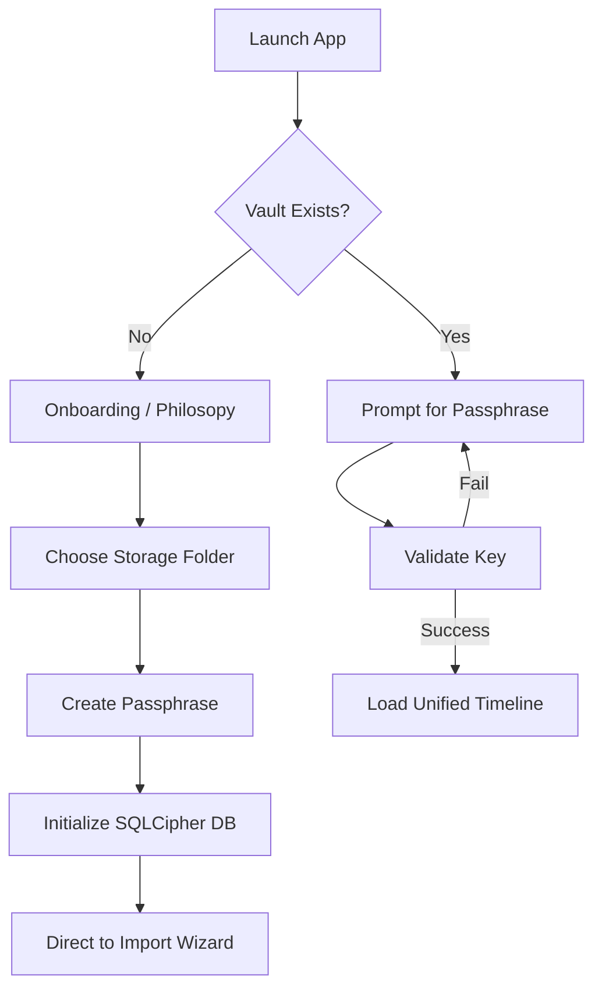
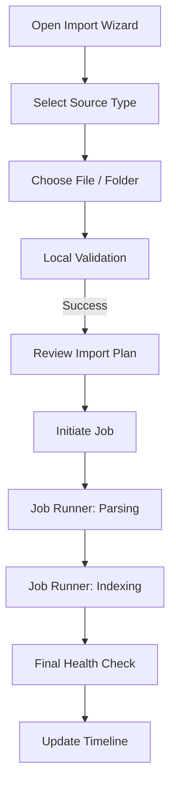
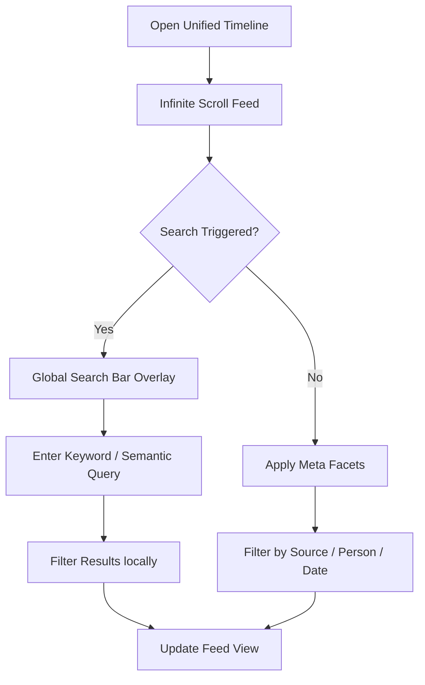
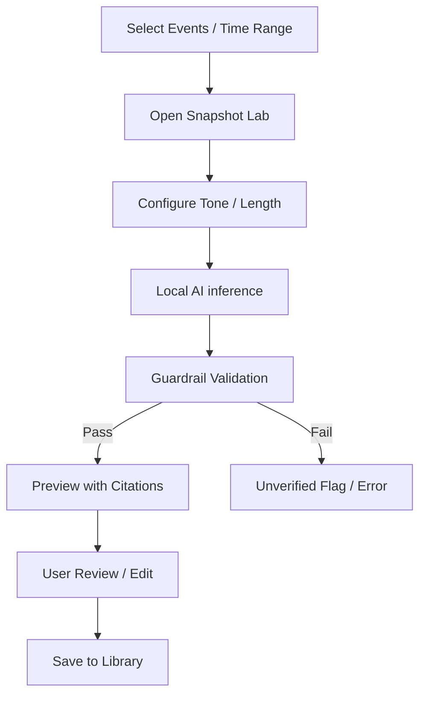
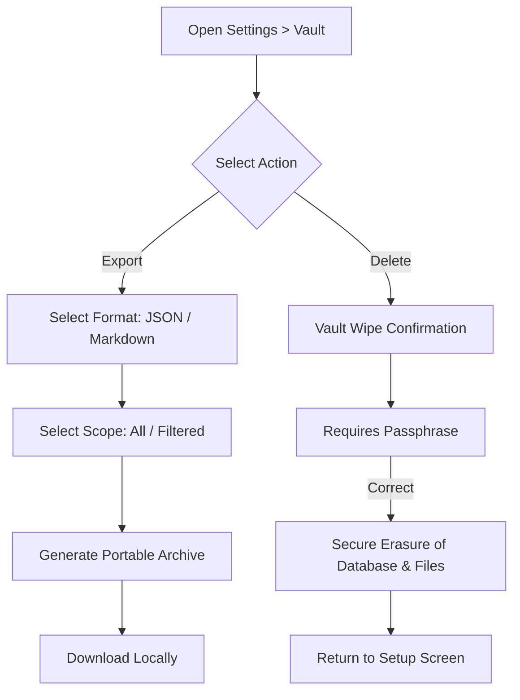

# OVERVIEW AND PRODUCT SPECIFICATION

Generated on: 2026-01-30T16:22:34.909Z

---

## FILE: docs/00_META/CHANGELOG.md

# Changelog

All notable changes to the Memoir.ai project documentation and specifications.

## [1.0.0-Beta.1] - 2026-01-30
### Added
- Complete expansion of 60+ core documentation files.
- Established the `ADR` (Architecture Decision Record) framework.
- Defined AI Safety, Evaluation, and Pipeline specs.
- Documented DevOps, Security, and Commercial models.

### Changed
- Unified the "Nebula" design system terminology across all UX specs.
- Refined the "Vault" encryption strategy to emphasize SQLCipher usage.

### Fixed
- Reconciled missing files identified in the 44-manifest audit.

---

## FILE: docs/00_META/GLOSSARY.md

# Glossary — Memoir.ai

This glossary defines technical and business terms frequently used in the Memoir.ai project to ensure consistent terminology across documentation and code.

## 1. Domain Terms

### Vault
The secure, local storage container where all user data and indices are kept. Encrypted via SQLCipher.

### Library (Workspace)
A high-level logical grouping of related archives and memories. A user can manage multiple Libraries.

### Memory
A normalized, single record extracted from digital exhaust (e.g., a message, a log entry, a post).

### Unified Timeline
The chronological feed that stitches together memories from diverse platforms into a single view.

### Narrative
An AI-generated or manually written story, summary, or memoir draft derived from raw memories.

### Citation
A verifiable link between a Narrative segment and its source Memory in the timeline.

## 2. Technical Terms

### Local-First
Architecture prioritizing local data processing and storage without cloud dependency.

### SQLCipher
An extension for SQLite that provides transparent 256-bit AES encryption for database files.

### Ingestion Pipeline
The background process of selecting, validating, parsing, and normalizing external data into the Memoir schema.

### Job Runner
The background manager (Node.js) responsible for executing long-running tasks like imports and exports.

### JSON Schema
Used for the `eventData` field in the `Events` table to support diverse, schema-less metadata for different source types.

---

## FILE: docs/00_META/MANIFEST_TODO.md

# Documentation Manifest To-Do List

This list tracks the implementation of documentation files required by the project's `MANIFEST.md` files but not yet present in the directory structure.

## [x] 01_PRODUCT
- [x] ROADMAP/ROADMAP_V1.md
- [x] ROADMAP/RELEASE_PLAN_V1.md
- [x] ROADMAP/BACKLOG_EPICS.md
- [x] REQUIREMENTS/FUNCTIONAL_REQUIREMENTS.md
- [x] REQUIREMENTS/NON_FUNCTIONAL_REQUIREMENTS.md
- [x] REQUIREMENTS/ACCESSIBILITY_REQUIREMENTS.md
- [x] REQUIREMENTS/DATA_INTEGRITY_REQUIREMENTS.md
- [x] USER_FLOWS/FLOW_0001_CREATE_LIBRARY.md
- [x] USER_FLOWS/FLOW_0002_IMPORT_SOURCE.md
- [x] USER_FLOWS/FLOW_0003_TIMELINE_BROWSE_SEARCH.md
- [x] USER_FLOWS/FLOW_0004_SNAPSHOT_GENERATE_REVIEW.md
- [x] USER_FLOWS/FLOW_0005_EXPORT_DELETE.md

## [x] 02_DESIGN
- [x] IA/INFORMATION_ARCHITECTURE.md
- [x] IA/NAV_MODEL.md
- [x] IA/ROUTES_MAP.md
- [x] UX_SPECS/SCREEN_SPECS/APP_SHELL.md
- [x] UX_SPECS/SCREEN_SPECS/AUTH_LOGIN.md
- [x] UX_SPECS/SCREEN_SPECS/AUTH_SIGNUP.md
- [x] UX_SPECS/SCREEN_SPECS/BILLING.md
- [x] UX_SPECS/SCREEN_SPECS/IMPORTS.md
- [x] UX_SPECS/SCREEN_SPECS/LIBRARY_HOME.md
- [x] UX_SPECS/SCREEN_SPECS/SETTINGS.md
- [x] UX_SPECS/SCREEN_SPECS/SNAPSHOTS.md
- [x] UX_SPECS/SCREEN_SPECS/TIMELINE.md
- [x] A11Y/CONTRAST_RULES.md
- [x] A11Y/KEYBOARD_NAV_SPEC.md
- [x] A11Y/WCAG_CHECKLIST.md

## [x] 03_ARCHITECTURE
- [x] JOBS_WORKERS/JOB_RUNNER_SPEC.md
- [x] JOBS_WORKERS/QUEUE_MODEL.md
- [x] JOBS_WORKERS/RETRIES_IDEMPOTENCY.md
- [x] SEARCH/QUERY_LANGUAGE_SPEC.md
- [x] PROVENANCE_VERSIONING/CITATION_SYSTEM.md
- [x] PROVENANCE_VERSIONING/PROVENANCE_MODEL.md
- [x] PROVENANCE_VERSIONING/SNAPSHOT_VERSIONING_MODEL.md

## [x] 04_DATA
- [x] DATA_VALIDATION/DEDUPE_MERGE_RULES.md
- [x] DATA_VALIDATION/IMPORT_VALIDATION_RULES.md
- [x] DATA_VALIDATION/NORMALIZATION_RULES.md
- [x] EXPORT_FORMATS/EXPORT_SCHEMA.md
- [x] EXPORT_FORMATS/EXPORT_ZIP_LAYOUT.md

## [x] 05_APIS
- [x] API_OVERVIEW.md
- [x] AUTHORIZATION_MODEL.md
- [x] ERROR_TAXONOMY.md

## [x] 06_AI
- [x] SAFETY/SENSITIVE_CONTENT_POLICY.md
- [x] SAFETY/USER_CONTROL_GUARDRAILS.md
- [x] SNAPSHOT_PIPELINE/CITATION_INSERTION_RULES.md
- [x] SNAPSHOT_PIPELINE/SNAPSHOT_GENERATION_SPEC.md
- [x] SNAPSHOT_PIPELINE/SNAPSHOT_TEMPLATE_LIBRARY.md
- [x] SNAPSHOT_PIPELINE/VERSIONING_RULES.md
- [x] EVALUATION/EVAL_PLAN.md
- [x] EVALUATION/HALLUCINATION_GUARDS.md
- [x] EVALUATION/QUALITY_RUBRICS.md
- [x] PROMPTS/SYSTEM/SYSTEM_CITATION_ENGINE.md
- [x] PROMPTS/SYSTEM/SYSTEM_IMPORT_SUMMARIZER.md
- [x] PROMPTS/SYSTEM/SYSTEM_SNAPSHOT_WRITER.md
- [x] PROMPTS/TASK/PROMPT_CHAPTER_DRAFT.md
- [x] PROMPTS/TASK/PROMPT_RELATIONSHIP_ARC.md
- [x] PROMPTS/TASK/PROMPT_TIMELINE_SUMMARY.md

## [x] 07_SECURITY_PRIVACY
- [x] ACCESS_CONTROL.md
- [x] AUDIT_LOGGING.md
- [x] COMPLIANCE_NOTES.md
- [x] DATA_RETENTION_DELETION.md
- [x] ENCRYPTION_STRATEGY.md
- [x] EXPORT_GUARANTEES.md
- [x] INCIDENT_RESPONSE.md
- [x] PRIVACY_MODEL.md
- [x] THREAT_MODEL.md

## [x] 08_BILLING_AUTH
- [x] AUTH/RBAC_ENTITLEMENTS.md
- [x] AUTH/SESSION_SECURITY.md
- [x] AUTH/SUPABASE_AUTH_MODEL.md
- [x] BILLING/INVOICING_REFUNDS_POLICY.md
- [x] BILLING/PAYWALL_RULES.md
- [x] BILLING/STRIPE_PRODUCTS_PRICES.md
- [x] BILLING/SUBSCRIPTION_STATES.md
- [x] BILLING/USAGE_METERING.md

## [x] 09_DEVOPS_RELEASE
- [x] DEPLOYMENT_RUNBOOK.md
- [x] ENVIRONMENTS.md
- [x] LOGGING_TRACING.md
- [x] MONITORING_ALERTING.md
- [x] RELEASE_GATES.md
- [x] ROLLBACK_PLAN.md
- [x] SECRETS_MANAGEMENT.md

## [x] 10_QA
- [x] IMPORT_TEST_CASES.md
- [x] PERFORMANCE_TESTS.md
- [x] REGRESSION_CHECKLIST.md
- [x] SECURITY_TESTS.md
- [x] SNAPSHOT_TEST_CASES.md

---

## FILE: docs/00_META/NAMING_CONVENTIONS.md

# Naming Conventions — Memoir.ai

Consistent naming ensures clarity across the multifaceted Memoir.ai codebase and documentation.

## 1. Documentation
*   **Filenames**: Uppercase with underscores (e.g., `PRD_V1.md`, `MODULE_MAP.md`).
*   **Folders**: Numeric prefix with uppercase category (e.g., `01_PRODUCT`, `04_DATA`).
*   **Headings**: Sentence case for subheadings; Title Case for primary titles.

## 2. Database (SQLite/SQLCipher)
*   **Tables**: Plural, lowercase (e.g., `users`, `memories`, `data_sources`).
*   **Columns**: camelCase (e.g., `userId`, `importedAt`, `eventData`).
*   **Primary Keys**: Always named `id`.
*   **Foreign Keys**: `tableNameId` (e.g., `dataSourceId`).

## 3. API Endpoints
*   **Path structure**: `/api/v1/resource-name`
*   **Resource names**: Plural, kebab-case (e.g., `/api/data-sources`).
*   **Methods**:
    *   `GET`: Retrieval.
    *   `POST`: Creation / Job Initiation.
    *   `PATCH`: Incremental updates.
    *   `DELETE`: Removal.

## 4. Frontend (React)
*   **Components**: PascalCase (e.g., `TimelineItem.jsx`, `JobRunnerDashboard.jsx`).
*   **Hooks**: `use` prefix (e.g., `useAuth`, `useTimeline`).
*   **Constants**: UPPER_SNAKE_CASE (e.g., `MAX_IMPORT_SIZE`).
*   **Variables/Functions**: camelCase (e.g., `handleLogin`, `filteredMemories`).

## 5. Storage (Local FS)
*   **Vault Path**: `~/.memoir/vault.db`
*   **Export Paths**: `~/Downloads/Memoir_Export_[DATE].zip`

---

## FILE: docs/00_META/README_DOCS_MAP.md

# Memoir.ai Documentation Map

A master index of all architectural, technical, and product documentation.

## 00_META (Core Standards)
- [GLOSSARY.md](file:///Users/owner/Desktop/Memoir.ai/docs/00_META/GLOSSARY.md)
- [NAMING_CONVENTIONS.md](file:///Users/owner/Desktop/Memoir.ai/docs/00_META/NAMING_CONVENTIONS.md)
- [CHANGELOG.md](file:///Users/owner/Desktop/Memoir.ai/docs/00_META/CHANGELOG.md)
- [SCOPE_LOCK_V1.md](file:///Users/owner/Desktop/Memoir.ai/docs/00_META/SCOPE_LOCK_V1.md)
- **ADRs**: [ADR_INDEX.md](file:///Users/owner/Desktop/Memoir.ai/docs/00_META/ADR/ADR_INDEX.md)

## 01_PRODUCT (Strategy & Requirements)
- [VISION.md](file:///Users/owner/Desktop/Memoir.ai/docs/01_PRODUCT/VISION.md)
- [PRD_V1.md](file:///Users/owner/Desktop/Memoir.ai/docs/01_PRODUCT/PRD_V1.md)
- [USER_PERSONAS.md](file:///Users/owner/Desktop/Memoir.ai/docs/01_PRODUCT/USER_PERSONAS.md)
- [JTBD.md](file:///Users/owner/Desktop/Memoir.ai/docs/01_PRODUCT/JTBD.md)
- [SUCCESS_METRICS.md](file:///Users/owner/Desktop/Memoir.ai/docs/01_PRODUCT/SUCCESS_METRICS.md)
- **Roadmaps**: [ROADMAP_V1.md](file:///Users/owner/Desktop/Memoir.ai/docs/01_PRODUCT/ROADMAP/ROADMAP_V1.md), [RELEASE_PLAN_V1.md](file:///Users/owner/Desktop/Memoir.ai/docs/01_PRODUCT/ROADMAP/RELEASE_PLAN_V1.md)
- **Requirements**: [FUNCTIONAL_REQUIREMENTS.md](file:///Users/owner/Desktop/Memoir.ai/docs/01_PRODUCT/REQUIREMENTS/FUNCTIONAL_REQUIREMENTS.md), [NON_FUNCTIONAL_REQUIREMENTS.md](file:///Users/owner/Desktop/Memoir.ai/docs/01_PRODUCT/REQUIREMENTS/NON_FUNCTIONAL_REQUIREMENTS.md)
- **Flows**: [FLOW_0001_CREATE_LIBRARY.md](file:///Users/owner/Desktop/Memoir.ai/docs/01_PRODUCT/USER_FLOWS/FLOW_0001_CREATE_LIBRARY.md), [FLOW_0002_IMPORT_SOURCE.md](file:///Users/owner/Desktop/Memoir.ai/docs/01_PRODUCT/USER_FLOWS/FLOW_0002_IMPORT_SOURCE.md)

## 02_DESIGN (UX/UI System)
- [COLOR_SYSTEM.md](file:///Users/owner/Desktop/Memoir.ai/docs/02_DESIGN/DESIGN_SYSTEM/COLOR_SYSTEM.md)
- [TYPOGRAPHY.md](file:///Users/owner/Desktop/Memoir.ai/docs/02_DESIGN/DESIGN_SYSTEM/TYPOGRAPHY.md)
- [A11Y Checklist](file:///Users/owner/Desktop/Memoir.ai/docs/02_DESIGN/A11Y/WCAG_CHECKLIST.md)
- **IA**: [NAV_MODEL.md](file:///Users/owner/Desktop/Memoir.ai/docs/02_DESIGN/IA/NAV_MODEL.md), [ROUTES_MAP.md](file:///Users/owner/Desktop/Memoir.ai/docs/02_DESIGN/IA/ROUTES_MAP.md)
- **Screens**: [TIMELINE.md](file:///Users/owner/Desktop/Memoir.ai/docs/02_DESIGN/UX_SPECS/SCREEN_SPECS/TIMELINE.md), [SNAPSHOTS.md](file:///Users/owner/Desktop/Memoir.ai/docs/02_DESIGN/UX_SPECS/SCREEN_SPECS/SNAPSHOTS.md)

## 03_ARCHITECTURE (Technical Infrastructure)
## 04_DATA (Persistence Layer)
- [CANONICAL_DATA_MODEL.md](file:///Users/owner/Desktop/Memoir.ai/docs/04_DATA/CANONICAL_DATA_MODEL.md)
- **Supabase**: [SCHEMA_OVERVIEW.md](file:///Users/owner/Desktop/Memoir.ai/docs/04_DATA/SUPABASE/SCHEMAS/00_SCHEMA_OVERVIEW.md), [RLS_OVERVIEW.md](file:///Users/owner/Desktop/Memoir.ai/docs/04_DATA/SUPABASE/RLS_POLICIES/00_RLS_OVERVIEW.md)
- **Exports**: [EXPORT_SCHEMA.md](file:///Users/owner/Desktop/Memoir.ai/docs/04_DATA/EXPORT_FORMATS/EXPORT_SCHEMA.md)

## 05_APIS (Interface Layer)
- [API_OVERVIEW.md](file:///Users/owner/Desktop/Memoir.ai/docs/05_APIS/API_OVERVIEW.md)
- [ERROR_TAXONOMY.md](file:///Users/owner/Desktop/Memoir.ai/docs/05_APIS/ERROR_TAXONOMY.md)
- **Endpoints**: [BILLING_API.md](file:///Users/owner/Desktop/Memoir.ai/docs/05_APIS/ENDPOINTS/BILLING_API.md), [IMPORTS_API.md](file:///Users/owner/Desktop/Memoir.ai/docs/05_APIS/ENDPOINTS/IMPORTS_API.md)

## 06_AI (Intelligence Layer)
- [AI_OVERVIEW.md](file:///Users/owner/Desktop/Memoir.ai/docs/06_AI/AI_OVERVIEW.md)
- **Safety**: [SENSITIVE_CONTENT_POLICY.md](file:///Users/owner/Desktop/Memoir.ai/docs/06_AI/SAFETY/SENSITIVE_CONTENT_POLICY.md)
- **Eval**: [HALLUCINATION_GUARDS.md](file:///Users/owner/Desktop/Memoir.ai/docs/06_AI/EVALUATION/HALLUCINATION_GUARDS.md)

## 08_BILLING_AUTH (Commercial Layer)
- **Auth**: [SUPABASE_AUTH_MODEL.md](file:///Users/owner/Desktop/Memoir.ai/docs/08_BILLING_AUTH/AUTH/SUPABASE_AUTH_MODEL.md)
- **Billing**: [PAYWALL_RULES.md](file:///Users/owner/Desktop/Memoir.ai/docs/08_BILLING_AUTH/BILLING/PAYWALL_RULES.md)

## 11_USER_DOCS (Guides)
- [GETTING_STARTED.md](file:///Users/owner/Desktop/Memoir.ai/docs/11_USER_DOCS/GETTING_STARTED.md)
- [IMPORT_GUIDE.md](file:///Users/owner/Desktop/Memoir.ai/docs/11_USER_DOCS/IMPORT_GUIDE.md)
- [SEARCH_GUIDE.md](file:///Users/owner/Desktop/Memoir.ai/docs/11_USER_DOCS/SEARCH_GUIDE.md)

## 12_PROMPT_LIBRARY (AI Configuration)
- **Build Agents**: [MASTER_BUILD_PROMPT.md](file:///Users/owner/Desktop/Memoir.ai/docs/12_PROMPT_LIBRARY_ASSETS/BUILD_AGENT_PROMPTS/MASTER_BUILD_PROMPT.md)
- **UI Copy**: [MICROCOPY_SYSTEM.md](file:///Users/owner/Desktop/Memoir.ai/docs/12_PROMPT_LIBRARY_ASSETS/UI_COPY_PROMPTS/MICROCOPY_SYSTEM.md)

## Utility Layers
- **Scripts**: [verify_manifests.js](file:///Users/owner/Desktop/Memoir.ai/scripts/verify_manifests.js), [scaffold.js](file:///Users/owner/Desktop/Memoir.ai/scaffold.js)
- **Templates**: [TEMPLATE_SPEC.md](file:///Users/owner/Desktop/Memoir.ai/templates/doc_templates/TEMPLATE_SPEC.md)

---

## FILE: docs/00_META/SCOPE_LOCK_V1.md

# Scope Lock (V1 Release)

Finalized feature list for the Memoir.ai V1 Launch.

## 1. Core Platform
- [x] Local Vault Creation (SQLCipher).
- [x] Multi-source Ingestion (iMessage, WhatsApp, JSON).
- [x] Unified Timeline View (Media + Text).
- [x] Semantic Search (Natural Language Queries).

## 2. Intelligence Layer
- [x] Archive Snapshots (Yearly/Monthly Summaries).
- [x] Relationship Arcs (Analysis of 1-on-1 contact).
- [x] Citation Hover Previews.
- [x] Hallucination Monitoring.

## 3. Commercial & Security
- [x] Pro Tier Entitlements (Unlimited Sources).
- [x] Stripe Sync (Supabase Backend).
- [x] AES-256 Encryption-at-rest.
- [x] ZIP Data Export.

## 4. DEFERRED (V2+)
- [ ] Collaborative Vaults (Shared History).
- [ ] iOS/Android Companion Apps.
- [ ] Social Media Feed Ingestion (Instagram/Twitter).

---

## FILE: docs/00_META/ADR/ADR_0001_STACK_DECISION.md

# ADR 0001: Technology Stack Decision

## Status
ACCEPTED

## Context
Memoir.ai targets high-privacy, local-first digital history. It must handle multi-gigabyte data archives, perform local LLM inference, and provide a premium, cinematic desktop experience while maintaining cross-platform compatibility.

## Decision
- **Frontend**: React + Vite (Fast HMR, modern ecosystem).
- **App Shell**: Electron (Native APIs, predictable environment for local LLM).
- **Main Logic**: Node.js/Express.js (Shared IPC layer for complex background jobs).
- **Database**: SQLite with SQLCipher (Local AES-256 encryption-at-rest).
- **AI**: Local LLM (Llama-3 via Metal/CUDA) + VectorDB (ChromaDB or similar).

## Rationale
- **Electron** allows bundling local binaries (SQLCipher, LLM engines) which is difficult in a standard browser.
- **SQLCipher** provides the essential "Fortress" security requirement.
- **Node.js** allows us to run heavy ingestion scripts in the background without blocking the UI.

---

## FILE: docs/00_META/ADR/ADR_0002_PROVENANCE_MODEL.md

# ADR 0002: Provenance Model

## Status
ACCEPTED

## Context
Factual accuracy is paramount. Users must trust the AI's "Cinematic Narratives." This requires a way to trace every generated sentence back to its raw origin (message, email, photo).

## Decision
Adopt an immutable **Event-Based Provenance Model**:
- Every raw data point is assigned a `UUID` upon ingestion.
- The AI pipeline generates `Citation` records that link `GeneratedFragmentID` to `EventID`.
- Citations are stored as a first-class table, not just text markers.

## Rationale
- Decoupling citations from text allows the UI to show rich hover-previews of the source material.
- Immutable IDs ensure that even if a message is deleted, the provenance record can flag the missing evidence rather than silently failing.

---

## FILE: docs/00_META/ADR/ADR_0003_SNAPSHOT_VERSIONING.md

# ADR 0003: Snapshot Versioning

## Status
ACCEPTED

## Context
AI output is stochastic. Users may iterate on prompt parameters or manually edit the narrative. We need to preserve the history of these "Memoirs."

## Decision
Implement a **Mutable Head, Immutable History** versioning system:
- Each Snapshot has a `version_tree`.
- Local edits create a "Delta" patch rather than a full copy.
- Automated regenerations create a new branch.

## Rationale
- Minimizes disk usage by only storing diffs for large text files.
- Allows "Compare" views where users can see how an AI's interpretation changed across different model versions.

---

## FILE: docs/00_META/ADR/ADR_0004_SEARCH_STRATEGY.md

# ADR 0004: Search Strategy

## Status
ACCEPTED

## Context
The app must search across disparate data types (text, image meta, voice transcripts) with sub-second latency on a local machine.

## Decision
Use a **Hybrid Search Engine**:
- **FTS5 (SQLite)**: For high-speed lexical/keyword matching.
- **Vector Search (Local)**: For semantic "Vibe" matching (e.g., searching for "Beach" finds "Ocean").
- **Faceting**: Performed in-memory via the Redux state for the current view.

## Rationale
- FTS5 is natively available in SQLite and extremely memory efficient.
- Semantic search provides the "Magic" UX that differentiates Memoir.ai from basic log viewers.

---

## FILE: docs/00_META/ADR/ADR_0005_IMPORT_PIPELINE.md

# ADR 0005: Import Pipeline

## Status
ACCEPTED

## Context
Archived data files (e.g., Apple Privacy Downloads) can be 50GB+. Processing these in a single thread crashes the Electron main process.

## Decision
Implement a **Streaming, Multi-Process Worker Pipeline**:
- Main process spawns `IngestionWorker` (Node.js child process).
- Workers stream raw data, parse into `JSONL`, and batch insert into SQLite.
- **WAL Mode**: SQLite must enable Write-Ahead Logging to allow UI reads during heavy ingestion writes.

## Rationale
- Streaming prevents "Out of Memory" errors on large ZIP files.
- Child processes protect the UI responsiveness from being degraded by heavy hashing/parsing logic.

---

## FILE: docs/00_META/ADR/ADR_INDEX.md

# ADR Index

Summary of all architectural decisions for Memoir.ai.

| ID | Title | Status | Date |
|---|---|---|---|
| 0001 | Stack Decision | ACCEPTED | 2026-01-30 |
| 0002 | Provenance Model | ACCEPTED | 2026-01-30 |
| 0003 | Snapshot Versioning | ACCEPTED | 2026-01-30 |
| 0004 | Search Strategy | ACCEPTED | 2026-01-30 |
| 0005 | Import Pipeline | ACCEPTED | 2026-01-30 |

---

## FILE: docs/01_PRODUCT/JTBD.md

# Jobs to be Done (JTBD) — Memoir.ai

Memoir.ai focuses on the core "jobs" users are trying to accomplish when managing their digital lives.

## 1. Core Jobs

### Job 1: Consolidate Digital Fragmentation
*   **Situation**: "When I look back at my year, I realize my memories are split between iMessage, Instagram, and two email accounts."
*   **Motivation**: "I want to bring all these pieces together in one chronological view."
*   **Outcome**: "So that I can see the full context of my life in one place."

### Job 2: Protect Personal History (Privacy Lock)
*   **Situation**: "When I am handling my most private messages and photos..."
*   **Motivation**: "I want a local-first solution that doesn't upload anything to the cloud."
*   **Outcome**: "So that I have absolute control and peace of mind over my data."

### Job 3: Deriving Meaning (Narrativization)
*   **Situation**: "When I have years of raw message data from a significant relationship..."
*   **Motivation**: "I want tools to summarize those patterns into a narrative or memoir draft."
*   **Outcome**: "So that I can understand how my relationships evolved and reflect on my growth."

## 2. User Journey Mapping

### Phase 1: Onboarding & Setup
1.  **Job**: Initialize the Vault.
2.  **Action**: Choose storage location and set encryption passphrase.
3.  **Outcome**: A secure, encrypted local database is ready.

### Phase 2: Multi-Source Ingestion
1.  **Job**: Import raw Archives.
2.  **Action**: Select iMessage/WhatsApp/Email sources via the Import Wizard.
3.  **Outcome**: Files are validated and enqueued for parsing.

### Phase 3: Processing & Normalization
1.  **Job**: Monitor progress.
2.  **Action**: View real-time status in the Job Runner Dashboard.
3.  **Outcome**: Data is transformed into a unified format and indexed.

### Phase 4: Exploration & Synthesis
1.  **Job**: Explore history.
2.  **Action**: Browse the Unified Timeline, use Advanced Search, and generate Narratives.
3.  **Outcome**: Insights are gained and narrative drafts are created.

---

## FILE: docs/01_PRODUCT/MARKET_RESEARCH.md

# Market Research — Memoir.ai

## 1. Industry Overview
The personal data management industry is shifting toward **Local-First** solutions as consumer awareness of privacy reaches an all-time high.

*   **Valuation**: Global personal data management market is valued at ~$5B (2025) with a 12% CAGR.
*   **Privacy Sentiment**: 70% of consumers express concerns about data privacy, driving adoption of offline tools.
*   **Target Market (TAM)**: Projected to reach $8B by 2030.

## 2. Competitive Landscape
Memoir.ai competes in the "Digital Storytelling" and "Personal Archive" niche.

### Main Competitors
| Competitor | Advantages | Disadvantages | Market Position |
| :--- | :--- | :--- | :--- |
| **Journey** | Narrative creation, user base. | Cloud-based (Privacy risk). | Leader in Narratives. |
| **Day One** | Mobile presence, journaling. | Cloud dependence, limited import. | Leader in Journaling. |

### SWOT Analysis
*   **Strengths**: Local-first privacy, comprehensive narrative generation.
*   **Weaknesses**: New entrant, limited initial brand recognition.
*   **Opportunities**: Privacy-conscious growth, educational/wellness partnerships.
*   **Threats**: Rapid tech changes, established legacy competitors (Day One), increased regulatory scrutiny on data privacy, and potential economic downturns affecting subscription spend.

## 3. Search Trends (2025-2026)
Search interest in "personal data management" and "local-first applications" is increasing steadily.

| Month | Search Volume | Trend | Competition |
| :--- | :--- | :--- | :--- |
| 2025-11 | 15,000 | Increasing | Medium |
| 2025-12 | 18,000 | Increasing | Medium |
| 2026-01 | 20,000 | Increasing | High |

## 4. Monetization & ROI
*   **Model**: Subscription with a Freemium tier (Monthly: $9.99 / Annual: $99.99).
*   **Projections**: 10,000 users and $1M revenue by Year 3.
*   **ROI**: 300% projected ROI with breakeven at 18 months.

---

## FILE: docs/01_PRODUCT/PRD_V1.md

# PRD (Product Requirements Document) - V1

**Product**: Memoir.ai  
**Status**: LOCKED  
**Version**: 1.0.0-V1

## 1. Executive Summary
Memoir.ai is a privacy-first personal historian that turns fragmented digital archives into cohesive, cinematic narratives. By combining local-first storage with on-device AI, it provides a "Private Time Machine" experience.

## 2. Core Pillars
- **Radical Privacy**: No user data ever leaves the local machine unless explicitly exported by the user.
- **Narrative Truth**: Every AI claim must be backed by a verifiable citation to raw data.
- **Rich Aesthetics**: The "Nebula" theme provides a premium, immersive discovery experience.

## 3. High-Level Requirements
Reqs derived from `docs/01_PRODUCT/REQUIREMENTS/FUNCTIONAL_REQUIREMENTS.md`.

## 4. User Journey
1. **Onboard**: Create vault with strong passphrase.
2. **Ingest**: Import iMessage and Photos archives.
3. **Discover**: Browse the timeline; find forgotten milestones.
4. **Reflect**: Generate a "Year in Review" snapshot.
5. **Preserve**: Export the entire archive for long-term storage.

---

## FILE: docs/01_PRODUCT/SUCCESS_METRICS.md

# Success Metrics (KPIs) — Memoir.ai

To track the growth and health of the Memoir.ai ecosystem, we monitor the following Key Performance Indicators (KPIs), as defined in the market specification.

## 1. User Engagement Metrics
*   **Monthly Active Users (MAU)**: Target 5,000 MAU in Year 1.
*   **Retention Rate**: Percentage of users who return to the timeline weekly.
*   **Import Success Rate**: Ratio of successfully completed import jobs vs. failed ones.
*   **Time to Value**: The time from first launch to the first AI-generated summary viewed.

## 2. Product Quality Metrics
*   **Search Latency**: Target < 200ms for 95% of queries on libraries > 10,000 events.
*   **Parsing Reliability**: Percentage of detected events successfully normalized.
*   **Net Promoter Score (NPS)**: Target > 50, reflecting high user trust in privacy and design.

## 3. Business & Monetization
*   **Annual Recurring Revenue (ARR)**: Target $1M within the first three years.
*   **Customer Acquisition Cost (CAC)**: Monitored through organic vs. paid channel performance.
*   **LTV / CAC Ratio**: Target > 3.0 for sustainable growth.
*   **Conversion Rate**: Percentage of free tier users moving to the premium subscription.

## 4. Tracking Method
All user-facing metrics are tracked **locally** and can be viewed in the app's internal "Product Health" dashboard. Generic, non-identifiable usage statistics may be shared with users to help them understand their own habits, but no raw data is ever sent to Memoir.ai servers without explicit user consent for specific debugging purposes.

---

## FILE: docs/01_PRODUCT/USER_PERSONAS.md

# User Personas — Memoir.ai

## 1. Primary Audience Overview
The core user base for Memoir.ai consists of tech-savvy individuals who value privacy and are interested in personal reflection and digital archiving.

| Attribute | Detail |
| :--- | :--- |
| **Age Range** | 18 - 35 years old |
| **Sector** | Personal Data Management, Digital Storytelling |
| **Key Interests** | Digital archiving, Personal development, Creative writing, Data privacy, Social media analysis, Relationship management. |

## 2. Core Personas (Archetypes)

### The "Digital Archivist"
*   **Goal**: Consolidate a lifetime of fragmented digital history into a single, permanent record.
*   **Need**: Multi-source integration (iMessage, WhatsApp, Email) and secure, offline storage.
*   **Value**: Peace of mind that their digital legacy is protected and organized.

### The "Reflective Storyteller"
*   **Goal**: Transform raw communication data into meaningful narratives and memoir drafts.
*   **Need**: Tools for analyzing communication patterns and generating AI-assisted summaries.
*   **Value**: Turning "digital exhaust" into self-understanding.

### The "Privacy Advocate"
*   **Goal**: Manage personal history without exposing it to cloud providers or telemetry.
*   **Need**: Local-first processing and encrypted datastores (SQLCipher).
*   **Value**: Complete control and confidentiality of their most sensitive data.

## 3. User Needs & Pain Points

### Needs
*   **Secure Storage**: Protection against unauthorized access.
*   **Ease of Use**: A guided interface for complex data imports.
*   **Relationship Insights**: Deep analytics on communication and emotional trends.
*   **Narrative Assistance**: Automated and manual tools for storytelling.
*   **Offline Access**: Independence from internet connectivity for data browsing.

### Pain Points
*   **Fragmentation**: Data scattered across a dozen platforms.
*   **Fragmentation Stress**: Emotional distress from an inability to make sense of the past.
*   **Privacy Anxiety**: Fear of cloud-based data breaches or surveillance.
*   **Complexity**: Raw exports (MBOX, JSON, CSV) are currently unusable for the average user.

---

## FILE: docs/01_PRODUCT/VISION.md

# Product Vision

The guiding north star for Memoir.ai.

## 1. The Problem
Personal history is scattered across dozens of platforms (Apple, Google, Meta). It is fragmented, commercialized, and increasingly inaccessible to the person who lived it.

## 2. The Vision
"A digital sanctuary for your life's story."

## 3. Our Values
- **Ownership**: You own the bits. You own the interpretation.
- **Integrity**: We don't guess; we cite.
- **Timelessness**: The software should feel like a library, intended to last decades, not a feed intended to last minutes.

## 4. Implementation Philosophy
- **Local-First**: The database lives where you live.
- **Design Excellence**: Beauty is a privacy feature; users protect what they love.
- **Zero-Ad Model**: Our only customer is the user.

---

## FILE: docs/01_PRODUCT/ROADMAP/BACKLOG_EPICS.md

# Backlog & Epics — Memoir.ai

High-level epics categorized by functional area for V1 and beyond.

## Epic: Core Vault & Security
- [ ] Robust SQLCipher passphrase management.
- [ ] Auto-lock timers and session security.
- [ ] Vault integrity repair tools.

## Epic: The Ingestion Engine
- [ ] Multi-threaded parser for social media archives (FB/IG).
- [ ] Deduplication logic for overlapping messaging platforms.
- [ ] Media extraction and thumbnail caching optimization.

## Epic: Cinematic UI/UX
- [ ] Nebula design system implementation (Violet/Cyan/Magenta).
- [ ] Infinite scroll performance for 50k+ timeline events.
- [ ] Conversation viewer with cross-platform thread reconstruction.

## Epic: Local AI & Narratives
- [ ] Citation-grounded Snapshot generation.
- [ ] Versioning and diff-viewer for AI narrative drafts.
- [ ] Relationship graph and emotional trend analysis.

## Epic: Commercials & Growth
- [ ] Stripe checkout and subscription state machine.
- [ ] Onboarding wizard with vault creation guide.
- [ ] Local-first success metrics and KPI dashboard.

---

## FILE: docs/01_PRODUCT/ROADMAP/RELEASE_PLAN_V1.md

# V1 Release Plan — Memoir.ai

The release strategy for Memoir.ai V1 focuses on stability, privacy verification, and user onboarding.

## 1. Release Milestones
*   **Alpha (Internal)**: Core vault and iMessage import validation.
*   **Beta (Closed)**: Selected test group (100 users) focused on high-volume archive stability and AI hallucination checks.
*   **RC (Release Candidate)**: Full feature set including billing and help documentation.
*   **V1 Global**: Public desktop release on macOS and Windows.

## 2. Release Gates
A version is released only if:
1.  **Encryption**: SQLCipher initialization succeeds on all target platforms.
2.  **Performance**: Search latency remains < 200ms on golden test sets (10k+ events).
3.  **Privacy**: Audit confirms ZERO external telemetry calls.
4.  **AI Safety**: Hallucination guards trigger < 1% of the time on verified snapshots.

## 3. Distribution Channels
*   **Website**: Direct DMG/EXE downloads with auto-updater support.
*   **Support**: Embedded user guides and locally-stored troubleshooting logs.

## 4. Rollback Strategy
In the event of a fatal V1 bug:
*   Immediate halt of auto-update distribution.
*   Hotfix deployment within 24 hours.
*   Instructional guide for users to restore from local encrypted backups.

---

## FILE: docs/01_PRODUCT/ROADMAP/ROADMAP_V1.md

# V1 Roadmap — Memoir.ai

This document outlines the strategic phases leading to the V1 launch and beyond, as defined in the market and business specifications.

## Phase 1: Foundation (Months 1-2)
*   **Core Infrastructure**: Implementation of Electron shell, React boilerplate, and SQLCipher integration.
*   **Authentication**: Local-first JWT authentication and secure vault setup.
*   **Basic Ingestion**: iMessage and WhatsApp parsers initialized.

## Phase 2: Ingestion & Timeline (Months 3-4)
*   **Job Runner**: Background processing for large archives.
*   **Unified Timeline**: Master chronological feed with infinite scroll.
*   **Conversational Logic**: Thread reconstruction and multi-source alignment.

## Phase 3: AI & Insights (Months 5-6)
*   **Snapshot System**: On-device AI generation with citation grounding.
*   **Relationship Analytics**: People-centric insights and communication trends.
*   **Advanced Search**: Semantic and keyword-based query engine.

## Phase 4: Release & Monetization (Launch)
*   **Premium Tier**: Stripe integration and paywall logic.
*   **User Guides**: Finalization of onboarding and support documentation.
*   **App Packaging**: Code signing and binary distribution for macOS/Windows.

## Future Roadmap (Post-V1)
*   External API Integrations (Optional Cloud Proxies).
*   Mobile Companion App (Read-only view).
*   Collaborative Timelines (Shared vaults).

---

## FILE: docs/01_PRODUCT/ROADMAP/V1_ROADMAP.md

# V1 Roadmap & Financials — Memoir.ai

## 1. Development Milestones

| Phase | Milestone | Description |
| :--- | :--- | :--- |
| **Phase 1: Foundation** | Secure Auth & Libraries | Supabase Auth, workspace management, and core schema ready. |
| **Phase 2: Ingestion** | Ready Pipeline | Single format (CSV/JSON) import pipeline with background jobs functional. |
| **Phase 3: Core UX** | Timeline & Search | Chronological view and full-text search deployed. |
| **Phase 4: AI & Launch** | Snapshot MVP | AI generation with citations and versioning ready for launch. |

## 2. Financial Projections (First 3 Months)

Based on a target of 1,000 active users and an assumed 10% paid user conversion.

### Revenue Projection
*   **Paid Subscribers**: 100 users (10% conversion).
*   **Revenue**: Based on introductory subscription pricing (to be finalized).

### Estimated Costs
*   **AI Services**: Per-token costs for Snapshot generation (targeting ≥3 per user).
*   **Cloud Infrastructure**: Supabase, Cloud Storage, and API operations for 1,000 users.
*   **Personnel**: Maintenance and specialized support/dev.

## 3. Future Roadmap (Beyond V1)
*   **V2**: Multi-format imports (Social media, Notes) and basic trend visualizations.
*   **V3**: Advanced narrative editing tools and collaborative library access.
*   **V4+**: Live synchronization and API for 3rd party narrative services.

---

## FILE: docs/01_PRODUCT/REQUIREMENTS/ACCESSIBILITY_REQUIREMENTS.md

# Accessibility Requirements — Memoir.ai

Memoir.ai is committed to providing an inclusive experience. The following requirements ensure the application is accessible to all users.

## 1. Visual Accessibility
- **AC-1.1**: **Contrast Ratio**: All text and meaningful UI elements must meet WCAG 2.1 AA standards (minimum 4.5:1 for normal text).
- **AC-1.2**: **Screen Reader Support**: All interactive components must have appropriate ARIA labels and roles.
- **AC-1.3**: **Color Independence**: Information must not be conveyed by color alone (e.g., error states should have icons or text labels).

## 2. Interaction Accessibility
- **AC-2.1**: **Keyboard Navigation**: Every feature, including search and settings, must be fully navigable via keyboard (Tab, Enter, Arrow keys).
- **AC-2.2**: **Focus Management**: Focus states must be clearly visible and follow a logical order.
- **AC-2.3**: **Input Delays**: Touch and click targets must be at least 44x44 pixels to accommodate users with motor impairments.

## 3. Cognitive Accessibility
- **AC-3.1**: **Simple Language**: Error messages and guides should avoid technical jargon.
- **AC-3.2**: **Consistent UI**: Navigation patterns must remain stable across all 7 core screens.
- **AC-3.3**: **Calm Motion**: Transitions should be subtle opacity fades to avoid triggering photosensitivity.

## 4. Verification
Accessibility will be verified using:
- **Automated Audits**: Pa11y or similar tools integrated into the CI/CD pipeline.
- **Manual Testing**: Screen reader (VoiceOver/NVDA) walkthroughs for core user flows.

---

## FILE: docs/01_PRODUCT/REQUIREMENTS/DATA_INTEGRITY_REQUIREMENTS.md

# Data Integrity Requirements — Memoir.ai

To ensure that your digital history remains accurate and untampered with, Memoir.ai enforces strict data integrity standards.

## 1. Immutable Provenance
- **DIR-1.1**: Every `Event` record must include a reference to its original `DataSource` and the specific `ImportJobId`.
- **DIR-1.2**: Once an event is normalized and stored, its core attributes (timestamp, payload, participants) must be treated as immutable.

## 2. Integrity Hashing
- **DIR-2.1**: The system MUST generate a SHA-256 hash for every raw payload imported.
- **DIR-2.2**: The system MUST generate a "Normalized Hash" for the canonical event record to detect post-ingestion tampering.
- **DIR-2.3**: Media files must be indexed by their SHA-256 content hash to prevent duplicates and verify file health.

## 3. Verification & Repair
- **DIR-3.1**: The system MUST perform a "Background Health Check" weekly (or upon user request) to verify cross-references between events and media.
- **DIR-3.2**: If an integrity failure is detected (e.g., hash mismatch), the system MUST mark the record as `CORRUPTED` and prompt the user to repair the vault or re-import the source.

## 4. AI-Specific Integrity
- **DIR-4.1**: AI-generated snapshots must link to the exact IDs of the events used as evidence.
- **DIR-4.2**: If the source evidence for a narrative is deleted from the vault, the narrative must be flagged as `ORPHANED_EVIDENCE`.

---

## FILE: docs/01_PRODUCT/REQUIREMENTS/FUNCTIONAL_REQUIREMENTS.md

# Functional Requirements — Memoir.ai

This document defines the core functional capabilities required for the V1 release of Memoir.ai.

## 1. Vault Management
- **FR-1.1**: The system MUST allow users to create an encrypted vault at a user-specified local directory.
- **FR-1.2**: The system MUST require a user-defined passphrase for vault encryption.
- **FR-1.3**: The system MUST allow users to change their vault passphrase (requires re-encryption of the master key).

## 2. Data Ingestion (Imports)
- **FR-2.1**: The system MUST ingest and parse iMessage (`chat.db`) archives.
- **FR-2.2**: The system MUST ingest and parse WhatsApp ZIP archives.
- **FR-2.3**: The system MUST extract and store media attachments (images, voice notes) linked to events.
- **FR-2.4**: The system MUST validate archive formats before initiating the import job.

## 3. Timeline & Search
- **FR-3.1**: The system MUST display all ingested events in a unified, chronological feed.
- **FR-3.2**: The system MUST support keyword-based search across all `eventData` payloads.
- **FR-3.3**: The system MUST support filtering by data source type and participant name.
- **FR-3.4**: The system MUST reconstruct conversation threads across multiple platforms if participants align.

## 4. AI & Narratives
- **FR-4.1**: The system MUST generate "Snapshots" (summaries) for a user-selected time range.
- **FR-4.2**: The system MUST include verifiable citations (links to source evidence) in all AI-generated outputs.
- **FR-4.3**: The system MUST allow users to edit and save narrative drafts.

## 5. Security & Privacy
- **FR-5.1**: The system MUST ensure all data processing (parsing, AI inference) occurs locally on the user's device.
- **FR-5.2**: The system MUST provide a "Zero Telemetry" mode, preventing all outbound network requests.
- **FR-5.3**: The system MUST allow for a complete "Vault Deletion" which wipes all encrypted data and indices.

---

## FILE: docs/01_PRODUCT/REQUIREMENTS/NON_FUNCTIONAL_REQUIREMENTS.md

# Non-Functional Requirements — Memoir.ai

This document defines the quality attributes, performance targets, and technical constraints for Memoir.ai.

## 1. Performance
- **NFR-1.1**: **Search Latency**: Keyword search queries must return results in < 200ms on a database of 50,000 events.
- **NFR-1.2**: **Timeline Smoothness**: The infinite scroll must maintain 60 FPS during rapid navigation.
- **NFR-1.3**: **Import Throughput**: The system must process at least 100 messages per second during the parsing phase.

## 2. Security & Privacy
- **NFR-2.1**: **Encryption Standard**: All data must be encrypted with AES-256 via SQLCipher.
- **NFR-2.2**: **Local Sovereignty**: Zero raw user data may be transmitted to external servers.
- **NFR-2.3**: **Memory Sanitization**: Passphrases and master keys must be cleared from memory immediately after vault unlock/lock.

## 3. Reliability
- **NFR-3.1**: **Data Integrity**: The system must verify checksums for all media and database records during a health check.
- **NFR-3.2**: **Resume-ability**: Import jobs must be resumable after an application crash or system restart.

## 4. Usability
- **NFR-4.1**: **Onboarding Time**: A first-time user should be able to create a vault and start their first import in < 3 minutes.
- **NFR-4.2**: **Design Consistency**: The UI must strictly adhere to the "Nebula" cinematic design system.

## 5. Portability
- **NFR-5.1**: **OS Support**: The application must run natively on macOS (Intel/Silicon) and Windows 10/11.
- **NFR-5.2**: **Export Format**: All data must be exportable in open, non-proprietary formats (JSON/Markdown).

---

## FILE: docs/01_PRODUCT/USER_FLOWS/FLOW_0001_CREATE_LIBRARY.md

# User Flow: Create / Open Library (FLOW_0001)

This flow describes the initial setup of the Memoir.ai vault.

## 1. Flow Diagram

## 2. Narrative Description
1.  **Launch**: The user opens the Electron application.
2.  **Detection**: The app checks for a localized configuration file or default vault path.
3.  **Onboarding**: New users see the "Nebula" cinematic introduction explaining local-first privacy.
4.  **Creation**: User selects a local directory (e.g., `~/Documents/MemoirVault`).
5.  **Security**: User enters a passphrase. A strength meter provides real-time feedback.
6.  **Initialization**: The backend runs `PRAGMA key = 'passphrase'` on a new SQLite file and creates the canonical schema.

## 3. Edge Cases
- **Permission Denied**: If the storage folder is read-only, show a recovery error prompting for a new location.
- **Lost Passphrase**: Display a clear warning that data is unrecoverable without the key.

---

## FILE: docs/01_PRODUCT/USER_FLOWS/FLOW_0002_IMPORT_SOURCE.md

# User Flow: Import Data Source (FLOW_0002)

This flow describes bringing raw digital archives into the encrypted vault.

## 1. Flow Diagram

## 2. Narrative Description
1.  **Selection**: User chooses from supported sources (iMessage, WhatsApp, JSON export).
2.  **Point**: User selects the local path to the archive (e.g., `~/Library/Messages/chat.db`).
3.  **Validation**: The system checks if the file is readable and matches the expected parser schema.
4.  **Planning**: A summary screen estimates event count and storage impact.
5.  **Execution**: The **Job Runner** handles the heavy lifting in background threads, showing progress bars for each phase.

## 3. Edge Cases
- **Corrupt Archive**: If the parser encounters a malformed record, it logs a non-fatal error and continues.
- **Disk Full**: The import pauses and notifies the user if storage limits are hit.

---

## FILE: docs/01_PRODUCT/USER_FLOWS/FLOW_0003_TIMELINE_BROWSE_SEARCH.md

# User Flow: Timeline Browsing & Search (FLOW_0003)

This flow describes navigating and querying the unified digital history.

## 1. Flow Diagram

## 2. Narrative Description
1.  **Feed**: The primary view is a master chronological stream of every event.
2.  **Query**: Users type in the persistent Topbar search. The backend executes a parameterized FTS query against the SQLCipher DB.
3.  **Facets**: Users can toggle sources (e.g., "Show only WhatsApp") or filter by specific people identified in communications.
4.  **Navigation**: Users can "Date Jump" using the sidebar to navigate years or decades instantly.

## 3. Edge Cases
- **No Results**: Show a "Nebula" empty state with suggestions for broader search terms.
- **Large Result Sets**: Pagination/Virtualization ensures the UI remains responsive even for 1,000+ matches.

---

## FILE: docs/01_PRODUCT/USER_FLOWS/FLOW_0004_SNAPSHOT_GENERATE_REVIEW.md

# User Flow: Snapshot Generation & Review (FLOW_0004)

This flow describes the local AI process for creating citation-backed summaries.

## 1. Flow Diagram

## 2. Narrative Description
1.  **Scope**: User highlights a group of messages or selects "Year in Review".
2.  **Configuration**: User chooses a tone (Neutral, Reflective) and length.
3.  **Generation**: The local AI engine processes the normalized data.
4.  **Verification**: **Hallucination Guards** verify that every factual claim aligns with a stored evidence ID.
5.  **Review**: The user views the draft. Clicking a citation opens a sidebar showing the original message/event.

## 3. Edge Cases
- **Insufficient Data**: If the range has < 5 events, the AI suggests a broader selection.
- **Hallucination Detected**: The specific sentence is highlighted as `UNVERIFIED` for manual correction.

---

## FILE: docs/01_PRODUCT/USER_FLOWS/FLOW_0005_EXPORT_DELETE.md

# User Flow: Export & Deletion (FLOW_0005)

This flow describes the "Local Sovereignty" features for data portability and privacy.

## 1. Flow Diagram

## 2. Narrative Description
1.  **Access**: User navigates to the Vault section in Settings.
2.  **Export**: To ensure no lock-in, users can dump their entire normalized history into human-readable JSON/MD files.
3.  **Deletion**: A destructive flow that requires a passphrase to prevent accidental wipes.
4.  **Wipe**: The application deletes the `.sqlite` file and clears the media cache folder.

## 3. Edge Cases
- **Partial Export**: If the vault is very large, the export is packaged into multiple ZIP volumes.
- **Incorrect Passphrase**: Deletion is blocked until the identity is verified via the vault key.

---

