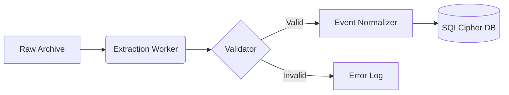
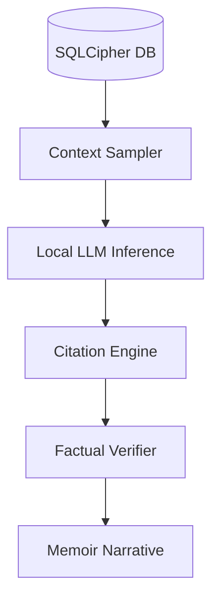
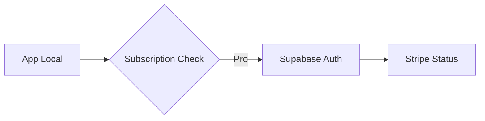

# TECHNICAL AND DATA SPECIFICATION

Generated on: 2026-01-30T16:22:34.958Z

---

## FILE: docs/03_ARCHITECTURE/DATA_FLOW_DIAGRAMS.md

# Data Flow Diagrams

High-level visualization of how bits move through Memoir.ai.

## 1. Ingestion Flow


## 2. AI Snapshot Flow


## 3. Sync Flow (Non-Vault)



---

## FILE: docs/03_ARCHITECTURE/MODULE_MAP.md

# Module Map — Memoir.ai

This document maps the logical modules of the Memoir.ai application and their boundaries, as defined in the technical specification.

## 1. System Components

### Frontend (Desktop Client)
*   **Env**: Electron (Shell), React (UI Layer).
*   **State Management**: Redux (Global Application State).
*   **Modules**:
    *   **Auth Module**: Handles registration, login, and JWT persistence.
    *   **Workspace Module**: Manages the Unified Timeline and Conversation Viewer.
    *   **Search Module**: Interfaces with the backend for semantic and keyword queries.
    *   **Settings Module**: User profile management and data export controls.

### Backend (Local Core)
*   **Env**: Node.js, Express.js.
*   **Database**: SQLite with SQLCipher (Encrypted Persistence).
*   **Modules**:
    *   **Ingestion Engine**: Handles multi-source archive parsing and normalization.
    *   **Job Runner**: Manages background processing of data imports/exports.
    *   **Narrative Engine**: Logic for processing events into summaries and drafts.
    *   **Security Layer**: Input validation, sanitization, and encryption management.

## 2. Component Boundaries

| Source | Destination | Protocol | Purpose |
| :--- | :--- | :--- | :--- |
| **Electron Shell** | **React Frontend** | IPC / Context Bridge | System-level integration (File Dialogs, Windows). |
| **React Frontend** | **Node.js Backend** | RESTful APIs (Local) | Data retrieval, Job initiation, Auth requests. |
| **Node.js Backend** | **SQLite DB** | SQL (SQLCipher) | Encrypted data persistence. |
| **Node.js Backend** | **Local Filesystem**| FS API | Raw file ingestion and ZIP export creation. |

## 3. Communication Patterns
*   **Request-Response**: Primary pattern for UI interactions (e.g., fetching a timeline range).
*   **Asynchronous Jobs**: Background tasks (Parsing, Indexing) reported via progress updates.
*   **Event-Driven**: Progress indicators in the frontend responding to job runner state changes.


---

## FILE: docs/03_ARCHITECTURE/SYSTEM_OVERVIEW.md

# System Architecture Overview

The structural blueprint of the Memoir.ai "Fortress."

## 1. Multi-Process Model (Electron)
- **Main Process**: Handles IPC, File System access, and Window lifecycle.
- **Renderer Process**: The "Nebula" UI (React).
- **Worker Processes**: Low-priority background tasks for heavy compute (Ingestion, AI).

## 2. Storage Layer
- **Vault Partition**: The encrypted SQLCipher database + Media subfolders.
- **Config Partition**: Unencrypted app settings (Theme, Window position).

## 3. Implementation Stack
See `docs/00_META/ADR/ADR_0001_STACK_DECISION.md` for full breakdown.

## 4. Security Philosophy
- **Process Isolation**: The Renderer has no direct access to `fs`. All data requests go through an IPC bridge with strict validation.
- **Ephemeral Keys**: Encryption keys are only held in memory for the duration of the session.


---

## FILE: docs/03_ARCHITECTURE/JOBS_WORKERS/IMPORT_PIPELINE.md

# Import Pipeline Specification — Memoir.ai V1

## 1. Goal
Provide robust, resumable, and transparent background processing for a single message export format (e.g., CSV/JSON).

## 2. Pipeline Stages

| Step | Component | Action | Output |
| :--- | :--- | :--- | :--- |
| **1. Initiate** | Frontend/API | Create `import_jobs` record, upload file to Storage. | `import_jobs` record, file in Storage. |
| **2. Process** | Worker | Download and parse raw file from Storage. | Structured data stream. |
| **3. Normalize** | Worker | Transform raw data into canonical `memories` schema. | Canonical Memory objects. |
| **4. Ingest** | Worker | Batch insert memories into Postgres (linked to library). | New `memories` records. |
| **5. Finalize** | Worker | Update job status to 'complete' or 'failed'. | Finalized `import_jobs` record. |

## 3. Technical Requirements
*   **Resumability**: The worker must handle temporary failures and retry from the last successful batch.
*   **Logging**: Detailed error and status logs must be stored in the `log_output` (JSONB) column.
*   **Progress Tracking**: `progress_percentage` must be updated in real-time for frontend display.
*   **File Isolation**: Raw imports must be stored in user-specific storage paths.


---

## FILE: docs/03_ARCHITECTURE/JOBS_WORKERS/JOB_RUNNER_SPEC.md

# Job Runner Specification

The engine responsible for all heavy background compute in Memoir.ai.

## 1. Execution Philosophy
- **Local-only**: All jobs run in separate worker threads within the Electron backend.
- **Priority-based**: High-priority jobs (Search Indexing) preempt low-priority jobs (Media Thumbnailing).
- **Non-blocking**: The UI remaining responsive even during 50k+ record imports.

## 2. Job Lifecycle
1.  **Enqueue**: Task added to SQLite-backed queue.
2.  **Dispatch**: Worker thread claims the oldest high-priority task.
3.  **Active**: Periodic `progress` events emitted to the UI via IPC.
4.  **Completion/Failure**: Results persisted and status updated.

## 3. Worker Configuration
- **Max Threads**: Configurable (default: CPUs - 1).
- **Memory Throttling**: Jobs pause if application memory usage exceeds 1.5GB to maintain OS stability.
- **Persistence**: Job state is stored in the `import_jobs` table to allow resumption after crash.

## 4. Specific Runners
- **Parser**: Specialized for `chat.db`, `WhatsApp.zip`, etc.
- **Indexer**: Updates SQLite FTS5 tables and vector stores.
- **AI Narrative**: Manages local LLM inference and verification.


---

## FILE: docs/03_ARCHITECTURE/JOBS_WORKERS/QUEUE_MODEL.md

# Queue Model & Data Structures

Defines how background tasks are represented and managed.

## 1. Database Schema (`job_queue`)
| Field | Type | Description |
|---|---|---|
| `job_id` | UUID | Primary Key |
| `type` | String | e.g., `PARSE_IMESSAGE`, `GEN_SNAPSHOT` |
| `priority` | Integer | 0 (Low) to 10 (Critical) |
| `payload` | JSON | Job parameters (file paths, UID, etc.) |
| `status` | Enum | `PENDING`, `RUNNING`, `PAUSED`, `FAILED`, `DONE` |
| `progress` | Float | 0.0 to 1.0 |
| `error_log` | Text | Captured stack trace if failed |

## 2. Priority Levels
- **P10 (Urgent)**: Onboarding flow jobs (Initial Vault Setup).
- **P5 (Normal)**: User-triggered imports.
- **P1 (Background)**: Media thumbnailing, long-term integrity scans.

## 3. Worker Interaction
Workers use a "Pull" model. They query the `job_queue` for the next available `PENDING` task, mark it as `RUNNING` within an atomic transaction to prevent double-claiming, and begin execution.


---

## FILE: docs/03_ARCHITECTURE/JOBS_WORKERS/RETRIES_IDEMPOTENCY.md

# Retries & Idempotency Rules

Ensuring data integrity during failure recovery.

## 1. Retry Semantic
- **Transient Failures**: (e.g., File system lock) Automatic retry with exponential backoff.
- **Fatal Failures**: (e.g., Disk Full, Permission Denied) Stop and notify user for manual intervention.
- **Max Retries**: Default 3 attempts per job chunk.

## 2. Idempotency Requirements
- **Parser Idempotency**: Running the same iMessage import twice MUST NOT result in duplicate events. The parser must check the `source_record_id` and `payload_hash` before insertion.
- **Media Ingestion**: Media files are only copied/indexed if their content hash (`SHA256`) does not already exist in the library.

## 3. Checkpointing
For large imports (100k+ records), the parser must commit batches to the database every 1,000 records. If the job is interrupted, it resumes from the last successfully committed batch ID.


---

## FILE: docs/03_ARCHITECTURE/PROVENANCE_VERSIONING/CITATION_SYSTEM.md

# Citation System Specification

Ensuring factual traceability between AI narratives and original source evidence.

## 1. Citation Anatomy
A citation is represented in the database as a link between a `Narrative` and one or more `Events`.

| Attribute | Description |
|---|---|
| `citation_id` | Unique UUID |
| `target_narrative_id` | Foreign Key to Narrative |
| `source_event_ids[]` | Array of Event IDs used as supporting evidence |
| `anchor_text` | The specific sentence or phrase in the draft being supported |
| `relevance_score` | AI-assigned confidence (0.0 - 1.0) |

## 2. UI Representation
In the Snapshot Editor, citations appear as superscript numbers (e.g., `Claim text [1]`).
- **Interaction**: Clicking `[1]` opens the "Evidence Drawer", displaying the raw message content, timestamp, and source metadata for the linked events.

## 3. Integrity Rules
- If a source `Event` is deleted, its linked `Citations` are invalidated.
- The UI MUST visually flag narratives with orphaned citations as `UNVERIFIED`.


---

## FILE: docs/03_ARCHITECTURE/PROVENANCE_VERSIONING/PROVENANCE_MODEL.md

# Provenance Model

The chain of custody for every memory record in Memoir.ai.

## 1. Provenance Meta-Data
Every `Event` record includes an immutable `provenance` block:
- **`origin_device`**: Local hostname where the import occurred.
- **`parser_signature`**: The version of the parser code used (e.g., `imessage-parser-v1.4.2`).
- **`raw_source_path`**: Relative path to the file within the imported archive (e.g., `chat.db/message/123`).
- **`ingestion_timestamp`**: When the record was first created in the vault.

## 2. Verification
During a "Deep Health Check", the system attempts to re-locate the raw record (if the source archive is still present) and verify its `payload_hash` against the current database state.

## 3. Trust Levels
- **Level 3 (High)**: Directly imported from a platform DB (e.g., `chat.db`).
- **Level 2 (Medium)**: Imported from a flattened JSON/CSV export.
- **Level 1 (Low)**: Manually added or manually edited by the user.


---

## FILE: docs/03_ARCHITECTURE/PROVENANCE_VERSIONING/SNAPSHOT_SYSTEM.md

# AI Snapshot System (Citations & Versioning) — Memoir.ai V1

## 1. AI Snapshot Generation
The system uses an LLM to transform selected memories into a cohesive narrative summary.

### Flow
1.  **Input Selection**: User selects a set of `memory_ids` or a time range on the timeline.
2.  **Prompt Construction**: The backend worker fetches the selected memories and prompts the LLM to generate a summary.
3.  **Citation Mapping**: The LLM is instructed to include inline markers (e.g., `[1]`) that map to specific input memories.
4.  **Record Creation**:
    *   Creates a new `ai_snapshots` (metadata) record if it's the first in a thread.
    *   Creates an `ai_snapshot_versions` record for the narrative content.
    *   Creates `snapshot_citations` records linking markers to source `memory_ids`.

## 2. Data Provenance (Citations)
*   **Markers**: Snapshot text contains clickable markers.
*   **Source Linking**: Interaction with a marker highlights or navigates the user to the exact source Memory in the timeline.
*   **Integrity**: Citations are non-destructive and persistent across versions.

## 3. Versioning Strategy
*   Every "Save" or "Regenerate" operation creates a **new version record**.
*   The UI defaults to the highest `version_number` but allows browsing and reverting to historical versions.
*   This approach ensures user edits do not destroy the original AI output or previous manual drafts.


---

## FILE: docs/03_ARCHITECTURE/PROVENANCE_VERSIONING/SNAPSHOT_VERSIONING_MODEL.md

# Snapshot Versioning Model

Managing the evolution of AI-generated narratives.

## 1. Revision Strategy
Narratives in Memoir.ai are versioned using a simple linear increment (V1, V2, V3).

## 2. Version Storage
Instead of overwriting, every "Regenerate" operation creates a NEW record in the `narrative_versions` table.
- **Parent ID**: Link to the root Narrative object.
- **Diff**: The system stores the full content for each version (simpler for local AI consumption) rather than incremental diffs.

## 3. UI Navigation
The "Version Browser" in the Snapshot Editor allows users to:
- **Compare**: Side-by-side view of V[X] and V[Current].
- **Reactivate**: Promote an old version to current.
- **Delete**: Remove bad drafts to save metadata space.

## 4. Stability Rule
Once a Narrative is "Published" (exported or pinned), the current version is locked. Future changes must create an explicit new version.


---

## FILE: docs/03_ARCHITECTURE/SEARCH/INDEXING_STRATEGY.md

# Indexing Strategy — Memoir.ai

Indexing is the final stage of the Memoir.ai Ingestion Pipeline, ensuring that raw digital history is transformed into a highly performant, queryable dataset.

## 1. Indexing Workflow
When a parsing job completes, the system initiates indexing:
1.  **Normalization**: Raw data is mapped to the `Events` canonical schema.
2.  **Schema-on-Read Optimization**: Common fields are indexed; custom `eventData` JSON fields are made searchable.
3.  **Health Check**: Indices are verified for integrity before directing the user to the timeline.

## 2. Technical Choices
*   **Database**: SQLite with SQLCipher.
*   **Indices**:
    *   B-Tree indices on `id`, `userId`, `dataSourceId`, and `createdAt`.
    *   Full-Text Search (FTS) indices (if applicable via SQLite FTS5) for keyword-heavy `eventData`.
*   **Batching**: Indexing runs in background workers during the Job Runner phase to prevent main-thread blocking.

## 3. Security & Performance
*   **Encrypted Indices**: All indices are stored within the encrypted SQLCipher vault, maintaining the local-first security posture.
*   **Resumable Jobs**: Indexing jobs are tracked by the Job Runner Dashboard, allowing for recovery if the app is closed during processing.
*   **Latency Target**: Search queries must return results in < 200ms, even for libraries with 50,000+ events.


---

## FILE: docs/03_ARCHITECTURE/SEARCH/QUERY_LANGUAGE_SPEC.md

# Query Language Specification

Grammar and reserved keywords for searching the Memoir.ai unified timeline.

## 1. Syntax Overview
Memoir.ai uses a simplified SQL-like DSL for advanced multi-parameter queries, which are translated into SQLite FTS5 queries.

## 2. Keywords & Facets
| Facet | Description | Example |
|---|---|---|
| `from:` | Filter by sender/author | `from: "Mom"` |
| `to:` | Filter by recipient | `to: "Dad"` |
| `source:` | Filter by platform | `source: imessage` |
| `date:` | Specific date or range | `date: 2023-01-01..2023-12-31` |
| `type:` | Event category | `type: media` or `type: text` |
| `has:` | Content attributes | `has: link` or `has: attachment` |

## 3. Logical Operators
- **AND**: Implicit (e.g., `from: Mom source: whatsapp`)
- **OR**: Explicit (e.g., `from: Mom OR from: Dad`)
- **NOT**: Prefix with `-` (e.g., `source: whatsapp -has: link`)

## 4. Semantic Search
Prefixing a query with `~` triggers a semantic/vector search instead of a keyword match.
- Example: `~ "When was the last time we talked about the trip?"`

## 5. Implementation Note
The frontend input component parses these tokens and highlights them for the user. The backend then constructs the `WHERE` clause dynamically, ensuring all inputs are sanitized to prevent SQL injection.


---

## FILE: docs/03_ARCHITECTURE/SEARCH/SEARCH_OVERVIEW.md

# Search Subsystem Overview

## 1. Hybrid Architecture
Combines Lexical (SQLite FTS5) and Semantic (Vector) search.

## 2. Relevancy Scoring
Final score = `(0.4 * LexicalScore) + (0.6 * SemanticScore)`.

## 3. Privacy
Vector embeddings are computed locally and stored in the encrypted vault.


---

## FILE: docs/03_ARCHITECTURE/PERFORMANCE/CACHING_STRATEGY.md

# Caching Strategy

Optimizing the "Private Time Machine" for local performance.

## 1. UI State Caching
- **Redux Persist**: Stores UI preferences but NOT user data (to avoid unencrypted spill).
- **Component Memoization**: Heavy use of `React.memo` for the Timeline feed entries.

## 2. Database Caching
- **SQLite Page Cache**: Configured to 128MB to keep hot indices in memory.
- **Prepared Statements**: Re-used for recurring search filters to avoid parse overhead.

## 3. Media Caching
- **Thumbnail generation**: During import, the app generates low-res WebP thumbnails stored in the `vault/.thumb/` directory.
- **Action**: The UI displays thumbnails while loading full-res assets from the encrypted blob store.


---

## FILE: docs/03_ARCHITECTURE/PERFORMANCE/LARGE_IMPORTS_STRATEGY.md

# Large Imports Strategy

Handling 10GB+ archives without application degradation.

## 1. The "Chunking" Pattern
The ingestion engine never reads a full file into memory. It uses Node.js streams to process records in chunks of 500.

## 2. Resource Throttling
- **CPU**: Workers are restricted to `N-1` cores to ensure the Main process remains responsive for UI input.
- **Priority**: Ingestion jobs are marked with `IDLE_PRIORITY` so they yield to real-time AI generation or search requests.

## 3. Interruption Recovery
- **Checkpointing**: After every 1,000 records, the progress is committed to SQLite.
- **Action**: If the app crashes or the computer shuts down, the import resumes from the last successful checkpoint.


---

## FILE: docs/03_ARCHITECTURE/PERFORMANCE/PERF_BUDGETS.md

# Performance Budgets

SLA-style targets for local interaction.

| Metric | Budget (P95) | Context |
|---|---|---|
| **Vault Unlock** | < 1.0s | PBKDF2 Hashing -> DB Open |
| **Timeline Scroll** | 60 FPS | Jitter-free vertical movement |
| **Global Search** | < 250ms | Keyword search across 50k events |
| **Semantic Search** | < 1.5s | Vector embedding -> Lookup |
| **Snapshot Draft** | < 8.0s | Model inference for 1 chapter |
| **Cold Start** | < 2.0s | App launch -> Splash screen |


---

## FILE: docs/04_DATA/CANONICAL_DATA_MODEL.md

# Canonical Data Model

The unified schema for all personal history.

## 1. The `Event` Entity
The core atom of Memoir.ai.

| Field | Type | Description |
|---|---|---|
| `event_id` | UUID | Primary Key |
| `source_id` | UUID | FK to the data source |
| `timestamp` | ISO8601 | Precision to milliseconds |
| `platform` | Enum | iMessage, WhatsApp, Email, etc. |
| `content_raw` | Text | Raw unformatted body |
| `metadata` | JSONB | Platform-specific headers |

## 2. The `Person` Entity
Extracted participants.

| Field | Type | Description |
|---|---|---|
| `person_id` | UUID | Primary Key |
| `display_name` | String | User-provided or extracted |
| `identities` | JSONB | Map of phone numbers/emails |

## 3. Relationships
- **Event -> Person**: Many-to-Many via `participants` table.
- **Event -> Snapshot**: Linked via `citations`.


---

## FILE: docs/04_DATA/ENTITY_DICTIONARY.md

# Entity Dictionary

Detailed semantic definitions for project terminology.

## Core Entities
- **DataSource**: A connection to a remote/local archive (e.g., "Troy's iPhone iMessage").
- **Attachment**: A binary file (Image, Video, Audio) linked to an Event.
- **Thread**: A chronological cluster of messages between a set of participants.
- **NarrativeBlock**: A single paragraph or section of an AI Snapshot.

## Field Semantics
- `normalized_at`: The UTC time when the record was finalized in the vault.
- `entropy_score`: Internal metric for the information density of a message (used by AI sampler).
- `citation_anchor`: The exact range of characters in a narrative linked to a source.


---

## FILE: docs/04_DATA/DATA_VALIDATION/DEDUPE_MERGE_RULES.md

# Deduplication & Merge Rules

Managing overlapping records from multiple data sources.

## 1. Deduplication (Exact Match)
Records are merged if they meet ALL of the following criteria:
- **Timestamp**: Identical within ±1 second.
- **Participants**: Exact match of resolved entity IDs.
- **Payload Hash**: SHA-256 of the normalized text content is identical.

## 2. Fuzzy Merging (Overlapping Events)
If records originate from different sources (e.g., an iMessage and a WhatsApp export) but describe the same event:
- **Rule**: If the timestamp is within ±30 seconds and the text similarity is > 90%, group them as a "Consolidated Event".
- **Metadata**: Retain BOTH `source_ids` and `raw_payloads` specifically for provenance verification.

## 3. Media Deduplication
- **Rule**: All media is indexed by SHA-256 content hash.
- **Action**: If a photo is sent in iMessage and later imported from a local folder, it is stored only ONCE. The database creates two `event_media` links pointing to the same media entry.

## 4. Conflict Resolution
If two sources provide conflicting metadata (e.g., different "Read" timestamps):
- **Priority**: Higher-integrity databases (e.g., live `chat.db`) override flattened ZIP exports.
- **Conservative Approach**: If priority is equal, keep BOTH values under a `metadata_conflicts` field.


---

## FILE: docs/04_DATA/DATA_VALIDATION/IMPORT_VALIDATION_RULES.md

# Import Validation Rules

Strict quality gates for data entering the Memoir.ai vault.

## 1. Schema Validation
Every record must conform to the `Event` schema before it is inserted into the encrypted datastore.
- **Required Fields**: `event_id`, `timestamp_utc`, `source_id`, `event_type`.
- **Constraint**: `timestamp_utc` must be a valid ISO 8601 string or Unix Epoch.

## 2. Source Integrity Checks
- **MBOX**: Must have valid headers (`From:`, `Date:`) and a non-empty body.
- **SQLite (iMessage/WhatsApp)**: The table schema must match the expected version for that platform's parser.
- **JSON Exports**: Must conform to the specific platform's current export structure (e.g., Instagram v3 Export).

## 3. Data Cleansing
- Remove `NULL` characters or malformed byte sequences that could crash indexers.
- Trim whitespace from participant names.
- Resolve relative media paths to absolute paths within the temporary import sandbox.

## 4. Rejection Policy
If > 10% of a batch fails structural validation, the entire `ImportJob` is paused, and the user is prompted for a "Deep Scan" or "Repair" of the source file.


---

## FILE: docs/04_DATA/DATA_VALIDATION/NORMALIZATION_RULES.md

# Normalization Rules

Transforming diverse data formats into the "Memoir.ai Canonical Schema".

## 1. Participant Normalization
- **Mapping**: Map platform-specific handles (e.g., `+123456789`, `user_123`, `mom@email.com`) to a single `person_id`.
- **Primary Name**: Use the richest metadata available (e.g., Apple Contacts name overrides raw phone number).

## 2. Timestamp Standardization
- All internal storage is in **UTC**.
- The `UI_DISPLAY_TIME` is calculated on the fly using the `vault_timezone` stored in the user profile.

## 3. Event Type Mapping
| Raw Source Type | Canonical `event_type` |
|---|---|
| iMessage SMS / WhatsApp Chat | `MESSAGE` |
| Instagram Post / FB Wall | `SOCIAL_POST` |
| Gmail / Outlook | `EMAIL` |
| JPG / PNG (No message) | `PHOTO_EVENT` |

## 4. Attachment Handling
- Attachments are extracted and assigned a unique `media_id`.
- If an event is a "Group Chat", the normalization layer creates links to all participants in the `event_participants` junction table.


---

## FILE: docs/04_DATA/EXPORT_FORMATS/EXPORT_SCHEMA.md

# Export Schema (JSON)

Ensuring data portability without proprietary lock-in.

## 1. Export Scope
The export includes all normalized events, narratives, and participant data in a machine-readable format.

## 2. Event Structure
```json
{
  "export_metadata": {
    "vault_id": "uuid",
    "exported_at": "timestamp",
    "version": "1.0.0"
  },
  "events": [
    {
      "id": "event_uuid",
      "timestamp": "2023-01-01T12:00:00Z",
      "type": "MESSAGE",
      "source": "imessage",
      "author": "Alice",
      "content": "Hello world!",
      "attachments": ["media_id_1.jpg"],
      "provenance": "chat.db/message/123"
    }
  ]
}
```

## 3. Narrative Structure
AI drafts include citations linked back to event IDs within the same export bundle.
```json
{
  "narratives": [
    {
      "id": "narrative_uuid",
      "title": "Summer Trip",
      "body": "We went to the beach [1].",
      "citations": [
        { "id": 1, "evidence_ids": ["event_uuid_456"] }
      ]
    }
  ]
}
```


---

## FILE: docs/04_DATA/EXPORT_FORMATS/EXPORT_ZIP_LAYOUT.md

# Export ZIP Layout

Organization of the human-readable data package.

## 1. Directory Structure
```text
Memoir_Export_[Date]/
├── data/
│   ├── events.json
│   ├── narratives.json
│   ├── library_metadata.json
├── media/
│   ├── images/
│   ├── videos/
│   └── originals/
├── docs/
│   ├── Narratives_Markdown/ (User-readble mirror)
│   └── README_EXPORT_MAP.md
└── LICENSE_DATA_SOVEREIGNTY.txt
```

## 2. Media Organization
- Media is stored in the `media/` folder, indexed by their `SHA256` hash (e.g., `media/images/a1b2c3d4...jpg`).
- The `events.json` file uses these relative paths for easy reconstruction by external tools.

## 3. Narrative Mirroring
To ensure users can read their memoirs without special software, every `Narrative` is also exported as a standalone `.md` file in `docs/Narratives_Markdown/`.

## 4. Integrity
The root level contains a `checksums.txt` file listing the MD5/SHA256 hashes of every file in the export bundle.


---

## FILE: docs/04_DATA/EXPORT_FORMATS/JSON_SCHEMAS/provenance.schema.json

```json
{
  "$schema": "http://json-schema.org/draft-07/schema#",
  "title": "Provenance Export Schema",
  "type": "object",
  "properties": {
    "export_id": { "type": "string", "format": "uuid" },
    "citations": {
      "type": "array",
      "items": {
        "type": "object",
        "properties": {
          "source_event_id": { "type": "string" },
          "target_fragment": { "type": "string" },
          "confidence_score": { "type": "number" }
        }
      }
    }
  }
}

```

---

## FILE: docs/04_DATA/EXPORT_FORMATS/JSON_SCHEMAS/snapshot.schema.json

```json
{
    "$schema": "http://json-schema.org/draft-07/schema#",
    "title": "Snapshot Export Schema",
    "type": "object",
    "properties": {
        "snapshot_id": {
            "type": "string"
        },
        "version": {
            "type": "integer"
        },
        "narrative_body_markdown": {
            "type": "string"
        },
        "generated_at": {
            "type": "string",
            "format": "date-time"
        }
    }
}
```

---

## FILE: docs/04_DATA/EXPORT_FORMATS/JSON_SCHEMAS/timeline.schema.json

```json
{
    "$schema": "http://json-schema.org/draft-07/schema#",
    "title": "Timeline Export Schema",
    "type": "object",
    "properties": {
        "timeline_id": {
            "type": "string"
        },
        "entries": {
            "type": "array",
            "items": {
                "$ref": "#/definitions/entry"
            }
        }
    },
    "definitions": {
        "entry": {
            "type": "object",
            "properties": {
                "event_id": {
                    "type": "string"
                },
                "timestamp": {
                    "type": "string"
                },
                "platform": {
                    "type": "string"
                },
                "content": {
                    "type": "string"
                }
            }
        }
    }
}
```

---

## FILE: docs/04_DATA/SUPABASE/SCHEMAS/00_SCHEMA_OVERVIEW.md

# Schema Overview

High-level map of the Supabase backend tables.

## 1. The Metadata Hub
While the "Private Bits" live in the Vault, the Supabase backend tracks:
- Subscription visibility.
- Sync health.
- Cross-device metadata (e.g., "Troy's MacBook" vs "Troy's PC").

## 2. Entity Map
See the individual `.sql` files in this directory for the full relational schema.
- **Auth Layer**: `01_AUTH_WORKSPACES.sql`
- **Job Layer**: `02_SOURCES_IMPORT_JOBS.sql`
- **Snapshot Layer**: `06_SNAPSHOTS_VERSIONS.sql`


---

## FILE: docs/04_DATA/SUPABASE/SCHEMAS/01_AUTH_WORKSPACES.sql

```sql
-- 01_AUTH_WORKSPACES.sql
CREATE TABLE auth_profiles (
    id UUID REFERENCES auth.users PRIMARY KEY,
    full_name TEXT,
    avatar_url TEXT
);

CREATE TABLE workspaces (
    id UUID PRIMARY KEY DEFAULT uuid_generate_v4(),
    owner_id UUID REFERENCES auth.users,
    slug TEXT UNIQUE,
    settings JSONB DEFAULT '{}'
);

```

---

## FILE: docs/04_DATA/SUPABASE/SCHEMAS/02_SOURCES_IMPORT_JOBS.sql

```sql
-- 02_SOURCES_IMPORT_JOBS.sql
CREATE TABLE data_sources (
    id UUID PRIMARY KEY DEFAULT uuid_generate_v4(),
    workspace_id UUID REFERENCES workspaces,
    source_type TEXT NOT NULL,
    config JSONB
);

CREATE TABLE import_jobs (
    id UUID PRIMARY KEY DEFAULT uuid_generate_v4(),
    source_id UUID REFERENCES data_sources,
    status TEXT,
    error_log TEXT
);

```

---

## FILE: docs/04_DATA/SUPABASE/SCHEMAS/03_PARTICIPANTS_CONVERSATIONS_MESSAGES.sql

```sql
-- 03_PARTICIPANTS_CONVERSATIONS_MESSAGES.sql
CREATE TABLE conversation_threads (
    id UUID PRIMARY KEY DEFAULT uuid_generate_v4(),
    workspace_id UUID REFERENCES workspaces,
    platform TEXT,
    external_id TEXT,
    metadata JSONB
);

CREATE TABLE participants (
    id UUID PRIMARY KEY DEFAULT uuid_generate_v4(),
    workspace_id UUID REFERENCES workspaces,
    display_name TEXT,
    contact_info JSONB
);

CREATE TABLE message_records (
    id UUID PRIMARY KEY DEFAULT uuid_generate_v4(),
    thread_id UUID REFERENCES conversation_threads,
    sender_id UUID REFERENCES participants,
    content_text TEXT,
    sent_at TIMESTAMPTZ
);

```

---

## FILE: docs/04_DATA/SUPABASE/SCHEMAS/04_MEDIA_ATTACHMENTS.sql

```sql
-- 04_MEDIA_ATTACHMENTS.sql
CREATE TABLE media_assets (
    id UUID PRIMARY KEY DEFAULT uuid_generate_v4(),
    workspace_id UUID REFERENCES workspaces,
    file_path TEXT,
    mime_type TEXT,
    size_bytes BIGINT,
    metadata JSONB
);

CREATE TABLE message_attachments (
    message_id UUID REFERENCES message_records,
    media_id UUID REFERENCES media_assets,
    PRIMARY KEY (message_id, media_id)
);

```

---

## FILE: docs/04_DATA/SUPABASE/SCHEMAS/05_TIMELINE_ENTRIES.sql

```sql
-- 05_TIMELINE_ENTRIES.sql
CREATE TABLE timeline_events (
    id UUID PRIMARY KEY DEFAULT uuid_generate_v4(),
    workspace_id UUID REFERENCES workspaces,
    event_type TEXT,
    occurred_at TIMESTAMPTZ,
    reference_id UUID, -- Link to message, photo, etc.
    summary_text TEXT
);

CREATE INDEX idx_timeline_workspace_time ON timeline_events (workspace_id, occurred_at DESC);

```

---

## FILE: docs/04_DATA/SUPABASE/SCHEMAS/06_SNAPSHOTS_VERSIONS.sql

```sql
-- 06_SNAPSHOTS_VERSIONS.sql
CREATE TABLE snapshot_records (
    id UUID PRIMARY KEY DEFAULT uuid_generate_v4(),
    workspace_id UUID REFERENCES workspaces,
    version_id INTEGER DEFAULT 1,
    title TEXT,
    narrative_blob_ref TEXT -- Path in Supabase Storage or UUID
);

```

---

## FILE: docs/04_DATA/SUPABASE/SCHEMAS/07_CITATIONS_PROVENANCE.sql

```sql
-- 07_CITATIONS_PROVENANCE.sql
CREATE TABLE citations (
    id UUID PRIMARY KEY DEFAULT uuid_generate_v4(),
    snapshot_id UUID REFERENCES snapshot_records,
    source_event_id UUID,
    confidence_score FLOAT,
    context_snippet TEXT
);

```

---

## FILE: docs/04_DATA/SUPABASE/SCHEMAS/08_TAGS_NOTES_BOOKMARKS.sql

```sql
-- 08_TAGS_NOTES_BOOKMARKS.sql
CREATE TABLE user_tags (
    id UUID PRIMARY KEY DEFAULT uuid_generate_v4(),
    workspace_id UUID REFERENCES workspaces,
    label TEXT,
    color TEXT
);

CREATE TABLE tagged_items (
    tag_id UUID REFERENCES user_tags,
    item_id UUID, -- Link to Event, Participant, etc.
    item_type TEXT,
    PRIMARY KEY (tag_id, item_id)
);

```

---

## FILE: docs/04_DATA/SUPABASE/SCHEMAS/09_EXPORT_DELETE_AUDIT.sql

```sql
-- 09_EXPORT_DELETE_AUDIT.sql
CREATE TABLE audit_logs (
    id UUID PRIMARY KEY DEFAULT uuid_generate_v4(),
    user_id UUID REFERENCES auth.users,
    action TEXT,
    metadata JSONB,
    created_at TIMESTAMPTZ DEFAULT now()
);

CREATE TABLE export_history (
    id UUID PRIMARY KEY DEFAULT uuid_generate_v4(),
    workspace_id UUID REFERENCES workspaces,
    status TEXT,
    download_url TEXT,
    expired_at TIMESTAMPTZ
);

```

---

## FILE: docs/04_DATA/SUPABASE/RLS_POLICIES/00_RLS_OVERVIEW.md

# RLS Overview

Row Level Security (RLS) is the primary defense for multi-tenant isolation in Memoir.ai's cloud metadata layer.

## 1. Core Principle
- **No Global Reads**: All tables must have RLS enabled.
- **Ownership Check**: Policies MUST verify that `auth.uid() == owner_id` or equivalent.

## 2. Policy Matrix

| Table | SELECT | INSERT/UPDATE |
|---|---|---|
| `workspaces` | owner | owner |
| `import_jobs` | workspace owner | workspace owner |
| `entitlements` | user | service_role only |

## 3. Enforcement
The Supabase `anon` key is restricted via these policies. The `service_role` key is used only by internal webhooks (e.g., Stripe) to bypass RLS for administrative updates.


---

## FILE: docs/04_DATA/SUPABASE/RLS_POLICIES/RLS_AUDIT_LOGS.sql

```sql
-- RLS for audit logs
ALTER TABLE audit_logs ENABLE ROW LEVEL SECURITY;

CREATE POLICY "Users can only view their own audit logs"
ON audit_logs FOR SELECT
USING (auth.uid() = user_id);

CREATE POLICY "System can insert audit logs"
ON audit_logs FOR INSERT
WITH CHECK (true); -- Usually restricted to service_role via API

```

---

## FILE: docs/04_DATA/SUPABASE/RLS_POLICIES/RLS_MEDIA.sql

```sql
-- RLS for media tables
ALTER TABLE media_assets ENABLE ROW LEVEL SECURITY;

CREATE POLICY "Users can only access media from their workspaces"
ON media_assets FOR SELECT
USING (auth.uid() IN (
    SELECT owner_id FROM workspaces WHERE id = workspace_id
));

CREATE POLICY "Users can upload media to their workspaces"
ON media_assets FOR INSERT
WITH CHECK (auth.uid() IN (
    SELECT owner_id FROM workspaces WHERE id = workspace_id
));

```

---

## FILE: docs/04_DATA/SUPABASE/RLS_POLICIES/RLS_MESSAGES.sql

```sql
-- RLS for messages (Cloud metadata layer only)
ALTER TABLE cloud_message_metadata ENABLE ROW LEVEL SECURITY;

CREATE POLICY "Users can only read their own message metadata"
ON cloud_message_metadata FOR SELECT
USING (auth.uid() IN (
    SELECT owner_id FROM workspaces WHERE id = workspace_id
));

```

---

## FILE: docs/04_DATA/SUPABASE/RLS_POLICIES/RLS_SNAPSHOTS.sql

```sql
-- RLS for snapshots
ALTER TABLE snapshot_records ENABLE ROW LEVEL SECURITY;

CREATE POLICY "Owners manage their snapshots"
ON snapshot_records FOR ALL
USING (auth.uid() IN (
    SELECT owner_id FROM workspaces WHERE id = workspace_id
));

```

---

## FILE: docs/04_DATA/SUPABASE/RLS_POLICIES/RLS_SOURCES_IMPORTS.sql

```sql
-- RLS for sources and imports
ALTER TABLE data_sources ENABLE ROW LEVEL SECURITY;
ALTER TABLE import_jobs ENABLE ROW LEVEL SECURITY;

CREATE POLICY "Users manage their own data sources"
ON data_sources FOR ALL
USING (auth.uid() IN (
    SELECT owner_id FROM workspaces WHERE id = workspace_id
));

CREATE POLICY "Users manage their own import jobs"
ON import_jobs FOR ALL
USING (auth.uid() IN (
    SELECT owner_id FROM workspaces WHERE id = workspace_id
));

```

---

## FILE: docs/04_DATA/SUPABASE/RLS_POLICIES/RLS_WORKSPACES.sql

```sql
-- RLS for workspaces
ALTER TABLE workspaces ENABLE ROW LEVEL SECURITY;

CREATE POLICY "Owners can see their workspaces"
ON workspaces FOR SELECT
USING (auth.uid() = owner_id);

CREATE POLICY "Owners can create workspaces"
ON workspaces FOR INSERT
WITH CHECK (auth.uid() = owner_id);

```

---

## FILE: docs/04_DATA/SUPABASE/MIGRATIONS/0001_init.sql

```sql
-- 0001_init.sql
-- Initial migration for Memoir.ai backend.

CREATE TABLE workspaces (
    id UUID PRIMARY KEY DEFAULT uuid_generate_v4(),
    owner_id UUID REFERENCES auth.users(id),
    name TEXT NOT NULL,
    created_at TIMESTAMPTZ DEFAULT now()
);

CREATE TABLE import_jobs (
    id UUID PRIMARY KEY DEFAULT uuid_generate_v4(),
    workspace_id UUID REFERENCES workspaces(id),
    status TEXT CHECK (status IN ('PENDING', 'RUNNING', 'COMPLETED', 'FAILED')),
    source_type TEXT NOT NULL,
    metadata JSONB DEFAULT '{}',
    created_at TIMESTAMPTZ DEFAULT now()
);

CREATE TABLE entitlements (
    id UUID PRIMARY KEY DEFAULT uuid_generate_v4(),
    user_id UUID REFERENCES auth.users(id),
    tier TEXT DEFAULT 'FREE',
    stripe_customer_id TEXT,
    updated_at TIMESTAMPTZ DEFAULT now()
);

```

---

## FILE: docs/04_DATA/SUPABASE/MIGRATIONS/0002_add_snapshot_versioning.sql

```sql
-- 0002_add_snapshot_versioning.sql

ALTER TABLE import_jobs ADD COLUMN version_id UUID;

CREATE TABLE snapshot_metadata (
    id UUID PRIMARY KEY DEFAULT uuid_generate_v4(),
    workspace_id UUID REFERENCES workspaces(id),
    version_key TEXT NOT NULL,
    checksum TEXT,
    created_at TIMESTAMPTZ DEFAULT now()
);

```

---

## FILE: docs/04_DATA/SUPABASE/MIGRATIONS/0003_add_citations.sql

```sql
-- 0003_add_citations.sql

CREATE TABLE provenance_sync (
    id UUID PRIMARY KEY DEFAULT uuid_generate_v4(),
    workspace_id UUID REFERENCES workspaces(id),
    event_id_map JSONB, -- Mapping local Event UUIDs to sync refs
    last_synced_at TIMESTAMPTZ DEFAULT now()
);

```

---

## FILE: docs/04_DATA/SUPABASE/SEEDS/seed_dev_minimal.sql

```sql
-- Seed Dev Minimal
-- Insert test user (Fake UUID)
INSERT INTO auth.users (id, email) VALUES ('f47ac10b-58cc-4372-a567-0e02b2c3d479', 'test@memoir.ai');

-- Insert initial workspace
INSERT INTO workspaces (owner_id, name) VALUES ('f47ac10b-58cc-4372-a567-0e02b2c3d479', 'Default Vault');

-- Insert Free Tier entitlement
INSERT INTO entitlements (user_id, tier) VALUES ('f47ac10b-58cc-4372-a567-0e02b2c3d479', 'FREE');

```

---

## FILE: docs/05_APIS/API_OVERVIEW.md

# API Overview

The internal communication layer between the React UI and the Node.js/Electron backend.

## 1. Protocol
- **IPC (Inter-Process Communication)**: Main communication channel for sensitive vault operations.
- **RESTful Endpoints (Local)**: Used for non-sensitive data retrieval (e.g., UI preferences, non-encrypted metadata).

## 2. Global Constants
- **Base Local URL**: `http://localhost:port/api/v1`
- **Authentication**: All requests must include the `X-Vault-Token` generated during the unlock flow.

## 3. Core Controllers
- **/api/vault**: Initialize, Unlock, Lock, Change Passphrase.
- **/api/timeline**: Fetch events, Filter, Search.
- **/api/jobs**: Enqueue import, Monitor progress, Cancel jobs.
- **/api/narratives**: CRUD operations for Snapshots and Drafts.
- **/api/billing**: Subscription status, Stripe session triggers.

## 4. Response Format
```json
{
  "success": true,
  "data": { ... },
  "error": null,
  "meta": {
    "timestamp": "ISO-8601",
    "requestId": "uuid"
  }
}
```


---

## FILE: docs/05_APIS/AUTHORIZATION_MODEL.md

# Authorization Model

Determining access rights within the local-first application.

## 1. The Master Key
Full access to the vault is strictly gated by the **Passphrase**.
- **Status: Locked**: Only the `/auth` routes are available. All `Event` and `Narrative` requests return `403 Forbidden`.
- **Status: Unlocked**: The backend holds the SQLCipher master key in memory (sanitized on lock). All local API calls are permitted.

## 2. Role-Based Access Control (RBAC)
While it is an individual-user app, internal RBAC applies to premium feature access:
- **Free**: Restricted imports (max 2 sources), no AI narratives.
- **Pro**: Unlimited sources, full AI Snapshot generation.
- **Team/Shared**: Future capability for multiple IDs within a single multi-participant vault.

## 3. Entitlement Checks
Every request to the Jobs or AI layers performs a check against the `subscription_status` cached in the secure local preferences.


---

## FILE: docs/05_APIS/ERROR_TAXONOMY.md

# Error Taxonomy

Standardized error codes and user-facing recovery messages.

## 1. Standard Error Object
```json
{
  "code": "VAULT_LOCKED",
  "message": "The vault must be unlocked to perform this action.",
  "recovery": "Navigate to the lock screen and enter your passphrase.",
  "severity": "FATAL"
}
```

## 2. Error Categories
| Code Prefix | Category | Description |
|---|---|---|
| `AUTH_` | Authentication | Passphrase mismatch, session expiry. |
| `VALT_` | Vault Integrity | Corruption, missing DB file, storage full. |
| `IMPT_` | Import Engine | Corrupt archive, unknown format, parser crash. |
| `AI_` | AI Services | Token limit, hallucination guard fail, model offline. |
| `BILL_` | Commercials | Payment failed, feature gated. |

## 3. Logging Policy
- **UI**: Display the `message` and `recovery` action in a "Nebula Red" toast or modal.
- **Backend logs**: Record the `code` and detailed stack trace locally in `logs/error.log` for troubleshooting.


---

## FILE: docs/05_APIS/ENDPOINTS/API_ENDPOINTS.md

# API Endpoints Specification

Public and internal REST endpoints for the Memoir.ai sync service.

## 1. Auth & Workspaces
- `POST /v1/auth/login`: Exchange Supabase credentials for a session.
- `GET /v1/workspaces`: List all associated vaults for the user.
- `POST /v1/workspaces`: Initialize a new cloud record for a local vault.

## 2. Billing & Entitlements
- `GET /v1/billing/status`: Fetch current subscription tier and usage counts.
- `POST /v1/billing/checkout`: Generate a Stripe Checkout URL.
- `GET /v1/billing/invoices`: List recent invoice metadata.

## 3. Sync & Jobs
- `POST /v1/sync/heartbeat`: Update the cloud with local health metrics.
- `GET /v1/jobs/:id/status`: Check the progress of an async cloud verification job.


---

## FILE: docs/05_APIS/ENDPOINTS/BILLING_API.md

# Billing API Specification

## Endpoints
- `GET /v1/billing/plans`: Fetch available subscription tiers.
- `POST /v1/billing/subscribe`: Initiate Stripe checkout.
- `DELETE /v1/billing/cancel`: Stop recurring payments.

## Responses
Standard JSON response with [ERROR_TAXONOMY.md](file:///Users/owner/Desktop/Memoir.ai/docs/05_APIS/ERROR_TAXONOMY.md) codes.


---

## FILE: docs/05_APIS/ENDPOINTS/EXPORT_DELETE_API.md

# Export/Delete API Specification

## 1. Data Export
- `POST /v1/export/request`: Trigger a full vault export.
- `GET /v1/export/status/:id`: Check status of a ZIP generation.
- `GET /v1/export/download/:id`: Get a temporary signed URL for the export.

## 2. Account Deletion
- `POST /v1/account/delete`: Initiate full account and data purge.
- `POST /v1/account/delete/confirm`: Securely confirm deletion with MFA/Password.


---

## FILE: docs/05_APIS/ENDPOINTS/IMPORTS_API.md

# Imports API Specification

## 1. Import Jobs
- `POST /v1/imports/jobs`: Start a new ingestion process.
- `GET /v1/imports/jobs`: List recent import history.
- `GET /v1/imports/jobs/:id`: Detailed status and error logs.

## 2. Sources
- `GET /v1/imports/sources`: List configured data connections.
- `DELETE /v1/imports/sources/:id`: Remove a source connection.


---

## FILE: docs/05_APIS/ENDPOINTS/MEDIA_API.md

# Media API Specification

## 1. Asset Management
- `GET /v1/media`: Search media assets with filters.
- `GET /v1/media/:id/url`: Get a temporary URL for high-res viewing.
- `GET /v1/media/:id/thumbnail`: Get low-res preview.


---

## FILE: docs/05_APIS/ENDPOINTS/SEARCH_API.md

# Search API Specification

## Endpoints
- `POST /v1/search/query`: Submit a hybrid search request.
- `GET /v1/search/history`: Retrieve recent query strings.

## Relevancy Parameters
- `alpha`: Balance between Lexical and Semantic.
- `limit`: Max records to return.


---

## FILE: docs/05_APIS/ENDPOINTS/SNAPSHOTS_API.md

# Snapshots API Specification

## 1. Generation
- `POST /v1/snapshots/generate`: Request AI narrative generation.
- `GET /v1/snapshots`: List available snapshots.
- `GET /v1/snapshots/:id`: Retrieve full snapshot body and citations.

## 2. Iteration
- `PATCH /v1/snapshots/:id`: Save manual edits to a narrative.
- `POST /v1/snapshots/:id/regenerate`: Trigger a new version with updated prompts.


---

## FILE: docs/05_APIS/ENDPOINTS/TIMELINE_API.md

# Timeline API Specification

## 1. Discovery
- `GET /v1/timeline`: Fetch a page of timeline events.
- `GET /v1/timeline/count`: Total event count for progress bars.
- `GET /v1/timeline/stats`: Distribution of events over time/platform.


---

## FILE: docs/05_APIS/EVENT_SCHEMAS/EVENT_SCHEMAS.md

# Event Schemas

The shape of messages sent over the IPC and Sync channels.

## 1. `VAULT_LOCKED` Event
Triggered when the user locks their database or the timeout expires.
```json
{
  "type": "VAULT_LOCKED",
  "payload": {
    "vault_id": "UUID",
    "timestamp": "ISO8601",
    "reason": "USER_ACTION | TIMEOUT"
  }
}
```

## 2. `IMPORT_PROGRESS` Event
Emitted by the Ingestion Worker.
```json
{
  "type": "IMPORT_PROGRESS",
  "payload": {
    "job_id": "UUID",
    "percent_complete": 45,
    "current_file": "chat.db"
  }
}
```


---

## FILE: docs/05_APIS/EVENT_SCHEMAS/export_ready.event.json

```json
{
    "$schema": "http://json-schema.org/draft-07/schema#",
    "title": "Export Ready Event Schema",
    "type": "object",
    "properties": {
        "export_id": {
            "type": "string"
        },
        "download_url": {
            "type": "string"
        },
        "expiry": {
            "type": "string",
            "format": "date-time"
        }
    }
}
```

---

## FILE: docs/05_APIS/EVENT_SCHEMAS/import_job.event.json

```json
{
    "$schema": "http://json-schema.org/draft-07/schema#",
    "title": "Import Job Event Schema",
    "type": "object",
    "properties": {
        "job_id": {
            "type": "string"
        },
        "status": {
            "enum": [
                "PENDING",
                "RUNNING",
                "COMPLETED",
                "FAILED"
            ]
        },
        "records_processed": {
            "type": "integer"
        }
    }
}
```

---

## FILE: docs/05_APIS/EVENT_SCHEMAS/snapshot_generated.event.json

```json
{
    "$schema": "http://json-schema.org/draft-07/schema#",
    "title": "Snapshot Generated Event Schema",
    "type": "object",
    "properties": {
        "snapshot_id": {
            "type": "string"
        },
        "version": {
            "type": "integer"
        },
        "uri": {
            "type": "string"
        }
    }
}
```

---

## FILE: docs/05_APIS/WEBHOOKS/STRIPE_WEBHOOKS.md

# Stripe Webhooks

## 1. Lifecycle Events
- `checkout.session.completed`: Upgrades user to Pro.
- `customer.subscription.deleted`: Downgrades user to Free.
- `invoice.payment_failed`: Triggers notification flow for payment issues.

## 2. Security
All webhooks MUST verify the `stripe-signature` header using the signing secret.


---

## FILE: docs/05_APIS/WEBHOOKS/SUPABASE_TRIGGERS.md

# Supabase Triggers

## 1. Database Events
- `on_user_created`: SQL trigger to insert default workspace and free entitlement.
- `on_workspace_deleted`: Cleanup trigger to purge linked metadata.

## 2. Real-time Listeners
The application listens for `INSERT` on `import_jobs` to refresh the UI progress state.


---

## FILE: docs/05_APIS/WEBHOOKS/WEBHOOKS_SPEC.md

# Webhooks Specification

External callbacks handled by the Memoir.ai backend.

## 1. Stripe Checkout Complete
- **Route**: `POST /webhooks/stripe/checkout-complete`
- **Action**: Update `entitlements` table to reflect new subscription tier.

## 2. Stripe Invoice Paid
- **Route**: `POST /webhooks/stripe/invoice-paid`
- **Action**: Reset usage meters for the new billing cycle.

## 3. Supabase Auth Signup
- **Route**: `POST /webhooks/auth/on-signup` (Database Trigger)
- **Action**: Create default "Solo" workspace record.


---

